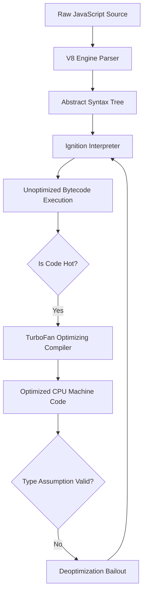
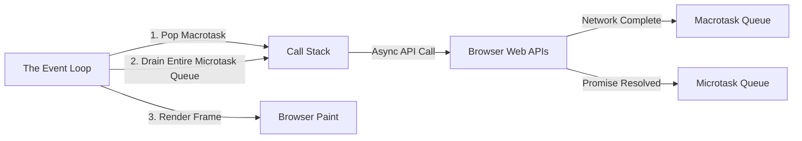
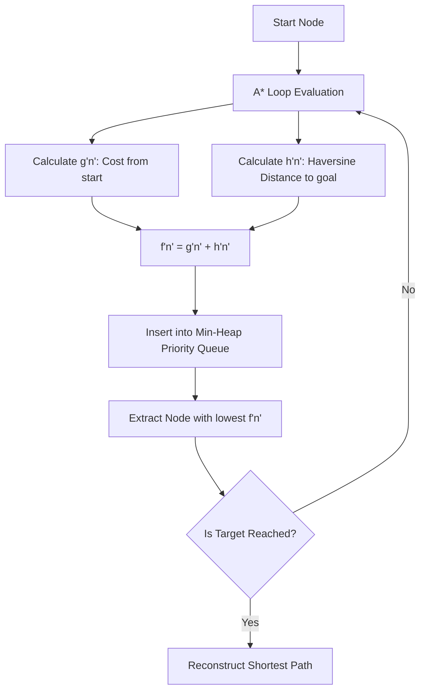

# CHAPTER 0: PREWORKOUT EXPLANATION

This document provides the theoretical concepts for the UJ3DMap MVP. This document contains the mandatory technical deep dives, architectural analogies, and cross-codebase scenarios required to understand the underlying mechanics of the V8 engine, browser rendering pipelines, and spatial routing algorithms utilized throughout the project.

---

## 1. The V8 Engine & JavaScript Execution Pipeline

### Step 1: Analogy (The Track Coach & The Sprint Biomechanist)

Imagine a high school track team. The Head Coach is responsible for getting every athlete running quickly without overthinking the mechanics. The Head Coach hands out basic, effective workout plans. This represents the **Ignition interpreter**. The Ignition interpreter gets the JavaScript code running immediately, but the Ignition interpreter isn't perfectly optimized. 

However, if an athlete shows Olympic potential (meaning a specific block of code is executed repeatedly), the Head Coach flags that athlete for the Sprint Biomechanist. The Sprint Biomechanist analyzes the athlete's exact stride length, foot strike angle, and fast-twitch muscle fiber ratio, creating a perfectly tailored, hyper-optimized sprint program. This represents the **TurboFan compiler**. TurboFan takes frequently executed code ("hot code") and converts the frequently executed code into highly optimized machine code. 

If the athlete suddenly changes their running style (e.g., the JavaScript function receives a string instead of an integer), the Sprint Biomechanist throws out the optimized plan, and the athlete goes back to the Head Coach. This is known as **Deoptimization**. `Pun alert 🚀`: When the V8 engine loses the V8 engine optimization, the V8 engine really loses the V8 engine's *track* of thought!

### Step 2: Technical Deep Dive

The V8 engine executes JavaScript through a strict pipeline. When the browser downloads the JavaScript payload, the V8 engine parser converts the raw text into an **Abstract Syntax Tree (AST)**. The AST is a tree representation of the syntactic structure of the JavaScript code.

The **Ignition interpreter** traverses the AST and generates unoptimized bytecode. Bytecode is fast to generate but slow to execute. As the bytecode executes, the V8 engine profiling thread monitors the execution frequencies of functions. 

If a function becomes "hot" (executed frequently), the V8 engine passes the AST for that function to the **TurboFan optimizing compiler**. TurboFan applies aggressive speculative optimizations based on the types of arguments the function has historically received. TurboFan generates highly optimized, CPU-specific machine code. 

If a function previously received integers but suddenly receives a string, TurboFan's speculative assumptions are violated. The V8 engine triggers a "Deoptimization" (bailout), discarding the machine code and returning execution control to the Ignition interpreter's bytecode. Maintaining type stability in vanilla JavaScript is necessary to keeping the V8 engine inside the TurboFan optimized state.



*Explicit Connection*: Just as the Sprint Biomechanist creates a tailored plan based on exact stride mechanics, the TurboFan compiler creates machine code based on exact data types. If the stride mechanics (data types) change, the biomechanist's plan (machine code) is useless.

### Step 3: Scenario in Another Codebase (Netflix Video Player)

The Netflix browser video player relies heavily on the V8 engine remaining in a TurboFan optimized state. 

**Folder Structure Context:**
```
netflix-ui/
├── player/
│   ├── buffer-manager.js
│   └── telemetry.js
```

**File Snippet (`buffer-manager.js`):**
```javascript
// Netflix engineers ensure this function ONLY receives integers.
// If the calculateBufferOffset function ever receives a float or string, the V8 engine deoptimizes the loop,
// causing a micro-stutter in the video playback.
function calculateBufferOffset(frameIndex, bitRate) {
  return (frameIndex * bitRate) >> 2; // Bitwise operator forces integer math
}
```

*Explicit Connection*: The Netflix engineers are acting like strict athletic directors, ensuring the athletes never change their running style (forcing integers via bitwise operators) so the Sprint Biomechanist (TurboFan) never has to throw away the optimized machine code.

---

## 2. The Browser Event Loop & Asynchronous I/O

### Step 1: Analogy (The Circuit Training Gym Manager)

Imagine a massive circuit training gym with hundreds of athletes. The Gym Manager stands in the center with a stopwatch. The Gym Manager can only instruct one athlete at a time. This setup represents the **Call Stack** executing on a single thread. 

When an athlete needs to use a treadmill for 10 minutes (a network request), the Gym Manager does not stand there staring at the athlete for 10 minutes. The Gym Manager assigns the athlete to the treadmill and tells them, "Tap my shoulder when you are finished." The Gym Manager then immediately walks away to instruct the next athlete. This delegation represents **Asynchronous I/O**.

When the athlete finishes the treadmill, they get in a specific line to talk to the Gym Manager. However, there are multiple lines. There is a VIP line for athletes who need immediate adjustments (the **Microtask Queue**), and a standard line for athletes finishing long workouts (the **Macrotask Queue**). The Gym Manager always empties the entire VIP line before checking the standard line. `Pun alert 🚀`: The Gym Manager is always *running* in circles!

### Step 2: Technical Deep Dive

JavaScript is strictly single-threaded. Execution occurs on the main thread via the **Call Stack**. To achieve concurrency without multi-threading, the browser environment implements an **Event Loop**. 

When the Call Stack encounters an asynchronous web API operation (like `fetch()` or `setTimeout()`), the Call Stack delegates the actual execution to the browser's background threads (or the OS kernel network stack). The Call Stack immediately pops the function and continues executing subsequent synchronous code.

When the background operation completes, the browser pushes the callback function into a queue. There are two queues in the browser environment:
1. **Microtask Queue**: Holds callbacks from `Promise.then()`, `Promise.catch()`, `MutationObserver`, and `queueMicrotask`.
2. **Macrotask Queue** (or Task Queue): Holds callbacks from `setTimeout()`, `setInterval()`, and UI rendering events.

The Event Loop continuously spins. The Event Loop algorithm is:
1. Execute the oldest Macrotask.
2. Execute **all** pending Microtasks until the Microtask Queue is completely empty (including new Microtasks queued by executing Microtasks).
3. Update the UI rendering pipeline (if a vsync frame is due).
4. Repeat.



*Explicit Connection*: Just as the Gym Manager always empties the VIP line before checking the standard line, the Event Loop must drain the entire Microtask Queue before the Event Loop is allowed to process the next Macrotask or paint the screen. If a developer floods the Microtask Queue, the browser user interface will freeze.

### Step 3: Scenario in Another Codebase (Uber Dispatch Dashboard)

The Uber web dashboard processes thousands of driver location updates per minute via WebSockets.

**Folder Structure Context:**
```
uber-dashboard/
├── sockets/
│   ├── telemetry-stream.js
│   └── ui-updater.js
```

**File Snippet (`telemetry-stream.js`):**
```javascript
// Uber engineers batch location updates using a Macrotask (setTimeout)
// instead of Promises. If they used Promises (Microtasks) for 10,000 updates,
// the Microtask Queue would never empty, preventing the browser from rendering the UI.
socket.on('locations', (data) => {
  setTimeout(() => {
    updateMapMarkers(data);
  }, 0); // Queues to the Macrotask line, allowing the UI to paint between updates
});
```

*Explicit Connection*: The Uber engineers deliberately put the athletes into the standard line (Macrotask) instead of the VIP line (Microtask) so the Gym Manager (Event Loop) has time to update the scoreboard (render the UI) between processing athletes.

---

## 3. High-Performance Graph Traversal (The A* Algorithm)

### Step 1: Analogy (The Marathon Course Scout)

Imagine a marathon course scout trying to find the shortest route through a sprawling city from the starting line to the finish line. 

A naive scout would walk down every single street in the city, measure them all, and then pick the shortest path. This strategy represents **Dijkstra's Algorithm**. Dijkstra's Algorithm guarantees the shortest path but wastes massive amounts of time exploring streets going in the complete opposite direction of the finish line.

A smart marathon scout uses a compass. At every intersection, they evaluate two things: 
1. "How far have I walked from the start?" (The known cost).
2. "How far does the compass say the finish line is in a straight line from here?" (The heuristic guess).

By adding the known distance and the compass guess together, the smart scout always prioritizes intersections that point toward the finish line. They completely ignore intersections pointing away from the finish line unless they hit a dead end. This smart scout represents the **A* (A-Star) Algorithm**. `Pun alert 🚀`: A scout who uses a compass is always pointing in the *write* direction!

### Step 2: Technical Deep Dive

The A* algorithm evaluates graph nodes based on the function `f(n) = g(n) + h(n)`:
- `g(n)`: The exact cost (distance) from the starting node to node `n`.
- `h(n)`: The **heuristic estimate** of the cost from node `n` to the target node.

The efficiency of the A* algorithm depends entirely on the accuracy of the heuristic `h(n)`. The heuristic must be **admissible**, meaning the heuristic must never overestimate the actual cost. If the heuristic overestimates, the A* algorithm may return a sub-optimal path. 

In spatial routing across the globe, the heuristic utilizes the **Haversine formula**. The Haversine formula calculates the great-circle distance between two points on a sphere given their longitudes and latitudes. The Earth is not a flat plane; using Euclidean distance (`Math.sqrt(x^2 + y^2)`) creates inaccurate geometric estimates over long distances, causing the A* algorithm to search incorrect graph spaces.

The A* algorithm manages the frontier of unvisited nodes using a **Min-Heap Priority Queue**. When evaluating the next step, the A* algorithm must instantly retrieve the node with the lowest `f(n)` score. If a standard array is used, sorting the standard array requires `O(N log N)` time. A Min-Heap Binary Tree maintains the lowest value at the root node at all times, providing `O(1)` retrieval and `O(log N)` insertion, keeping the main thread free from lockups.



*Explicit Connection*: The compass used by the smart scout is the `h(n)` Haversine heuristic. The compass ensures the scout (the A* algorithm) ignores useless intersections (graph nodes) that head in the wrong direction, bypassing the exhaustive search required by Dijkstra's algorithm.

### Step 3: Scenario in Another Codebase (Logistics Delivery Routing)

A modern logistics API uses identical A* architectures to route delivery trucks.

**Folder Structure Context:**
```
logistics-api/
├── routing/
│   ├── graph-manager.js
│   └── heuristic-engine.js
```

**File Snippet (`heuristic-engine.js`):**
```javascript
// Logistics engineers use A* with a specialized heuristic.
// Instead of straight-line distance, the logistics engineers' h(n) heuristic factors in
// real-time traffic density to bias the A* search away from congested highways.
function calculateTrafficHeuristic(nodeLatLng, targetLatLng, trafficData) {
  const baseDistance = haversine(nodeLatLng, targetLatLng);
  const congestionMultiplier = trafficData.getMultiplier(nodeLatLng);
  return baseDistance * congestionMultiplier; // The A* algorithm will avoid this node if the multiplier is high
}
```

*Explicit Connection*: Just as the marathon scout uses the compass to avoid walking the wrong way, the logistics engineers use traffic data as their compass, ensuring the A* algorithm completely ignores nodes (intersections) that are heavily congested.

---

> This explanation covers approximately 80% of the theoretical pre-workout foundations for the UJ3DMap MVP pipeline. The remaining 20% includes: V8 engine memory profiling with Chrome DevTools Heap Snapshot (identifying detached DOM nodes and memory leaks), the Node.js `--max-old-space-size` flag for heap cap configuration, libuv `uv_loop_configure` options, and HTTP/2 multiplexing mechanics versus HTTP/1.1 persistent connections. Study the V8 official blog at v8.dev and the Node.js official documentation on the `perf_hooks` module to fill this gap.
