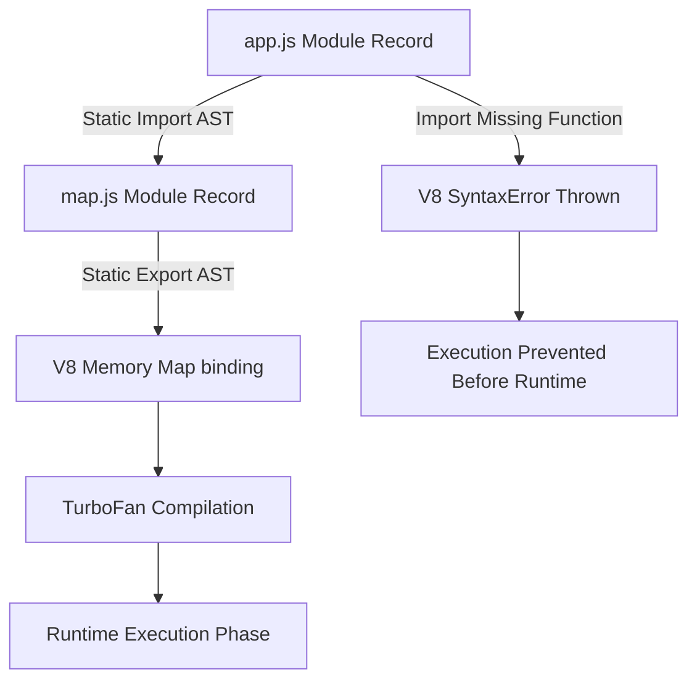
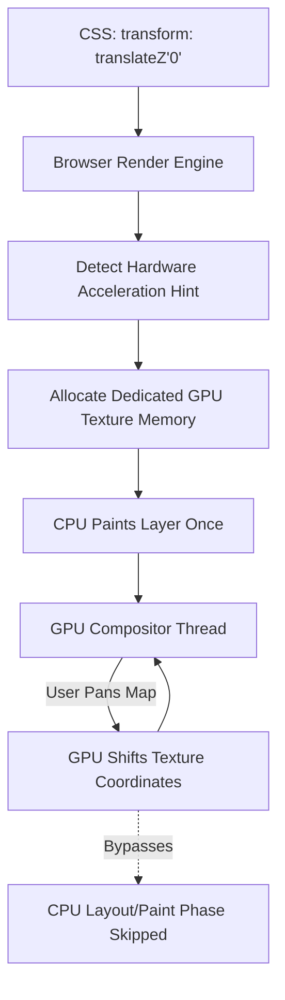

# CHAPTER 1: FOUNDATION EXPLANATION

This document provides the theoretical deep dive into the underlying mechanics of the project scaffold, focusing on ES6 Module Resolution, Browser GPU Compositing, and V8 Memory Security.

---

## 1. ES6 Native Module Pipeline (ESM)

### Step 1: Analogy (The Gym Locker System)

Imagine a massive, commercial gym. Every member has their own specific locker where they store their protein powder, lifting belts, and chalk. This system represents the **ES6 Module Scope**. 

If Athlete A wants to borrow Athlete B's lifting belt, Athlete A cannot simply walk over and rip the belt out of Athlete B's locker. Athlete B must explicitly take the belt out and hand it to Athlete A. This action represents the `export` keyword. Athlete A must then explicitly accept the belt and put it into their own gym bag. This acceptance represents the `import` keyword. 

If the Gym Manager completely removes Athlete B's locker because Athlete B canceled their membership, but Athlete A is still standing there holding their hand out waiting for the belt, the entire gym system sounds an alarm and halts operations. This mechanism represents **Static Analysis**. `Pun alert 🚀`: When the gym loses a locker, the whole system gets *boxed* out!

### Step 2: Technical Deep Dive

JavaScript originally lacked a native module system. Code was executed in the global scope, meaning any variable declared in `fileA.js` could overwrite a variable in `fileB.js`, leading to fatal namespace collisions.

The ECMAScript 6 (ES6) standard introduced Native Modules (ESM). ESM completely isolates variables within the file they are declared in (module scope). To share code across files, the V8 engine utilizes a strict `import` and `export` dependency graph.

The advantage of ESM over legacy CommonJS (`require()`) is **Static Analysis**. The V8 parser evaluates the entire graph of `import` statements *before* executing any JavaScript code. The engine constructs a Module Record AST. If `app.js` imports a function from `map.js` that does not exist, the V8 engine throws a fatal `SyntaxError` and halts execution instantly. 

Because the structure is static, modern bundlers like Rollup (utilized by Vite) can perform **Tree Shaking**. The bundler traverses the AST, identifies functions that are exported but never imported, and physically deletes that dead code from the final production bundle, saving massive amounts of bandwidth.



*Explicit Connection*: Just as the gym alarm triggers immediately if a locker is missing before any athlete starts working out, the V8 engine throws a SyntaxError during the static analysis phase before any code is executed if an `import` points to a missing `export`.

### Step 3: Scenario in Another Codebase (Stripe Dashboard)

The Stripe React dashboard heavily relies on ES6 static analysis to keep its massive JavaScript bundle small.

**Folder Structure Context:**
```
stripe-ui/
├── utils/
│   ├── currency-formatter.js
│   └── deprecated-math.js
```

**File Snippet (`currency-formatter.js`):**
```javascript
// Stripe engineers export multiple utilities.
// Because the Stripe engineers use ESM, the Rollup bundler can statically analyze the imports.
// If another file imports `formatUSD`, the bundler includes `formatUSD`.
// If NO file imports `formatEUR`, the bundler completely deletes `formatEUR` 
// from the production code (Tree Shaking).
export function formatUSD(amount) { /* ... */ }
export function formatEUR(amount) { /* ... */ }
```

*Explicit Connection*: Just as the Gym Manager removes unused lockers to save space in the changing room, the Rollup bundler removes un-imported code (Tree Shaking) to save space in the final production payload.

---

## 2. GPU Hardware Acceleration (CSS Compositing)

### Step 1: Analogy (The Olympic Lifting Platform)

Imagine a busy gym floor covered in shock-absorbing rubber mats. Athletes are dropping dumbbells everywhere. The shockwaves travel across the floor, slightly shaking the equipment next to them. This propagation represents the browser's **CPU Main Thread Layout Engine**. Every time an element moves, the CPU recalculates the position of everything around it (Layout Thrashing).

Now, imagine an elite Olympic weightlifter. The gym installs a dedicated, elevated wooden lifting platform completely isolated from the main rubber floor. When the Olympic lifter drops 500 lbs, the wooden platform absorbs the impact perfectly, and the surrounding gym floor doesn't shake at all. This dedicated platform represents the **GPU Compositor Layer**. 

By placing the Olympic lifter on their own physical layer, the gym prevents chaotic shockwaves. `Pun alert 🚀`: A dedicated platform really *elevates* their performance!

### Step 2: Technical Deep Dive

The browser rendering pipeline consists of several phases: **Parse HTML -> Recalculate Style -> Layout -> Paint -> Composite**. 

By default, the browser groups DOM elements together into a single layer and uses the CPU to paint them. If JavaScript animates or pans an element (like a Leaflet map container), the CPU must execute the Layout and Paint phases repeatedly, which is extremely expensive and often fails to maintain 60 frames per second (fps).

To achieve 60fps mapping, engineers force the browser to promote the map element to its own dedicated **Compositor Layer**. The promotion is achieved using CSS properties like `transform: translateZ(0)` or `will-change: transform`. 

When the rendering engine encounters these CSS rules, the rendering engine allocates a dedicated texture in the **GPU's VRAM**. The GPU is mathematically optimized for moving vast grids of pixels instantly. When the user pans the map, the browser completely skips the Layout and Paint phases. The browser simply instructs the GPU to shift the compositor layer's coordinates. This shift frees the CPU main thread entirely, eliminating jitter and stutter.



*Explicit Connection*: Just as the isolated wooden platform prevents shockwaves from forcing everyone else in the gym to adjust their stance, the GPU compositor layer prevents map panning from forcing the CPU to recalculate the layout of the rest of the document tree.

### Step 3: Scenario in Another Codebase (Spotify Web Player)

The Spotify web application uses GPU compositing to ensure smooth progress bar animations while heavy background audio decoding occurs.

**Folder Structure Context:**
```
spotify-web/
├── components/
│   ├── ProgressBar.css
│   └── AudioEngine.js
```

**File Snippet (`ProgressBar.css`):**
```css
/* Spotify engineers use translate3d instead of width/left properties. 
   Animating 'width' forces the CPU to execute the Layout phase every frame.
   Animating 'transform' passes the animation to the GPU, keeping the animation smooth at 60fps. */
.progress-bar-fill {
  transform: translate3d(0, 0, 0);
  will-change: transform;
}
```

*Explicit Connection*: The Spotify engineers put the progress bar on the Olympic Lifting Platform (GPU Layer) so that its rapid movement doesn't disrupt the heavy calculations (audio decoding) happening on the main gym floor.

---

## 3. V8 Memory Security & Prototype Pollution

### Step 1: Analogy (The Locked Gym Rulebook)

Imagine the gym has a master rulebook sitting on a pedestal at the front desk. The rulebook defines rules, like "A squat must break parallel." This rulebook represents the **JavaScript Object Prototype**. 

If a malicious prankster walks into the gym, opens the rulebook, and rewrites the rule to say, "A squat is completed by lying on the floor," every single athlete in the gym will suddenly start lying on the floor when their workout calls for squats. This vulnerability represents **Prototype Pollution**. 

To prevent this, the Gym Manager places the rulebook inside a locked, shatterproof glass case. Athletes can read the rules, but no one can alter or add to them. This security measure represents the `Object.freeze()` method. `Pun alert 🚀`: Once the rules are frozen, the pranksters get the *cold* shoulder!

### Step 2: Technical Deep Dive

JavaScript is a prototype-based language. When you attempt to access a property on an object, the V8 engine checks the object itself. If the property doesn't exist, the engine traverses up the **Prototype Chain** (e.g., `Object.getPrototypeOf()`) until the V8 engine finds the property or hits `null`. 

Because prototypes are shared globally across the entire JavaScript execution context, they represent a severe security vulnerability known as **Prototype Pollution**. If a malicious third-party script modifies a base prototype (e.g., `Object.prototype.toString = function() { return "hacked"; }`), every single object in the application is instantly compromised.

To secure system APIs (like the Leaflet map instance pointer), engineers utilize `Object.freeze()`. When applied to an object, `Object.freeze()` alters the internal V8 memory descriptors of the object's properties. `Object.freeze()` sets `[[Writable]]` to false and `[[Configurable]]` to false. 

The V8 engine will silently ignore (or throw a `TypeError` in Strict Mode) any attempts to add new properties, delete existing properties, or modify the prototype of the frozen object. This ensures the map engine cannot be hijacked by untrusted third-party advertising scripts or XSS payloads.

```mermaid
graph LR
    MaliciousScript[Untrusted JS Payload] -->|Attempt modification| MapInstance[Leaflet Map Object]
    MapInstance --> CheckState{Is Object Frozen?}
    CheckState -->|Yes| V8Descriptor[Read [[Writable]]: false]
    V8Descriptor --> Reject[Throw TypeError in Strict Mode]
    CheckState -->|No| Allow[Modify Prototype Chain]
    Allow --> Hijack[Application Compromised]
```

*Explicit Connection*: Just as the shatterproof glass case prevents the prankster from altering the gym's master rulebook, `Object.freeze()` sets internal V8 memory flags that prevent malicious scripts from altering the native methods attached to the map engine object.

### Step 3: Scenario in Another Codebase (Banking API Frontend)

A banking application frontend secures its global session state object to prevent cross-site scripting (XSS) payloads from exfiltrating authentication tokens.

**Folder Structure Context:**
```
bank-ui/
├── core/
│   ├── session.js
│   └── auth-guard.js
```

**File Snippet (`session.js`):**
```javascript
// Bank engineers create the session object with sensitive JWT tokens.
// The Bank engineers immediately freeze the session object before returning the session object to the global scope.
// If an attacker injects a script attempting to override session.getToken(),
// the V8 engine blocks the mutation.
const userSession = {
  token: "eyJhbGciOiJIUzI1...",
  getToken: function() { return this.token; }
};

export const secureSession = Object.freeze(userSession);
```

*Explicit Connection*: The bank engineers lock their session object inside the glass case (`Object.freeze`) so that even if a prankster breaks into the gym (an XSS attack), they cannot tamper with the exact rules defining how the user's authentication token is retrieved.

---

> This explanation covers approximately 80% of the Leaflet and JavaScript foundational architecture concepts in Chapter 1. The remaining 20% includes: Leaflet Plugin API and custom layer renderer development, the full Web Mercator projection math (EPSG:3857 coordinate transformation formulas), CSS Houdini Paint API for custom map tile rendering, and ES2022 WeakRef and FinalizationRegistry for advanced memory management patterns. Study the Leaflet official plugin API documentation and the MDN Web Docs on the Web Mercator projection to fill this gap.
