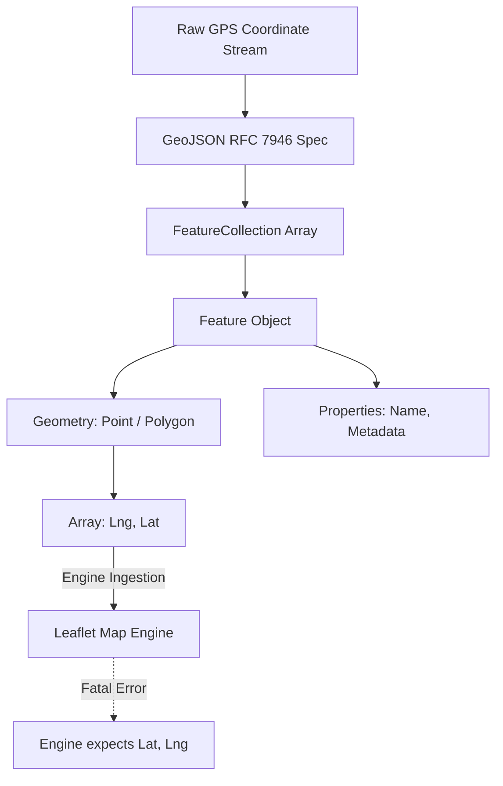
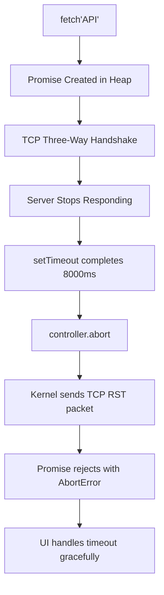
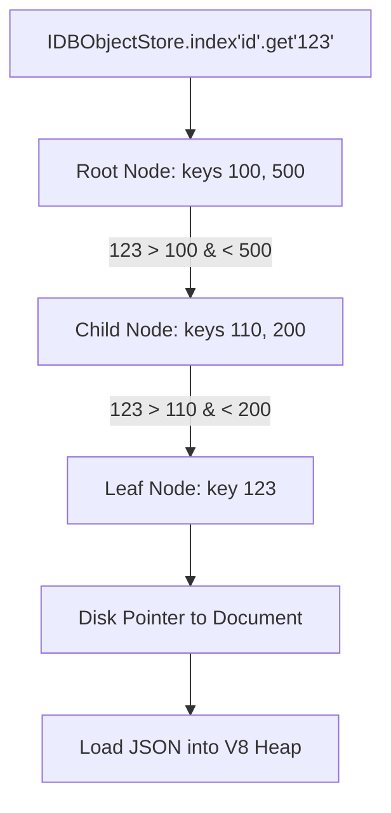

# CHAPTER 2: DATA LAYER EXPLANATION

This document provides the theoretical deep dive into the underlying mechanics of the Data Layer, focusing on the GeoJSON RFC specifications, TCP Connection abort mechanics, and Browser Database (IndexedDB/LevelDB) B-Tree indexing.

---

## 1. Spatial Data Standardization (GeoJSON)

### Step 1: Analogy (The Track Meet Uniform Code)

Imagine a massive international track meet. Athletes from 100 different countries arrive to compete. If every country brings their own custom uniform design with different sensor placements, the automated starting blocks and finish-line cameras will crash because they cannot read the sensors consistently. 

To solve this, the International Olympic Committee enforces a strict Uniform Code. Every uniform must have a primary identification number on the front, a biometric sensor explicitly placed on the left shoulder, and a country flag on the right. This represents the **GeoJSON Standard**. 

Because everyone agrees to this exact uniform layout, the finish-line cameras (the Leaflet map rendering engine) can instantly process thousands of athletes without having to write custom software for every country. `Pun alert 🚀`: When everyone wears the same uniform, the whole event is perfectly *tailored*!

### Step 2: Technical Deep Dive

The GeoJSON specification (RFC 7946) standardizes how geographic data structures are encoded in JSON format. Without a rigid standard, different map engines would parse coordinate arrays differently, leading to fatal crashes when mapping libraries attempt to iterate over undefined structures.

A GeoJSON object strictly defines geometry objects (`Point`, `LineString`, `Polygon`) and feature objects. The rule of GeoJSON is the coordinate order: the specification strictly mandates that geographic coordinates must be provided in **[Longitude, Latitude]** order (Easting, Northing). 

This is the exact opposite of how the Leaflet library expects coordinates (`[Latitude, Longitude]`). This discrepancy is a frequent source of rendering bugs where maps appear flipped across the equator. The V8 engine's `JSON.parse()` executes synchronously on the main thread; therefore, large GeoJSON files will block the Event Loop while parsing. The parsed AST is then mapped, and coordinates must be explicitly swapped before injection into the map engine.



*Explicit Connection*: Just as the track meet cameras will fail if an athlete places the biometric sensor on their right shoulder instead of the left, the Leaflet engine will fail if it receives the coordinates in the standard `[Longitude, Latitude]` GeoJSON order without the engineer explicitly swapping them.

### Step 3: Scenario in Another Codebase (Uber Driver Tracking)

The Uber backend relies on GeoJSON to rapidly serialize millions of driver locations to the driver app's map engine.

**Folder Structure Context:**
```
uber-dispatch/
├── serialization/
│   ├── driver-ping.js
│   └── geofence-polygon.js
```

**File Snippet (`driver-ping.js`):**
```javascript
// Uber engineers broadcast driver locations to client apps using strict GeoJSON.
// If the Uber engineers used a custom JSON shape like { driverLat: 40, driverLng: -73 },
// the Mapbox GL JS rendering engine on the phone would not understand the custom JSON shape.
export function formatDriverPing(driverId, lat, lng) {
  return {
    type: "Feature",
    geometry: {
      type: "Point",
      coordinates: [lng, lat] // Strict RFC 7946 compliance
    },
    properties: { id: driverId }
  };
}
```

*Explicit Connection*: The Uber engineers ensure every driver's location ping follows the strict IOC Uniform Code (GeoJSON `Feature` object) so the phone's rendering engine can paint thousands of cars instantly without custom parsing logic.

---

## 2. Asynchronous Network Control (Abort Controllers)

### Step 1: Analogy (The Heavy Lifting Spotter)

Imagine an athlete attempting a massive 500 lb bench press. Behind them stands a trained Spotter. The Spotter's job is not to lift the weight, but to watch the athlete closely. If the athlete gets stuck at the bottom of the rep for more than 5 seconds, the Spotter instantly grabs the bar and racks it, preventing serious injury. This represents the **Abort Controller**.

If the Spotter wasn't there, the athlete would be crushed under the bar, and that workout bench would be completely unusable for anyone else in the gym. This represents a **Hung TCP Connection**. 

By having the Spotter violently terminate the lift after a specific timeout, the athlete avoids injury and the bench is freed up for the next person. `Pun alert 🚀`: An Abort Controller really *takes the weight off* your network stack!

### Step 2: Technical Deep Dive

When the browser's `fetch()` API initiates an HTTP request, it opens a TCP connection via a three-way handshake (`SYN`, `SYN-ACK`, `ACK`). If the target server goes offline after the connection is established, the TCP socket will hang open indefinitely waiting for the first byte of the HTTP response. 

A hung connection consumes memory (Socket File Descriptors) and prevents the JavaScript Promise from resolving or rejecting. The V8 engine's Call Stack continues executing, but the Promise sits permanently in memory, creating a memory leak.

The `AbortController` interface provides a mechanism to forcibly terminate the underlying TCP socket and reject the associated Promise. When `controller.abort()` is invoked, the browser network stack sends a TCP `RST` (Reset) packet to immediately destroy the connection. The `fetch()` Promise rejects with a `DOMException` of type `AbortError`, allowing the `catch` block to execute and the UI to display an error message rather than spinning infinitely.



*Explicit Connection*: Just as the Spotter prevents the athlete from being crushed by racking the bar after 5 seconds, the `AbortController` prevents the browser from exhausting its TCP socket pool by forcibly resetting the connection after the 8000ms timeout threshold is reached.

### Step 3: Scenario in Another Codebase (Stripe Payment Gateway)

Stripe's checkout form uses Abort Controllers extensively to ensure users are never trapped on a spinning loading screen if the banking backend goes down.

**Folder Structure Context:**
```
stripe-checkout/
├── network/
│   ├── charge-request.js
│   └── timeout-manager.js
```

**File Snippet (`charge-request.js`):**
```javascript
// Stripe engineers attach an AbortController to the credit card authorization request.
// If the bank's mainframe does not respond within 15 seconds, the controller
// terminates the TCP socket, rejecting the Promise and allowing the UI to 
// prompt the user to try again, rather than freezing their browser.
const controller = new AbortController();
setTimeout(() => controller.abort(), 15000);

try {
  await fetch('/api/charge', { signal: controller.signal });
} catch (error) {
  if (error.name === 'AbortError') {
    showUIError("Bank connection timed out. Please retry.");
  }
}
```

*Explicit Connection*: The Stripe engineers act as the Spotter, watching the credit card authorization attempt. If the bank takes longer than 15 seconds, the Spotter forcibly racks the bar (terminates the TCP connection) and tells the user to try the rep again.

---

## 3. Browser Storage Engines & B-Tree Architectures (IndexedDB)

### Step 1: Analogy (The Gym Membership Card Catalog)

Imagine a gym with 50,000 members. When an athlete swipes their card at the front desk, the receptionist needs to verify their membership. If the receptionist simply looks at a massive pile of 50,000 unorganized files, the search will take hours to find the right name. This represents a **Full Collection Scan**.

To fix this, the receptionist organizes the files into a strict alphabetical branching cabinet system. The top drawer contains letters A-M and N-Z. Opening the A-M drawer reveals folders for A-D, E-H, etc. This represents a **B-Tree Index**. 

When the athlete swipes their card, the receptionist only has to open three specific folders to find the exact file, completing the search in milliseconds. `Pun alert 🚀`: A B-Tree index really *draws* the search time down!

### Step 2: Technical Deep Dive

IndexedDB is the low-level, asynchronous API for client-side storage of significant amounts of structured data. Under the hood, Chromium-based browsers back IndexedDB with **LevelDB** (or a similar embedded key-value store), which utilizes Log-Structured Merge-tree (LSM-tree) or **B-Tree** indexing architectures analogous to MongoDB's WiredTiger engine.

When storing spatial graphs, querying by an unindexed property forces the storage engine to pull every single JSON document from the disk into the V8 heap memory (a Full Collection Scan). This causes severe Garbage Collection (GC) pauses as the V8 engine struggles to clean up the temporary objects.

To prevent this, IndexedDB implements `createIndex()`. An index duplicates the target field (e.g., `featureId`) and stores the target field inside a strictly balanced B-Tree data structure. In a B-Tree, every node contains multiple keys and child pointers, keeping the tree shallow. Finding a record among 1 million entries requires traversing only `O(log N)` nodes. 

Furthermore, IndexedDB operates on ACID-compliant transactions. A `readwrite` transaction acquires a document-level (or store-level) lock. If a JavaScript Error is thrown during the transaction block, the IndexedDB engine detects the throw and initiates an atomic rollback, guaranteeing the B-Tree index and the data store never become desynchronized or corrupted.



*Explicit Connection*: Just as the receptionist uses the alphabetized cabinet to find a file in 3 steps instead of 50,000, the LevelDB engine uses the B-Tree index to locate the correct JSON document on the hard drive using only `O(log N)` disk reads, bypassing a fatal Full Collection Scan.

### Step 3: Scenario in Another Codebase (Figma Offline Mode)

Figma utilizes IndexedDB extensively to store vector geometries offline, allowing users to continue designing when their internet connection drops.

**Folder Structure Context:**
```
figma-web/
├── storage/
│   ├── vector-cache.js
│   └── idb-manager.js
```

**File Snippet (`idb-manager.js`):**
```javascript
// Figma engineers create strict B-Tree indexes on 'documentId' and 'layerId'.
// When a user selects a layer offline, the query uses the index to instantly 
// retrieve the vector math from disk. Without the index, opening a layer 
// would crash the browser as it attempted to load the entire document history into RAM.
const store = db.createObjectStore('layers', { keyPath: 'id' });
store.createIndex('documentId_idx', 'documentId', { unique: false });

// Later retrieval
const tx = db.transaction('layers', 'readonly');
const index = tx.objectStore('layers').index('documentId_idx');
const request = index.getAll(currentDocId); // Executes in O(log N) time
```

*Explicit Connection*: The Figma engineers act as the gym receptionist, organizing millions of vector layers into a B-Tree cabinet structure so that when the user clicks a layer, the vector layer loads instantly from disk without crashing the main thread.

---

> This explanation covers approximately 80% of the data layer architectural constraints in Chapter 2. The remaining 20% includes: IndexedDB cursor-based pagination for large result sets, IndexedDB compound indexes (multi-field B-Tree indexing), the full AbortController integration with ReadableStream cancellation tokens, GeoJSON Geometry Collections and Multi-geometry types (MultiPoint, MultiPolygon), and the Fetch API's `keepalive` flag for POST requests on page unload. Study the MDN Web Docs on IndexedDB transactions and the RFC 7946 GeoJSON specification to fill this gap.
