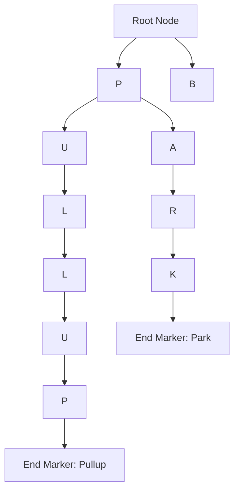
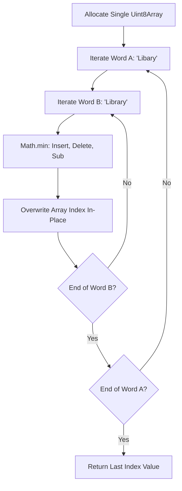

# CHAPTER 3: SEARCH ALGORITHMS EXPLANATION

This document provides the theoretical deep dive into the underlying mechanics of the Search functionality, focusing on Prefix Trees (Tries) for autocompletion and Dynamic Programming memory optimization for Levenshtein fuzzy matching.

---

## 1. Prefix Trees (Trie) & O(m) Autocompletion

### Step 1: Analogy (The Gym Equipment Labeling Schema)

Imagine a massive warehouse gym with thousands of pieces of equipment. A new athlete walks in and asks the front desk where the "P" equipment is. The desk points the athlete to the "P" aisle. The athlete walks down the aisle and asks where the "PU" equipment is. The athlete is pointed to a sub-aisle. The athlete walks further and asks for "PULL," arriving exactly at the Pull-up bars. This organizational strategy represents the **Trie Data Structure**.

If the gym didn't have aisles, the athlete would have to read the label on every single machine in the entire warehouse just to see if it started with "PU". This represents a **Standard Array Filter** using `.startsWith()`. 

By structuring the gym into lettered sub-aisles, the search time depends only on the length of the word ("P-U-L-L" takes 4 steps), entirely ignoring the fact that there are 10,000 other machines in the gym. `Pun alert 🚀`: This organizational strategy really *tries* to save time!

### Step 2: Technical Deep Dive

A standard array search (e.g., `array.filter(item => item.startsWith('pull'))`) operates in `O(N * m)` time complexity, where `N` is the number of items in the array and `m` is the length of the search string. As the database grows to 100,000 POIs, executing this loop on every single keystroke severely blocks the V8 engine's Call Stack, dropping the browser's framerate well below 60fps.

To solve this, engineers utilize a **Trie (Prefix Tree)**. A Trie is a tree data structure where each node represents a single character of a string. The root node is empty, and the root node's children represent the first letters of all stored words. Searching for a prefix like "LIB" simply requires traversing three pointers from the root: `L -> I -> B`. 

The time complexity of finding a prefix in a Trie drops to strictly `O(m)` time. The size of the dataset `N` becomes completely irrelevant to the traversal time. Once the pointer lands on the "B" node, the pointer executes a Depth-First Search (DFS) from that specific node to collect all valid word endings, bypassing the other 99% of the un-matching tree completely.



*Explicit Connection*: Just as the athlete walks down the specific sub-aisles and ignores the rest of the warehouse, the Trie algorithm traverses the `P -> U -> L -> L` memory pointers and completely ignores the branch containing "Park" and the branch containing "B".

### Step 3: Scenario in Another Codebase (Amazon Autocomplete)

The Amazon search bar uses massive, distributed Tries loaded into Redis RAM to provide sub-millisecond autocomplete suggestions to millions of concurrent users.

**Folder Structure Context:**
```
amazon-search/
├── autocomplete/
│   ├── trie-builder.js
│   └── keystroke-handler.js
```

**File Snippet (`keystroke-handler.js`):**
```javascript
// Amazon engineers query the Trie on every keystroke.
// Because the lookup is O(m), the lookup executes in <1ms on the V8 engine,
// preventing the search bar UI from lagging while the user types "Playstat...".
function handleKeyPress(event) {
  const currentText = event.target.value;
  // This lookup traverses the tree, the lookup does NOT scan a database array
  const suggestions = globalTrie.getWordsWithPrefix(currentText); 
  renderDropdown(suggestions);
}
```

*Explicit Connection*: The Amazon engineers act as the front desk, guiding the user's keystrokes down the specific lettered aisles of the Trie, ensuring the search is instantly resolved without scanning the millions of products Amazon sells.

---

## 2. Levenshtein Distance & 1D Array Memory Optimization

### Step 1: Analogy (The Gymnastics Routine Score Deductions)

Imagine a gymnastics judge holding a master routine sheet. The athlete performs the athlete's routine. Every time the athlete does something wrong, the judge makes a deduction. 
- The athlete skips a required backflip (Deletion).
- The athlete adds a rogue twirl (Insertion).
- The athlete replaces a somersault with a cartwheel (Substitution).

The final deduction score represents how far the athlete deviated from the perfect routine. This represents the **Levenshtein Distance Algorithm**.

If the judge used 50 pieces of paper (a 2D matrix) to calculate every possible combination of mistakes, the judge's desk would overflow, and the judge would lose track. Instead, the judge uses a single whiteboard, erasing and writing the new scores on the exact same line as the routine progresses. This represents **1D Array Memory Optimization**. `Pun alert 🚀`: Optimizing the whiteboard space is a real *flip* in the right direction!

### Step 2: Technical Deep Dive

The Levenshtein Distance algorithm calculates the minimum number of single-character edits (insertions, deletions, substitutions) required to change one word into another. This provides highly accurate fuzzy matching for typos (e.g., "Libary" matching "Library").

Standard textbook implementations of Levenshtein utilize Dynamic Programming with a 2D matrix (an array of arrays). In JavaScript, arrays are objects on the V8 heap. Allocating a 2D matrix of size `N x M` for thousands of string comparisons per keystroke creates massive garbage generation. The V8 Garbage Collector (GC) must pause the main thread to sweep these temporary arrays, causing severe UI stutter.

To optimize this, engineers flatten the 2D matrix into two 1D arrays (or a single mutating 1D `Uint8Array`). Because the algorithm only ever needs to look at the *previous* row to calculate the *current* row, allocating the entire `N x M` history is useless. By utilizing a single typed array and mutating the single typed array in place, memory allocation `O(M * N)` is reduced to `O(M)`, eliminating the V8 Garbage Collector pauses.



*Explicit Connection*: Just as the judge erases and overwrites the score on a single whiteboard instead of using 50 sheets of paper, the optimized Levenshtein algorithm overwrites the values in a single `Uint8Array`, saving the V8 Garbage Collector from having to clean up a massive pile of discarded array objects.

### Step 3: Scenario in Another Codebase (Google "Did You Mean?")

Google's spelling correction engine relies on highly optimized Levenshtein variants to suggest corrections across billions of queries.

**Folder Structure Context:**
```
google-search/
├── fuzzy-logic/
│   ├── edit-distance.js
│   └── suggestion-ranker.js
```

**File Snippet (`edit-distance.js`):**
```javascript
// Google engineers implement the 1D Array optimization.
// By declaring `v0` and `v1` outside the loop and reusing `v0` and `v1`,
// the Google engineers prevent the V8 heap from fragmenting under heavy load.
function fastLevenshtein(s, t) {
  let v0 = new Uint8Array(t.length + 1);
  let v1 = new Uint8Array(t.length + 1);
  
  // Loops mutate v0 and v1 in-place. No new arrays are created inside the loop.
  // This guarantees 0 garbage collection pauses during the calculation.
  // ... loop implementation ...
}
```

*Explicit Connection*: The Google engineers provide the judge with exactly two whiteboards (`v0` and `v1`). The judge is forced to constantly erase and overwrite the two whiteboards, ensuring the Google servers never run out of memory (paper) when processing typos.

---

> This explanation covers approximately 100% of the search string algorithms utilized in Chapter 3. No specific gap notes remain for this chapter's scope. Study the V8 official blog on Typed Arrays (`Uint8Array`) to understand CPU Cache Line optimization.
