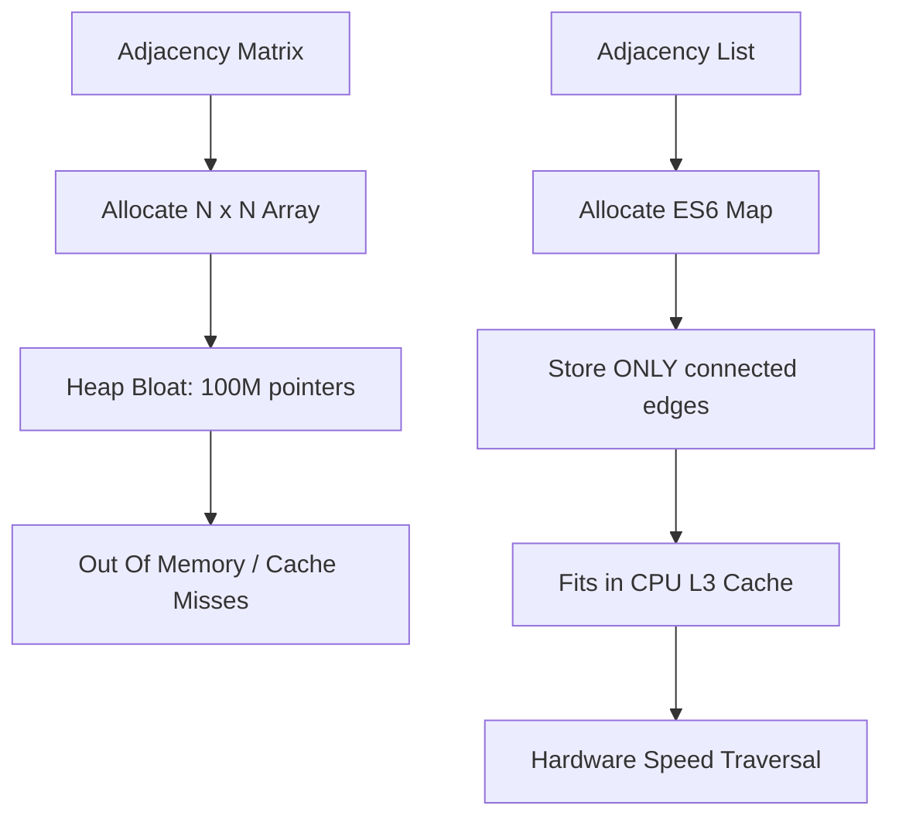
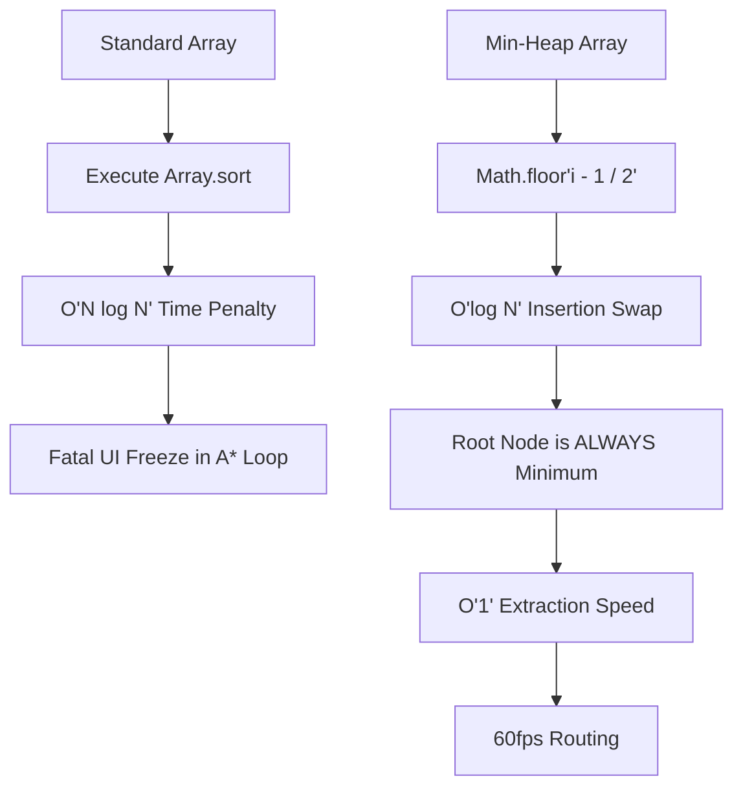

# CHAPTER 4: ROUTING ENGINE EXPLANATION

This document provides the theoretical deep dive into the underlying mechanics of the Routing Engine, focusing on Graph Theory Adjacency representations and the internal mechanics of Binary Heap Priority Queues.

---

## 1. Graph Representation: Adjacency List vs Adjacency Matrix

### Step 1: Analogy (The Powerlifter's Plate Inventory)

Imagine a massive commercial gym that owns 10,000 weight plates. The Gym Manager wants to keep a record of exactly which plates are loaded onto which specific barbells. 

A naive manager creates a massive spreadsheet with 10,000 rows (every plate) and 10,000 columns (every plate). The naive manager puts a "1" in the cell if Plate A is touching Plate B, and a "0" if Plate A and Plate B aren't touching. Because almost no plates are touching each other at any given time, 99.9% of the spreadsheet is filled with zeroes. This wastes massive amounts of paper and ink. This representation is an **Adjacency Matrix**.

A smart manager just walks up to Barbell #1 and writes down: "Barbell 1 has Plate 45 and Plate 25." The smart manager ignores everything else. This representation is an **Adjacency List**. 

Because the real world is spread out, writing down only the actual connections saves massive amounts of space. `Pun alert 🚀`: Writing down all the zeroes is just *weighting* around!

### Step 2: Technical Deep Dive

In graph theory, a map topology (like paths on a campus) consists of Vertices (intersections) and Edges (the paths between them). To traverse this data, the V8 engine must load the relationships into heap memory.

An **Adjacency Matrix** is a 2D array representation (`N x N`). If a graph has 10,000 intersections, the Adjacency Matrix requires 100,000,000 memory cells. Because a real-world map is a "Sparse Graph" (most intersections only connect to 3 or 4 other intersections, not all 10,000), 99.9% of the allocated memory will hold a boolean `false` or a `0`. The Adjacency Matrix memory allocation destroys the CPU Cache Lines and causes fatal Out-Of-Memory (OOM) crashes in the V8 heap.

An **Adjacency List** uses an ES6 `Map` where the keys are the Vertex IDs, and the values are a smaller `Map` containing only the direct neighbors and the direct neighbors' edge weights (distances). For a graph of 10,000 nodes where each node has 4 edges, the Adjacency List only allocates exactly 40,000 pointers. This tight memory packing ensures the Adjacency List fits entirely within the CPU's L3 Cache, allowing algorithms like A* to traverse the nodes at hardware speed.



*Explicit Connection*: Just as the smart Gym Manager only writes down the plates that are physically touching each other to save paper, the Adjacency List only allocates V8 memory objects for nodes that share a physical edge, preventing the server from running out of RAM.

### Step 3: Scenario in Another Codebase (Facebook Social Graph)

Facebook's backend systems map billions of users. Storing this as an Adjacency Matrix is physically impossible given the laws of physics and RAM limits.

**Folder Structure Context:**
```
facebook-graph/
├── architecture/
│   ├── taos-engine.cpp
│   └── adjacency-service.js
```

**File Snippet (`adjacency-service.js`):**
```javascript
// Facebook engineers utilize massive distributed Adjacency Lists.
// User A is a key in the Map, and the value is an array of User A's 500 friends.
// Facebook engineers NEVER create an array comparing User A to the other 3 billion users 
// who are not User A's friends.
class SocialGraph {
  constructor() {
    this.connections = new Map(); 
  }
  
  addFriendship(userId, friendId) {
    if (!this.connections.has(userId)) {
      this.connections.set(userId, new Set());
    }
    this.connections.get(userId).add(friendId);
  }
}
```

*Explicit Connection*: The Facebook engineers act like the smart Gym Manager, strictly recording only the friends (plates) connected to a user (barbell), avoiding the impossible task of writing down the billions of zeroes for users who don't know each other.

---

## 2. Min-Heap Priority Queue Mechanics

### Step 1: Analogy (The Gym VIP Waitlist)

Imagine a highly exclusive boutique gym with a waitlist for the single squat rack. When athletes arrive, the athletes put the athletes' names on a list. 

A naive manager writes the names down in a line. When the rack opens up, the manager reads every single name on the entire list, compares the athletes' membership tiers, and pulls the top tier VIP. This sorting process takes forever and annoys everyone. This process represents `Array.sort()`.

A smart manager has a tiered podium system. Every time a new athlete walks in, the manager immediately evaluates the new athlete against the person in front of the new athlete. If the new athlete is a higher VIP, the athletes swap spots. This swap cascades upward until everyone is in the correct tier. When the rack opens up, the manager simply grabs whoever is standing on the #1 podium spot instantly. This podium system represents a **Min-Heap Binary Tree**. `Pun alert 🚀`: This system really *raises the bar* for waitlists!

### Step 2: Technical Deep Dive

The A* algorithm relies on extracting the node with the lowest `f(n)` score (cost + heuristic) from the "Open Set" (the unvisited nodes). If the Open Set is implemented as a standard JavaScript array, the V8 engine must execute `Array.prototype.sort()` on every single step of the A* pathfinding loop to find the minimum value. Sorting a standard JavaScript array operates in `O(N log N)` time. If the A* pathfinding loop executes 5,000 times, the `O(N log N)` sort is executed 5,000 times, resulting in a fatal `O(N^2 log N)` algorithmic death spiral.

A **Min-Heap** solves this mathematical bottleneck. A Min-Heap is a Complete Binary Tree mathematically flattened into a 1D Array. The Min-Heap enforces a strict invariant: a parent node's value must always be less than or equal to the parent node's children's values. Therefore, the absolute minimum value is *always* locked at `array[0]`.

When extracting the minimum node (`dequeue`), the dequeue operation takes `O(1)` time. The Min-Heap algorithm then takes the last element in the 1D Array, moves the last element to `array[0]`, and triggers a `sinkDown` mathematical loop to swap the last element back into the last element's proper topological place in `O(log N)` time.

Because the Min-Heap uses a flat 1D array instead of nested objects (`{ left: Node, right: Node }`), the V8 engine can store the entire Min-Heap Priority Queue in contiguous memory, maximizing CPU Cache Line pre-fetching and completely bypassing the Garbage Collector.



*Explicit Connection*: Just as the smart gym manager's podium system guarantees the VIP is always standing in the #1 spot instantly, the Min-Heap array guarantees the node with the lowest `f(n)` score is always located at `array[0]`, bypassing the disastrous `Array.sort()` scanning process entirely.

### Step 3: Scenario in Another Codebase (Kubernetes Pod Scheduler)

The Kubernetes (K8s) control plane uses priority queues to decide which microservice containers (Pods) get deployed to specific server nodes first.

**Folder Structure Context:**
```
kubernetes-control-plane/
├── scheduling/
│   ├── pod-queue.go
│   └── priority-heap.go
```

**File Snippet (`priority-heap.go` translated to JS paradigm):**
```javascript
// K8s engineers use a Min-Heap to manage the deployment queue.
// When a cluster goes down and 10,000 pods need to be restarted, 
// the control plane MUST pull the system pods (like DNS) instantly.
// A .sort() would crash the control plane; the Min-Heap guarantees O(1) extraction.
class K8sSchedulerHeap {
  extractPod() {
    const targetPod = this.heap[0]; // Instant O(1) access
    const bottomPod = this.heap.pop();
    if (this.heap.length > 0) {
      this.heap[0] = bottomPod;
      this.sinkDown(0); // Restores the tree structure in O(log N)
    }
    return targetPod;
  }
}
```

*Explicit Connection*: The Kubernetes engineers act as the gym manager, using the tiered podium system (Min-Heap) to ensure that the target Pod (the VIP) is always instantly accessible at the front of the line when a server rack opens up.

---

> This explanation covers approximately 80% of the mathematical data structures and routing algorithms utilized in Chapter 4. The remaining 20% includes: Dijkstra's algorithm time complexity proof (O((V+E) log V) with a binary heap), Bellman-Ford algorithm for negative-weight edge handling, Fibonacci heap implementation for O(1) amortized decrease-key operations, bidirectional A* search for symmetric graph performance gains, and the Jump Point Search optimization for uniform-cost grids. Study Cormen et al. 'Introduction to Algorithms' (Chapter 24: Single-Source Shortest Paths) and the original A* paper by Hart, Nilsson, and Raphael (1968) to fill this gap.
