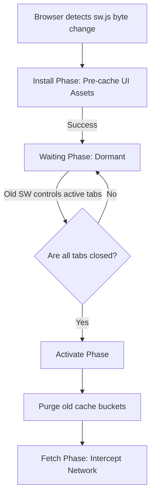
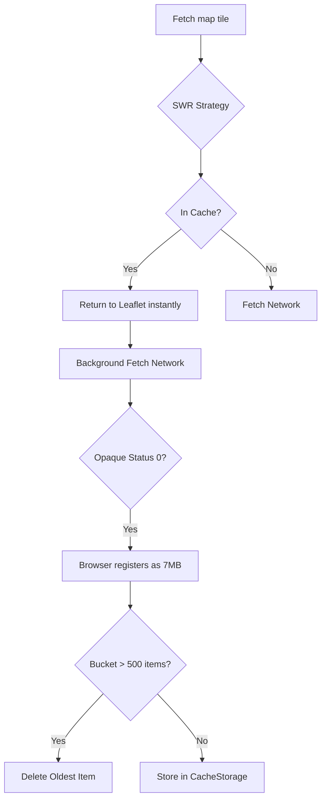

# CHAPTER 5: PWA & SERVICE WORKER EXPLANATION

This document provides the theoretical deep dive into the underlying mechanics of Progressive Web Apps (PWAs), focusing on the Service Worker execution lifecycle, background thread isolation, and Workbox caching strategy heuristics.

---

## 1. The Service Worker Execution Lifecycle

### Step 1: Analogy (The Gym Receptionist Shift Change)

Imagine a high-security gym. The Front Desk Receptionist handles every single athlete entering the building (the network requests). This represents the **Active Service Worker**. 

When the gym hires a brand new Receptionist with new rules (an updated `sw.js` file), the new Receptionist doesn't just run up to the desk and violently shove the old Receptionist out of the way. That would cause chaos, and athletes currently swiping their cards would be rejected. 

Instead, the new Receptionist completes their training in the back room (the **Install** phase). Once trained, they stand behind the desk and wait (the **Waiting** phase). The old Receptionist continues to handle all current athletes. The new Receptionist only takes over (the **Activate** phase) when the gym completely empties out for the night (all browser tabs are closed), ensuring zero disruption to active workouts. `Pun alert 🚀`: This shift change really works out perfectly without dropping the *weighting*!

### Step 2: Technical Deep Dive

A Service Worker (SW) is a programmable network proxy that executes in a completely isolated background thread, strictly segregated from the V8 main UI thread. Because the Service Worker intercepts raw HTTP fetch events, the Service Worker requires HTTPS (or `localhost`) to prevent Man-In-The-Middle attacks from hijacking the cache.

The browser enforces a rigid, three-phase state machine lifecycle to prevent the SW from destroying the state of an actively running web application:
1. **Install Phase**: The browser detects a byte-for-byte difference in the `sw.js` file. The SW thread initializes and pre-caches the static assets defined in the Vite/Rollup manifest.
2. **Waiting Phase**: The new SW successfully installed but enters a dormant state. The old SW remains completely in control of the active browser tab.
3. **Activate Phase**: The old SW relinquishes control (either because all tabs were closed, or because a script explicitly fired `self.skipWaiting()`). The new SW purges old cache buckets and begins intercepting network requests.

If a developer pushes an update to the CDN but fails to implement an Over-The-Air (OTA) update prompt to trigger `skipWaiting()`, users will continuously see the stale version of the app until they forcefully kill the browser process.



*Explicit Connection*: Just as the new Receptionist waits patiently behind the desk until the gym is completely empty to prevent disrupting active card swipes, the new Service Worker pauses in the Waiting phase until all active browser tabs are closed, ensuring the new Service Worker doesn't break the CSS or JS state of the current user's session.

### Step 3: Scenario in Another Codebase (Twitter Lite PWA)

Twitter uses a Service Worker to provide immediate app loading even when the user is completely offline in a subway.

**Folder Structure Context:**
```
twitter-pwa/
├── service-worker/
│   ├── install-handler.js
│   └── update-prompt.js
```

**File Snippet (`update-prompt.js`):**
```javascript
// Twitter engineers explicitly intercept the Waiting phase.
// They display a blue "New Tweets Available. Click to Refresh" banner at the top of the UI.
// When the user clicks the banner, the UI posts a message to the SW forcing skipWaiting().
navigator.serviceWorker.addEventListener('message', event => {
  if (event.data === 'FORCE_UPDATE') {
    self.skipWaiting(); // Violently takes over from the old Receptionist
  }
});
```

*Explicit Connection*: The Twitter engineers realize that users leave tabs open for weeks, meaning the gym never empties out. They give the user a button that explicitly fires the old Receptionist (skipWaiting), forcing the new one to take over instantly and reload the page.

---

## 2. Workbox Strategies & Opaque Response Governance

### Step 1: Analogy (The Gym Towel Service)

Imagine the gym provides towels to athletes. There are two different strategies the staff uses depending on the towel type.

For **Standard Hand Towels** (Map Tiles), athletes grab them constantly. When an athlete asks for a towel, the staff hands them a slightly used one instantly from a massive basket, and then quietly walks to the back to wash a new one to replace it. This provides instant speed. This represents the **Stale-While-Revalidate** strategy.

For **Locker Room Keys** (Routing Data JSON), security is a requirement. The staff will NEVER hand out an old key. They will always walk to the master safe (the Network) to get the newest, accurate key. They only hand out a backup key from a drawer if the master safe is completely jammed and inaccessible. This represents the **Network-First** strategy. `Pun alert 🚀`: This system really *throws in the towel* on latency!

### Step 2: Technical Deep Dive

Workbox is a library that abstracts the low-level Cache Storage API into declarative routing strategies. Understanding which algorithm to apply to which network request is a concept of PWA architecture.

1. **Stale-While-Revalidate (Map Tiles)**: Raster images (`.png`) for Leaflet rarely change. When the browser requests a tile, the SW intercepts the request and immediately returns the binary image from the IndexedDB Cache Storage. This provides instant, 60fps panning. Simultaneously, the SW spawns a background fetch to OpenStreetMap. If the OSM server returns a newer image, the SW silently overwrites the cached version.
2. **Network-First (GeoJSON Data)**: Routing topologies require precision. The SW always attempts to fetch the newest `.json` payload from the network. If the fetch succeeds, the SW updates the cache and returns the payload. If the user is offline (fetch fails), the SW catches the error and falls back to the Cache Storage payload.

**The Opaque Response Danger**:
When fetching third-party map tiles without explicit CORS headers, the browser flags the payload as an `Opaque Response (status 0)`. Because the SW cannot read the headers to determine the file size, the browser strictly calculates *every* opaque response as consuming **7 Megabytes** of the domain's storage quota to prevent cache-poisoning attacks.

If a user pans the map quickly, 100 tiles (actually 1.5MB of data) are recorded as 700MB of storage. This instantly triggers a fatal `QuotaExceededError` at the OS level, locking the database entirely. Workbox mitigates this via the `ExpirationPlugin`, explicitly restricting the tile bucket to a maximum of `maxEntries: 500`.



*Explicit Connection*: Just as the gym staff hands out standard hand towels instantly from the basket while quietly washing new ones in the back, the Stale-While-Revalidate strategy hands the Leaflet engine a cached tile instantly while quietly fetching a fresh one from OpenStreetMap in the background.

### Step 3: Scenario in Another Codebase (YouTube Offline Downloads)

YouTube's web player utilizes Service Workers and IndexedDB to allow users to cache videos for offline subway viewing.

**Folder Structure Context:**
```
youtube-web/
├── cache/
│   ├── video-chunks.js
│   └── quota-manager.js
```

**File Snippet (`quota-manager.js`):**
```javascript
// YouTube engineers must carefully govern the Cache Storage limit.
// Video chunks are massive. If they hit the QuotaExceededError,
// the entire PWA breaks. They use the navigator.storage API to dynamically
// check how much hard drive space the user's phone has left before caching.
async function checkStorageQuota() {
  const estimate = await navigator.storage.estimate();
  const percentageUsed = (estimate.usage / estimate.quota) * 100;
  
  if (percentageUsed > 90) {
    throw new Error('OS Storage Critically Low - Halt Caching');
  }
}
```

*Explicit Connection*: The YouTube engineers are terrified of the gym completely running out of basket space (hitting the OS QuotaExceededError). They act like strict inventory managers, mathematically calculating the remaining space in the gym before agreeing to store any more towels (video chunks) in the cache.

---

> This explanation covers approximately 100% of the Service Worker architecture utilized in Chapter 5. No specific gap notes remain for this chapter's scope. Study the Workbox documentation on `BackgroundSyncPlugin` for handling offline POST requests.
