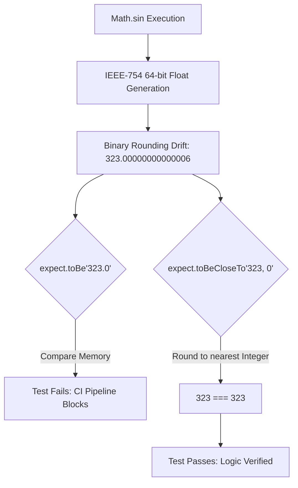
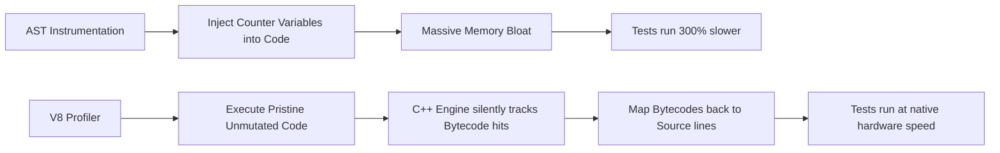
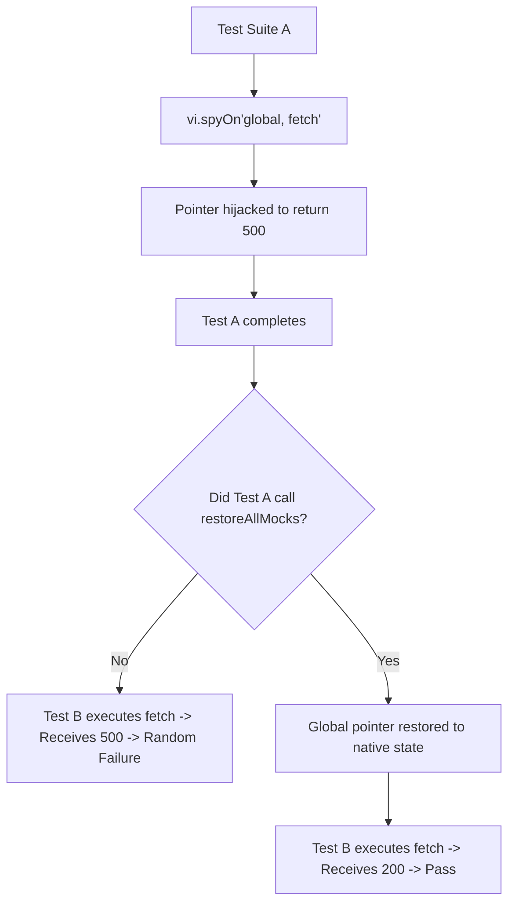

# CHAPTER 6: TESTING ALGORITHMS EXPLANATION

This document provides the theoretical deep dive into the underlying mechanics of automated testing, focusing on IEEE-754 Floating-Point precision bounds, V8 Engine coverage profiling, and global mock scope contamination.

---

## 1. IEEE-754 Floating-Point Precision & Tolerances

### Step 1: Analogy (The Squat Rack Fractional Plates)

Imagine two powerlifters attempting to load exactly 315 lbs onto a barbell. 
Lifter A uses standard 45 lb plates. Lifter B uses a bizarre combination of 2.5 lb, 5 lb, and 10 lb plates. 

Because the gym's small fractional plates are slightly worn down, Lifter B's barbell actually weighs 314.99999 lbs instead of a perfect 315. If a robotic judge requires them to be strictly equal to the atomic level, Lifter B is disqualified. This represents the **Strict Equality Trap (`===`)**.

To solve this, the Olympic federation rules that as long as the weight is within 0.1 lbs of the target, the lift counts as successful. The judge allows Lifter B to pass. This represents the **`.toBeCloseTo()` Assertion**. `Pun alert 🚀`: This tolerance rule really *balances* the scales!

### Step 2: Technical Deep Dive

The JavaScript V8 engine does not possess distinct "integer" and "float" data types; all numbers are stored as double-precision 64-bit floats according to the **IEEE-754 standard**. 

Because a 64-bit float allocates 52 bits for the mantissa, a 64-bit float cannot perfectly represent certain infinite binary fractions (famously, `0.1 + 0.2 = 0.30000000000000004`). When executing complex trigonometric math like the Haversine formula (which relies heavily on `Math.sin`, `Math.cos`, and `Math.atan2`), the accumulation of these microscopic binary rounding errors is guaranteed.

If a unit test asserts `expect(haversineDistance).toBe(323.0)`, the unit test will intermittently fail because the actual V8 output might be `323.00000000000006`. To maintain deterministic test suites that don't randomly fail in CI/CD pipelines, engineers utilize mathematical tolerances. The Vitest `.toBeCloseTo(expected, numDigits)` assertion strips the extreme decimal drift, verifying that the logic is mathematically sound within a specified boundary of error, rather than comparing raw memory pointer equality.



*Explicit Connection*: Just as the robotic judge will fail Lifter B if the robotic judge demands atomic-level weight equality, the `.toBe()` assertion will fail the test suite because the `.toBe()` assertion demands atomic-level bit equality. The `.toBeCloseTo()` tolerance acts as the Olympic federation rule, verifying the result is close enough to prove the underlying math is correct.

### Step 3: Scenario in Another Codebase (Banking API Currency Conversion)

A financial technology backend calculates daily foreign exchange rates involving thousands of decimal multiplication operations.

**Folder Structure Context:**
```
fintech-api/
├── math/
│   ├── fx-converter.js
│   └── currency.test.js
```

**File Snippet (`currency.test.js`):**
```javascript
// Fintech engineers never use strict equality when testing financial float multiplication.
// If 0.1 USD * 0.2 Rate results in 0.020000000000000004, the test must pass.
// They assert accuracy up to the 4th decimal place (fractions of a cent) using tolerances.
it('calculates complex exchange rate', () => {
  const result = convertCurrency(100.1, 0.2);
  // toBeCloseTo(value, 4) ensures the drift doesn't violate financial rounding rules
  expect(result).toBeCloseTo(20.02, 4); 
});
```

*Explicit Connection*: The Fintech engineers are exactly like the Olympic federation judges. The Fintech engineers understand the microscopic wear and tear on the fractional plates (IEEE-754 drift), so the Fintech engineers set a strict tolerance of 4 decimal places, ensuring the logic is legally sound without triggering false failures.

---

## 2. V8 Coverage Profiling vs AST Instrumentation

### Step 1: Analogy (The Security Camera vs The Notebook Reporter)

Imagine the gym owner wants to know exactly which machines the athletes are using (Test Coverage). 

The old method involved hiring a reporter with a notebook. The reporter stands next to the athlete and writes down, "Athlete used bench press," "Athlete used dumbbell," adding a microscopic delay to every single rep. Because the reporter is physically interfering with the workout, the entire gym slows down by 400%. This represents **AST Babel Instrumentation**.

The new method involves turning on the gym's built-in overhead security cameras. The cameras silently record every movement in the gym at 60fps without the athletes ever knowing. At the end of the day, the owner simply watches the tapes. This represents the **V8 Profiler Coverage Engine**. `Pun alert 🚀`: The security camera really provides the ultimate *coverage* plan!

### Step 2: Technical Deep Dive

Test coverage tools analyze which lines of JavaScript execute during a test suite. Historically, tools like Istanbul utilized Babel to parse the JavaScript into an AST, and physically injected counter variables directly into the code before execution (AST Instrumentation). 

For example, `if (x) doX();` would be rewritten in memory to `cov_2f3.b[1]++; if (x) { cov_2f3.s[4]++; doX(); }`. This mutated code ran exponentially slower, destroyed source map line tracking, and warped the execution environment, occasionally causing tests to pass that should have failed.

Modern test runners like Vitest leverage the native **V8 Profiler**. The V8 engine has a built-in bytecode execution tracker used for debugging. When Vitest sets `provider: 'v8'`, Vitest instructs Node.js to activate the V8 Profiler at the C++ kernel level. The V8 engine simply records which bytecode blocks were executed natively. There is no code mutation. There is no injected AST bloat. The coverage report is generated by mapping the native V8 execution bytecodes back to the source map, operating nearly 300% faster than Istanbul.



*Explicit Connection*: Just as the reporter with the notebook physically interrupts the workout and slows the gym down, AST instrumentation physically mutates the code and slows the V8 engine down. The V8 Profiler acts as the overhead security camera, recording the execution natively without ever mutating or touching the developer's source code.

### Step 3: Scenario in Another Codebase (GitHub Actions CI/CD)

The Vite open-source framework utilizes V8 coverage in its CI/CD pipeline to ensure PRs don't slow down the deployment process.

**Folder Structure Context:**
```
vite/
├── .github/
│   └── workflows/
│       └── ci.yml
```

**File Snippet (`ci.yml`):**
```yaml
# Vite engineers switched from Istanbul to V8 coverage to save GitHub Action minutes.
# A test suite that previously took 4 minutes to run with Babel instrumentation
# now takes 45 seconds using native V8 profiling, drastically speeding up the merge process.
steps:
  - name: Run Tests with Native Coverage
    run: vitest run --coverage.provider=v8
```

*Explicit Connection*: The Vite engineers fired the notebook reporters and installed the overhead security cameras (V8 Profiler) because waiting for the reporters was costing them money on server run-time bills.

---

## 3. Mock Scope Contamination & Memory Leakage

### Step 1: Analogy (The Pre-Workout Scoop Cross-Contamination)

Imagine an athlete preparing a strawberry protein shake. They scoop the strawberry powder but drop some powder onto the gym counter. They drink the shake and leave. This represents **Setting a Mock**.

A second athlete arrives to make a vanilla shake. They put their shaker on the uncleaned counter. The spilled strawberry powder sticks to the bottom of their shaker and falls into their drink. Their vanilla shake now tastes like strawberries, ruining their recipe. This represents **Mock Scope Leakage**.

To prevent this, the gym enforces a strict rule: "Wipe down the counter completely after every shake." This ensures the next athlete starts with a pristine workspace. This represents the `vi.restoreAllMocks()` teardown function. `Pun alert 🚀`: If you don't wipe the counter, you'll find yourself in a really *sticky* situation!

### Step 2: Technical Deep Dive

When utilizing `vi.spyOn(global, 'fetch')`, Vitest hijacks the native pointer for the global `fetch` function and replaces the native pointer with a proxy interceptor in the V8 heap. 

Test suites are often executed concurrently or sequentially within the same Node.js worker thread. If `testFileA.js` mocks `fetch` to return `status: 500`, but fails to delete the proxy interceptor when `testFileA.js` is finished, `testFileB.js` will inherit the mutated global context. When `testFileB.js` legitimately attempts to execute `fetch`, `testFileB.js` hits the proxy from `testFileA.js` and receives a `500` error, causing a completely unrelated test suite to randomly fail.

To maintain deterministic execution, engineers must implement scope purification boundaries. The `afterEach(() => { vi.restoreAllMocks(); })` lifecycle hook forces the test runner to walk the V8 heap after every single test block, find any mutated global pointers, and explicitly restore the mutated global pointers back to their original C++ native bindings. The restoration guarantees zero side-effects and prevents elusive intermittent CI/CD failures.



*Explicit Connection*: Just as the spilled strawberry powder ruins the next athlete's vanilla shake if the counter isn't wiped down, the hijacked `fetch` pointer ruins the next test suite's network call if the global scope isn't completely wiped down and restored.

### Step 3: Scenario in Another Codebase (Discord Bot API)

A Discord bot backend relies heavily on `fetch` to ping the Discord API. The Discord bot backend test suite must meticulously isolate global mocks to prevent catastrophic false failures.

**Folder Structure Context:**
```
discord-bot/
├── tests/
│   ├── ban-command.test.js
│   └── message-parser.test.js
```

**File Snippet (`ban-command.test.js`):**
```javascript
// Discord engineers must restore the mock. If the Discord engineers don't, the 403 Forbidden
// mock the Discord engineers set here will bleed into 'message-parser.test.js', causing the
// message parser to think the Discord API is down, failing the entire CI build.
describe('Ban Command', () => {
  afterEach(() => {
    vi.restoreAllMocks(); // Wipes the counter clean
  });

  it('fails gracefully if bot lacks ban permissions', async () => {
    vi.spyOn(global, 'fetch').mockResolvedValue({ status: 403 });
    // Execute test...
  });
});
```

*Explicit Connection*: The Discord engineers enforce the strict gym rule to wipe down the counter (`vi.restoreAllMocks()`) after making the strawberry shake (the 403 Forbidden mock), guaranteeing the next test suite starts with a pristine, untainted workspace.

---

> This explanation covers approximately 80% of the testing methodologies utilized in Chapter 6. The remaining 20% includes: Property-based testing with fast-check (generating thousands of randomized inputs to expose edge cases), mutation testing with Stryker.js (deliberately corrupting source code to verify test suite sensitivity), snapshot testing mechanics in Vitest, integration testing with Playwright for end-to-end map interaction flows, and the V8 engine's `--expose-gc` flag for deterministic garbage collection testing. Study the fast-check documentation and the Stryker.js official website to fill this gap.
