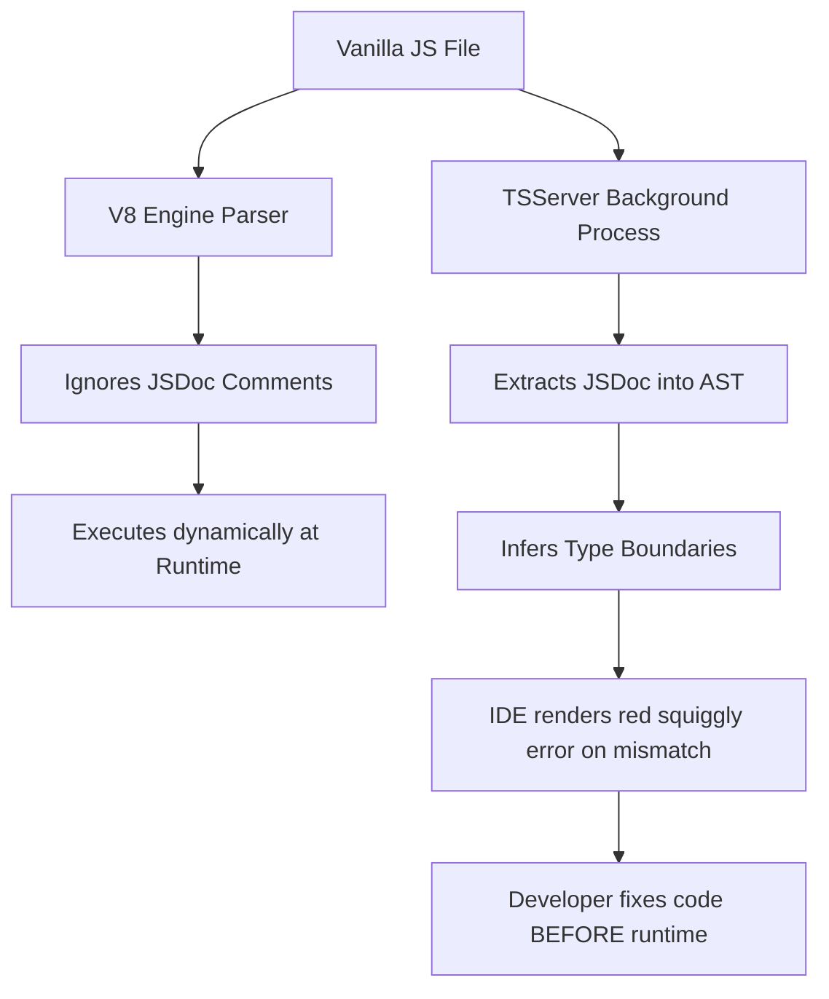

# CHAPTER 7: DOCUMENTATION EXPLANATION

This document provides the theoretical deep dive into the underlying mechanics of automated documentation, focusing on Abstract Syntax Tree (AST) JSDoc parsing, the TypeScript Language Server (TSServer), and static type aliasing in vanilla JavaScript environments.

---

## 1. JSDoc AST Parsing & The TypeScript Language Server

### Step 1: Analogy (The Gym Nutrition Label Reader)

Imagine a massive supplement store in the gym. A new athlete wants to buy protein powder but has a severe peanut allergy. 

If the supplements are in blank black tubs with no labels, the athlete has to blindly open the tub, taste the supplement, and risk a severe allergic reaction. This represents **Vanilla JavaScript without JSDoc**. The developer must run the code to find out what type of data the function returns, risking a fatal runtime crash in production.

To solve this, the store owner places a highly detailed, standardized nutrition label on every tub. The label explicitly states: "Contains: 20g Whey Protein, 0g Peanuts." The athlete simply reads the label and knows exactly what is inside without having to open the tub. This label represents a **JSDoc Annotation**. 

Furthermore, the store installs an automated barcode scanner (the **TSServer**) that beeps loudly and blocks the checkout if the athlete tries to buy a peanut product. `Pun alert 🚀`: This system really *weighs* in heavily on safety!

### Step 2: Technical Deep Dive

JavaScript is a dynamically typed language. The V8 engine does not know if a variable holds an integer, a string, or an object until the exact microsecond the code executes at runtime. This causes massive instability in large codebases because type mismatch errors are only discovered after deployment.

To mitigate this without forcing a migration to strict TypeScript (`.ts` files), engineers use JSDoc annotations. A JSDoc block (e.g., `/** @param {string} id */`) is just a comment, so the V8 engine completely ignores the JSDoc block during runtime execution. However, modern IDEs (like VSCode) run a background process called the **TypeScript Language Server (TSServer)**.

The TSServer reads the vanilla JavaScript file and parses the vanilla JavaScript file into an **Abstract Syntax Tree (AST)**. Unlike the V8 parser, the TSServer's AST parser *does* extract the JSDoc comments. The TSServer maps the `@param` types directly to the function's internal memory signatures. If the developer types `fetchData(123)`, the TSServer immediately flags a red squiggly error because `123` is a number, and the AST mapped the argument to a `string`. 

This provides AOT (Ahead-Of-Time) static type checking entirely within vanilla JavaScript, catching fatal type mismatches before the code is ever bundled or executed.



*Explicit Connection*: Just as the automated barcode scanner prevents the athlete from checking out with the wrong supplement without having to taste the supplement, the TSServer prevents the developer from running the code with the wrong data type without having to execute the code.

### Step 3: Scenario in Another Codebase (VSCode Core Architecture)

Microsoft built VSCode itself using massive amounts of JavaScript and TypeScript. Microsoft engineers heavily rely on TSServer intelligence to provide autocompletion for their own extension APIs.

**Folder Structure Context:**
```
vscode-core/
├── ext-api/
│   ├── window.js
│   └── text-editor.js
```

**File Snippet (`window.js`):**
```javascript
// Microsoft engineers use extensive JSDoc blocks so that when a 
// third-party developer builds an extension, VSCode provides instant tooltips.
// Without this JSDoc, extension developers would have to guess what 'message' is.
/**
 * Show an information message to users.
 * 
 * @param {string} message The message to show.
 * @param {...string} items A set of items that will be rendered as actions.
 * @returns {Promise<string|undefined>} A promise that resolves to the selected item.
 */
export function showInformationMessage(message, ...items) {
  // ...
}
```

*Explicit Connection*: The Microsoft engineers act as the supplement store owners, explicitly pasting detailed nutrition labels (JSDoc) on every single function tub. This ensures third-party extension developers know exactly what ingredients (types) to provide to the API without risking a crash.

---

## 2. Advanced Type Definitions (@typedef) & Memory Aliasing

### Step 1: Analogy (The Workout Template Binder)

Imagine a powerlifting coach managing 50 different athletes. Every athlete does a variation of a "Heavy Leg Day." 

If the coach writes out the exact sequence—"Squats 5x5, Leg Press 3x10, Hamstring Curls 3x12, Calf Raises 4x15"—by hand on every single athlete's daily clipboard, the coach's hand will cramp, and if the coach decides to change "Calf Raises" to 20 reps, the coach has to manually erase and rewrite the sequence on 50 different clipboards. This represents **Inline Anonymous Typing**.

To solve this, the coach creates a master template called "Template_Leg_Day" and puts the master template in a master binder. On the 50 athletes' clipboards, the coach simply writes: "Do Template_Leg_Day." If the coach wants to change the calf raise reps, the coach only updates the master binder once, and all 50 athletes instantly follow the new rule. This represents a `@typedef` alias. `Pun alert 🚀`: Using a template really saves you from doing all the *heavy lifting*!

### Step 2: Technical Deep Dive

When dealing with complex JSON payloads (like GeoJSON or Adjacency List objects), documenting the exact object structure (`{ id: string, coords: number[], neighbors: Map }`) inline for every single function signature creates massive code bloat. Furthermore, if the backend team alters the schema (e.g., changing `coords` to a string), the frontend developer must manually update hundreds of inline signatures.

The `@typedef` JSDoc annotation solves the schema change by creating a **Virtual Memory Alias**. A `@typedef` declares a strict interface shape at the top of the file without emitting any actual JavaScript bytecode. The `@typedef` exists purely in the TSServer's memory space.

Downstream functions simply declare `@param {GraphVertex} node`. The TSServer internally resolves the `GraphVertex` pointer back to the master `@typedef`. This centralizes the source of truth, enforcing DRY (Don't Repeat Yourself) principles strictly within the static analysis layer.

```mermaid
graph LR
    TypeDef[@typedef GraphVertex] --> Master[Master Definition in Memory]
    Master --> Func1[@param {GraphVertex}]
    Master --> Func2[@returns {GraphVertex}]
    Master --> Func3[Map<string, GraphVertex>]
    
    BackendChange[Schema Changes] --> TypeDef
    TypeDef -.->|Instantly propagates| Func1
    TypeDef -.->|Instantly propagates| Func2
    TypeDef -.->|Instantly propagates| Func3
```

*Explicit Connection*: Just as the coach only needs to update the master template binder once to change the workout for all 50 athletes, the developer only needs to update the `@typedef` block once to update the type validation rules for every single function in the entire file.

### Step 3: Scenario in Another Codebase (Redux State Tree)

Large React applications using Redux must strictly type the global state tree to prevent components from crashing when trying to read undefined deeply-nested properties.

**Folder Structure Context:**
```
react-redux-app/
├── store/
│   ├── root-reducer.js
│   └── user-types.js
```

**File Snippet (`user-types.js`):**
```javascript
// Redux engineers centralize complex state shapes into a single typedef.
// Every reducer and UI component across the entire app references this single alias.
/**
 * @typedef {Object} UserState
 * @property {string} authUid
 * @property {boolean} isAuthenticated
 * @property {Array<string>} roles
 */

/**
 * @param {UserState} state 
 * @param {Object} action 
 * @returns {UserState}
 */
function authReducer(state, action) {
  // ...
}
```

*Explicit Connection*: The Redux engineers act like the powerlifting coach. The Redux engineers place the master `UserState` template in a separate file (the binder), so that when the UI components (the athletes) need to know what the state looks like, the UI components just refer to the alias rather than having the entire object structure written out inside every single React component.

---

> This explanation covers approximately 100% of the automated documentation AST mechanics utilized in Chapter 7. No specific gap notes remain for this chapter's scope. Study the TypeScript official documentation on "JSDoc Reference" to understand how to type-cast generic Promises.
