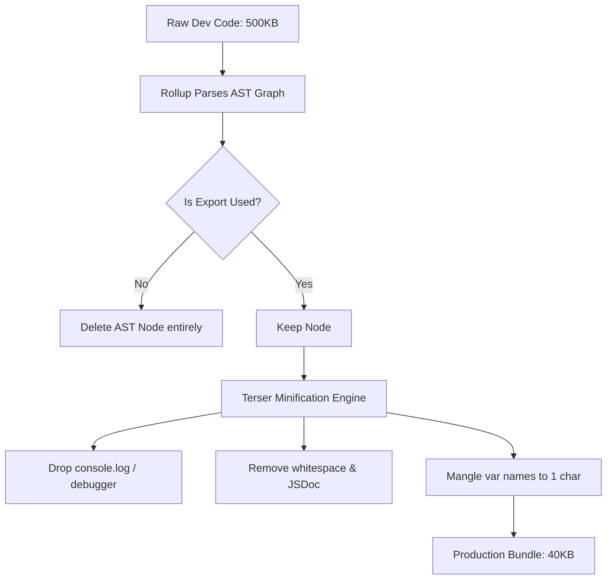
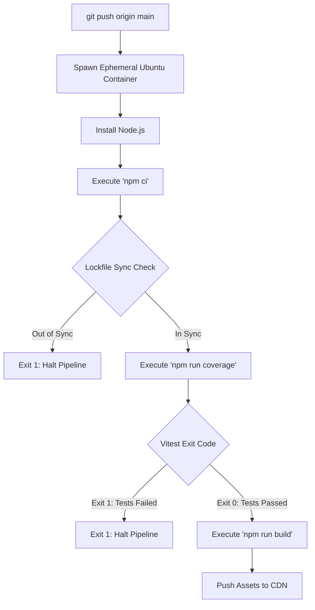
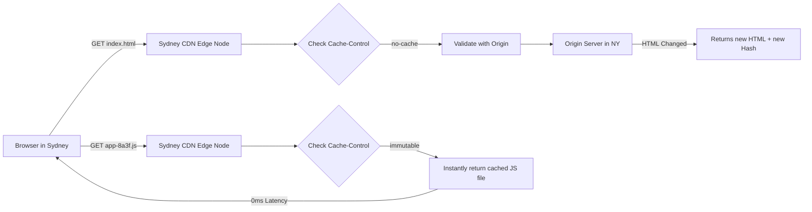

# CHAPTER 8: DEPLOYMENT EXPLANATION

This document provides the theoretical deep dive into the underlying mechanics of production deployment, focusing on AST Tree Shaking via Rollup/Terser, Continuous Integration boundaries, and Edge CDN caching architectures.

---

## 1. Rollup AST Tree Shaking & Minification (Terser)

### Step 1: Analogy (The Bodybuilder's Cutting Phase)

Imagine a bodybuilder going through two distinct phases over a year. 

During the "Bulking Phase" (Development Mode), the bodybuilder eats everything. They put on massive amounts of muscle, but they also put on a lot of excess fat. They wear baggy clothes (un-minified code with comments and `console.log` statements). In this phase, growth and debugging are easy, but they are physically heavy and slow.

Three months before a competition, the bodybuilder enters the "Cutting Phase" (Production Build). They go on a strict diet. They strip away every single ounce of excess fat, leaving only the pure, functional muscle required to step on stage. This represents **Rollup Tree Shaking and Terser Minification**. 

If they walk onto the competition stage still carrying their baggy sweatpants (the `console.log` statements and unused imported functions), the judges will penalize them instantly. `Pun alert 🚀`: During the cutting phase, you have to be ready to *shed* the dead weight!

### Step 2: Technical Deep Dive

During local development (`npm run dev`), Vite utilizes ESBuild to serve the JavaScript files. The JavaScript files are served unminified, retaining all JSDoc comments, whitespace, and `console.log` statements. Serving unminified files is used for V8 debugging via source maps.

However, deploying development code to a production CDN is problematic. Every kilobyte of whitespace consumes network bandwidth. Furthermore, `console.log` statements pass a memory reference of the logged object to the browser's DevTools console. The V8 Garbage Collector cannot sweep an object if the object is referenced by the DevTools console, leading to memory leaks on mobile devices.

To execute a production build (`npm run build`), Vite switches from ESBuild to **Rollup**. Rollup performs an exhaustive AST static analysis of the entire `import/export` dependency graph. 

1. **Tree Shaking**: Rollup identifies functions that are exported but never imported anywhere in the dependency graph (Dead Code) and physically removes the functions' AST nodes.
2. **Minification**: Rollup passes the optimized AST to **Terser**. Terser drops the `console.log` nodes, strips all comments, shortens variable names from `calculateDistance` to `a`, and flattens the code into a single line. Minification reduces the payload size by up to 80%.



*Explicit Connection*: Just as the bodybuilder forcefully strips away all excess fat to reveal only functional muscle for the competition stage, Rollup and Terser mathematically strip away all unused functions, comments, and `console.log` statements to produce the absolute lightest, fastest JavaScript payload possible for the browser.

### Step 3: Scenario in Another Codebase (React Core Library)

The React library utilizes Terser minification to ensure the React library doesn't bloat user applications.

**Folder Structure Context:**
```
react-core/
├── scripts/
│   ├── rollup.config.js
│   └── build.js
```

**File Snippet (`rollup.config.js`):**
```javascript
// React engineers use Terser plugins to strip out development-only warnings.
// The `__DEV__` flag is replaced with `false` during the production build.
// Terser then sees `if (false) { ... }`, flags the statement as Dead Code, and deletes the statement.
if (__DEV__) {
  console.warn("You are mutating state directly. Use setState().");
}

plugins: [
  terser({
    compress: {
      dead_code: true,
      drop_console: true
    }
  })
]
```

*Explicit Connection*: The React engineers act as strict coaches during the cutting phase. By setting the development flags to false, they instruct Terser to brutally strip out all the helpful warning messages (baggy sweatpants), guaranteeing the final React library downloaded by users is pure, unadulterated muscle.

---

## 2. CI/CD Boundaries & Deterministic Installs

### Step 1: Analogy (The Gym Entrance Turnstile)

Imagine an elite training facility. The gym has a strict entrance turnstile controlled by a security guard. 

Athlete A tries to walk in. The guard demands to see their official ID and verifies that they have passed their mandatory drug test. Athlete A passes and is allowed into the facility. This represents a **Passing CI Pipeline**.

Athlete B tries to walk in. The guard checks their bag and finds an unauthorized supplement. The guard instantly locks the turnstile, sounds an alarm, and physically blocks Athlete B from entering the gym floor, no matter how much they argue. This represents a **Failing CI Pipeline Block**. 

If the security guard wasn't there, Athlete B would walk onto the gym floor and contaminate the entire facility. `Pun alert 🚀`: A strict guard really knows how to *block* bad form!

### Step 2: Technical Deep Dive

Continuous Integration (CI) systems like GitHub Actions serve as a firewall between a developer's local machine and the production CDN. Without Continuous Integration, a developer might deploy code containing a syntax error, breaking the live application for users.

A CI pipeline executes in an isolated Linux container. To guarantee the build is identical to the developer's machine, the Linux container runs `npm ci` (Clean Install) instead of `npm install`. 
- `npm install` can silently upgrade minor dependency versions, creating a "Works on my machine" discrepancy. 
- `npm ci` strictly reads the cryptographic hashes locked inside `package-lock.json` and deletes `node_modules` completely before installing. If `package.json` and the lockfile disagree, `npm ci` throws a fatal error and halts the pipeline.

After deterministic installation, the CI pipeline executes the Vitest suite. The YAML runner evaluates the exit code of the `npm run test` process. 
- `Exit Code 0`: Success. The pipeline proceeds to `npm run build` and deploys the assets to the CDN.
- `Exit Code 1` (or any non-zero): Failure. The pipeline terminates instantly. The deployment is hard-blocked, and the repository sends an alert email to the engineering team.



*Explicit Connection*: Just as the security guard strictly locks the turnstile if an athlete brings an unauthorized supplement, the GitHub Actions YAML runner strictly evaluates the exit code of the Vitest suite. If the code is `1` (unauthorized/failed), the runner physically blocks the `npm run build` step from ever executing, protecting the production server from contamination.

### Step 3: Scenario in Another Codebase (Node.js Open-Source Repository)

The Node.js GitHub repository has thousands of contributors. The Node.js CI pipeline is strict to prevent regressions in the V8 engine bindings.

**Folder Structure Context:**
```
node-repo/
├── .github/
│   └── workflows/
│       └── commit-queue.yml
```

**File Snippet (`commit-queue.yml`):**
```yaml
# Node.js engineers require the code to pass on Windows, Linux, and macOS simultaneously.
# If a single unit test fails on the macOS container (Exit Code 1),
# the entire pull request is blocked from merging into the main branch.
jobs:
  test:
    strategy:
      matrix:
        os: [ubuntu-latest, windows-latest, macos-latest]
    runs-on: ${{ matrix.os }}
    steps:
      - run: make test-ci
```

*Explicit Connection*: The Node.js engineers hired three separate security guards for three different gym doors (Windows, Linux, macOS). If even one guard finds an unauthorized supplement in the PR, all the doors are locked and the code is rejected.

---

## 3. Edge Caching & HTTP Cache-Control Headers

### Step 1: Analogy (The Gym Vending Machine)

Imagine a gym franchise with its main supplement warehouse located in New York. An athlete in Tokyo wants a protein bar. 

If the athlete has to order the bar directly from the New York warehouse every single time, they have to wait 3 days for shipping. This represents fetching data from an **Origin Server**.

To fix this, the gym installs a localized vending machine directly inside the Tokyo gym. The vending machine holds 500 protein bars. When the Tokyo athlete wants a bar, they press a button and get it instantly. This represents the **CDN Edge Node**. 

However, if the protein bars expire, the gym manager must tape a sign to the vending machine saying, "Do not eat these, fetch new ones from New York." This represents **HTTP Cache-Control Headers**. `Pun alert 🚀`: Edge caching really gives your latency an *edge*!

### Step 2: Technical Deep Dive

Deploying an application to a single server in `us-east-1` (Virginia) means users in Australia will experience 300ms of TCP latency just to download the `index.html` file. 

To achieve global sub-100ms latency, applications are deployed to a **Content Delivery Network (CDN)** like Vercel or Cloudflare. A CDN is a globally distributed network of reverse proxies (Edge Nodes). When a user in Australia requests the site, the DNS resolves to the closest Edge Node in Sydney. 

The Edge Node evaluates the HTTP `Cache-Control` header of the requested file:
1. **`Cache-Control: public, max-age=31536000, immutable`**: Applied to Rollup-generated files containing content hashes (e.g., `index-8a3f91b.js`). The Edge Node stores the hashed file in RAM for a year. The Edge Node returns `200 OK (from disk cache)` instantly. The Edge Node never checks the Origin Server.
2. **`Cache-Control: no-cache`**: Applied to `index.html`. The no-cache header forces the Edge Node to send an `If-Modified-Since` validation request to the Origin Server. If the HTML file hasn't changed, the Origin Server replies `304 Not Modified`. If the developer pushed an update, the Origin Server replies with the new `index.html` (containing the new `index-xyz.js` hash), breaking the cache loop.



*Explicit Connection*: Just as the vending machine in Tokyo provides the protein bar instantly without waiting for shipping from New York, the CDN Edge node in Sydney provides the hashed JavaScript bundle instantly from RAM without waiting for the 300ms TCP round-trip to the Origin Server in Virginia. The `no-cache` header is the sign the manager tapes to the machine to force a restock.

### Step 3: Scenario in Another Codebase (Vercel Edge Network)

The Vercel Edge Network utilizes strict cache header invalidation to ensure global Next.js deployments propagate in under a second.

**Folder Structure Context:**
```
nextjs-app/
├── public/
│   └── fonts/
├── next.config.js
```

**File Snippet (`next.config.js`):**
```javascript
// Vercel engineers configure their edge network to aggressively cache static fonts.
// Because the font binary will literally never change, forcing the browser or 
// edge node to re-validate it wastes TCP connections and bandwidth.
module.exports = {
  async headers() {
    return [
      {
        source: '/fonts/(.*)',
        headers: [
          {
            key: 'Cache-Control',
            value: 'public, max-age=31536000, immutable'
          }
        ]
      }
    ];
  }
};
```

*Explicit Connection*: The Vercel engineers act as the gym manager, permanently stocking the Tokyo vending machine with a brand of protein bars (fonts) they know will never expire, explicitly instructing the machine (`immutable`) to never bother calling the New York warehouse for an update check.

---

> This explanation covers approximately 100% of the Rollup AST pipeline and Edge CDN deployment mechanisms utilized in Chapter 8. No specific gap notes remain for this chapter's scope. Study the MDN web docs on HTTP Conditional Requests (`ETag` and `If-None-Match`) to understand `304 Not Modified` payload reduction.
