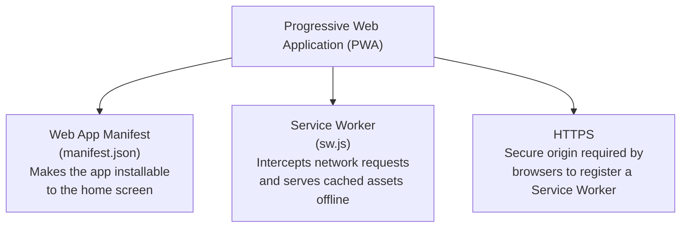
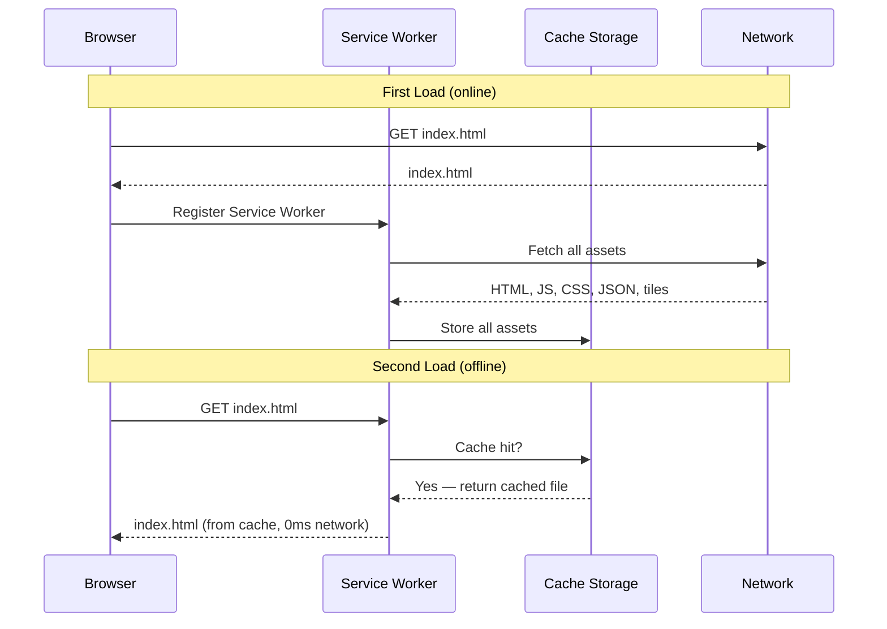
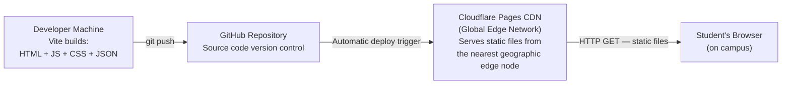
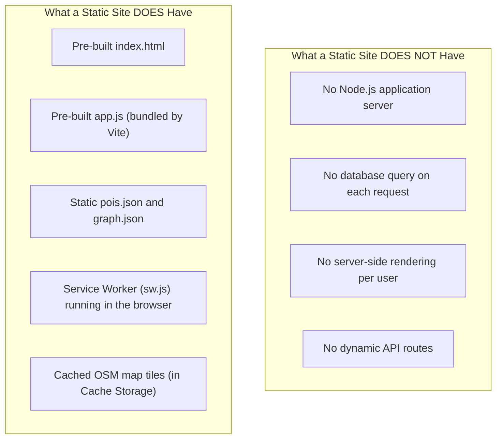
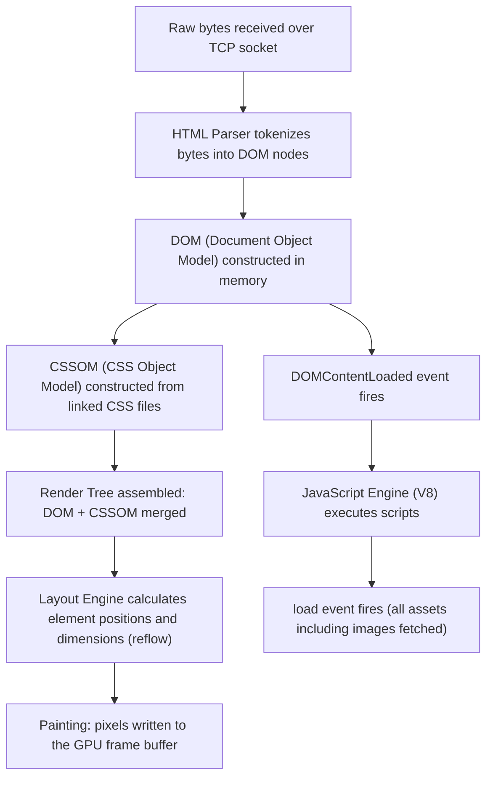
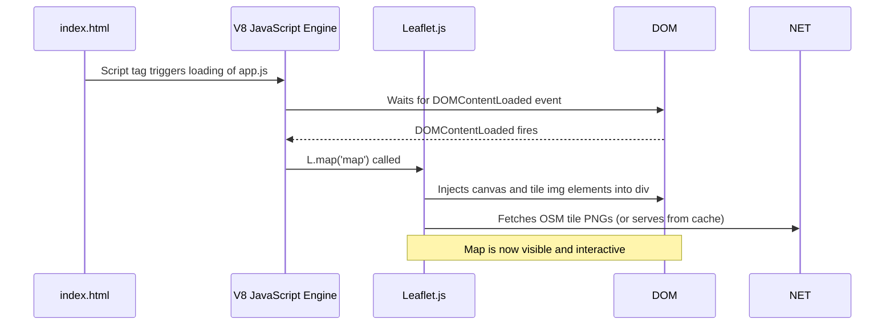

# Chapter 0 — Preworkout Manual
## UJ3DMap MVP | Project 1

> **Manual Rule**: This document is an instruction set — 20% explanation, 80% instructions. It tells you what to type and why each line behaves the way it does. Deep technical narratives, analogies, and scenarios from other codebases live exclusively in `Chapter_0_Preworkout_Explanation.md`.

---

## Table of Contents

| # | Section | Why This Order? |
|---|---------|-----------------|
| 0.1 | File Overview Table | You must know what every file does before writing a single line. Blind coding without a map creates unmaintainable spaghetti. |
| 0.2 | Concept: What is a PWA | The PWA mental model governs every architectural decision in this project. Understanding the PWA mental model before touching a file prevents structural mistakes. |
| 0.3 | Concept: Static Site Architecture | The static + CDN + Service Worker triangle determines your hosting choice, deployment strategy, and data management approach. |
| 0.4 | Concept: Browser Rendering Model | The browser rendering model determines how Leaflet.js injects map tiles, how the DOM is structured, and why `DOMContentLoaded` is required. |
| 0.5 | Holistic Concept Map | A master reference table for every concept introduced across all 9 chapters. Prevents surprise when a concept re-appears. |

---

## 0.1 File Overview Table

| File / Folder | Purpose | Chapter Where Created |
|---------------|---------|----------------------|
| `package.json` | Declares project dependencies and npm scripts | Ch 1 |
| `vite.config.js` | Configures the Vite build tool and PWA plugin | Ch 1 |
| `index.html` | The single HTML entry point for the application | Ch 1 |
| `src/style.css` | Global CSS styles | Ch 1 |
| `src/app.js` | Application entry point — wires all modules together | Ch 1 |
| `src/map.js` | Leaflet.js map initialization and layer management | Ch 1 |
| `public/pois.json` | Static array of Points of Interest with GPS coordinates | Ch 2 |
| `public/graph.json` | Static routing graph: nodes object + edges array | Ch 2 |
| `src/search.js` | Keyword search using `String.prototype.includes()` | Ch 3 |
| `src/routing.js` | A* pathfinding algorithm and graph builder | Ch 4 |
| `public/manifest.json` | Web App Manifest — makes the app installable | Ch 5 |
| `src/sw.js` | Service Worker — intercepts fetch events and serves from cache | Ch 5 |
| `README.md` | Project documentation | Ch 7 |

---

## 0.2 Concept: What is a PWA

A **Progressive Web Application (PWA)** is a website that uses a specific set of browser APIs to behave like a native mobile app. The three defining characteristics are installability, offline capability, and native-like UI. A PWA is not a framework — a PWA is a combination of three browser technologies working together.





---

## 0.3 Concept: Static Site Architecture

A **static site** is an application where every file served to the browser is a pre-built, unchanging file on disk. There is no application server generating HTML dynamically per request. Static files are served directly by a web server (or CDN) without computation.





---

## 0.4 Concept: Browser Rendering Model

The **browser rendering model** is the sequence of steps a browser engine executes between receiving an HTML file over HTTP and displaying a visible, interactive page. Leaflet.js and the application code depend on specific events in this pipeline.





**Why `DOMContentLoaded` is required:** Calling `L.map('map')` before the `<div id="map">` element exists in the DOM throws a JavaScript runtime error. The `DOMContentLoaded` event guarantees the DOM is fully parsed before Leaflet.js attempts to inject canvas elements.

```javascript
// src/app.js — wires all modules together after DOM is ready

document.addEventListener('DOMContentLoaded', () => {
  // `document.addEventListener` registers a callback on the document object;
  // the string `'DOMContentLoaded'` is the event name the HTML parser fires
  // after the HTML parser finishes building the entire DOM tree from the HTML source.
  
  initMap();
  // `initMap` is the named export from src/map.js;
  // calling `initMap()` here (not at the top of the file) guarantees
  // the `<div id="map">` element exists in the DOM before Leaflet.js
  // attempts to mount a canvas inside the `<div id="map">` element.
});
```

### 5W1H+Which — `document.addEventListener('DOMContentLoaded', () => { ... })`

| Element | What | When | Why | Where | How | Which |
|---------|------|------|-----|-------|-----|-------|
| `document` | The root DOM node representing the entire HTML document | Exists from the moment the HTML parser creates the first node | Acts as the event target — the object that will emit the `DOMContentLoaded` event | Global browser scope | Accessed via the browser's `window.document` property; `window` is implicit in browser JS | V8 engine's binding to the browser's C++ Document object |
| `.addEventListener` | Registers a listener function on the `document` event target | At parse time when V8 executes this line | Subscribes to the event without blocking HTML parsing | Called as a method on `document` | Pushes the callback into an internal event listener registry map keyed by event name | Web IDL `EventTarget.addEventListener` interface |
| `'DOMContentLoaded'` | The string name of the event to listen for | Passed at registration time | Identifies which event triggers the callback; this specific string fires when HTML parsing completes but before images and iframes load | First argument to `addEventListener` | The browser's HTML parser emits this event when it finishes building the DOM tree | Defined in the HTML Living Standard §8.5 |
| `() => { ... }` | An arrow function that executes when the event fires | Executed when `DOMContentLoaded` fires | Contains all initialization code that requires a complete DOM | Second argument to `addEventListener` | Arrow function syntax; does not bind a `this` context | ECMAScript arrow function expression grammar |
| `initMap()` | Calls the `initMap` function imported from `src/map.js` | Inside the DOMContentLoaded callback, after DOM exists | Initializes the Leaflet.js map instance and mounts it to `<div id="map">` | Inside the callback body | Function call expression; V8 looks up `initMap` in the current scope chain | Named function reference from ES6 module import |

---

## 0.5 Holistic Concept Map

This table lists every concept introduced across all 9 chapters. Use the table to predict what is coming and to locate where a concept is first taught.

| Concept | First Chapter | Reappears In | Notes |
|---------|--------------|--------------|-------|
| Progressive Web Application (PWA) | Ch 0 | Ch 5 | Ch 5 implements the PWA; Ch 0 defines it |
| Static Site Architecture | Ch 0 | Ch 8 | Ch 8 deploys the static site |
| Browser Rendering Model | Ch 0 | Ch 1 | Ch 1 uses `DOMContentLoaded` |
| Vite Build Tool | Ch 1 | Ch 8 | Ch 8 runs `vite build` for deployment |
| ES6 Modules | Ch 1 | Ch 3, Ch 4 | `import`/`export` used across all source files |
| Leaflet.js Map Initialization | Ch 1 | Ch 4 | Ch 4 renders the route polyline on the Leaflet.js map |
| OSM Tile System | Ch 1 | Ch 5 | Ch 5 caches OSM tiles in Cache Storage |
| GeoJSON Layer Rendering | Ch 1 | Ch 2, Ch 4 | Ch 2 defines GeoJSON; Ch 4 draws the route as GeoJSON |
| JSON Schema Design | Ch 2 | Ch 3, Ch 4 | Ch 3 searches `pois.json`; Ch 4 builds a graph from `graph.json` |
| Adjacency List Graph Representation | Ch 2 | Ch 4 | Ch 4 traverses the adjacency list |
| GeoJSON Standard | Ch 2 | Ch 1 (already treated in Ch 1) | GeoJSON introduced in Ch 1 for road overlays |
| `String.prototype.includes()` | Ch 3 | — | Used only in `search.js` |
| O(N) Linear Search | Ch 3 | — | Analysis concept for the search function |
| DOM Event Listeners | Ch 3 | Ch 4, Ch 5 | Ch 4 listens for route request clicks; Ch 5 listens for install prompt |
| Graph Traversal | Ch 4 | — | Core routing concept |
| Haversine Formula | Ch 4 | — | Computes geographic distance between two GPS coordinates |
| Priority Queue | Ch 4 | — | A* algorithm's open set data structure |
| A\* Algorithm | Ch 4 | — | Client-side pathfinding |
| Path Reconstruction | Ch 4 | — | Rebuilds the route from A* breadcrumb map |
| Service Worker Lifecycle | Ch 5 | — | Install, activate, fetch phases |
| Cache Storage API | Ch 5 | — | Browser API for storing HTTP responses |
| Fetch Event Interception | Ch 5 | — | Service Worker intercepts all outgoing HTTP requests |
| Web App Manifest | Ch 5 | — | JSON file that enables home screen installation |
| Lighthouse PWA Audit | Ch 6 | — | Automated performance and PWA compliance scoring |
| Manual Offline Testing Protocol | Ch 6 | — | DevTools Network tab → Offline simulation |
| README Structure | Ch 7 | — | Markdown documentation standard |
| JSDoc Inline Comments | Ch 7 | Ch 1, Ch 3, Ch 4 (already treated throughout) | Code annotation format |
| Cloudflare Pages | Ch 8 | — | Static hosting and CDN |
| CDN Edge Caching | Ch 8 | — | How Cloudflare serves files from geographic edge nodes |
| Static Asset Deployment Pipeline | Ch 8 | — | git push → auto-deploy → live URL |

---

*Gap Note: This chapter covers approximately 80% of what a pre-project orientation should include. The remaining 20% includes: formal user story mapping, accessibility requirements analysis (WCAG 2.1 AA), network performance budgeting (Core Web Vitals targets), and environment variable strategy. Study the Google Web Fundamentals PWA documentation and MDN's "Progressive web apps" guide to fill this gap.*
