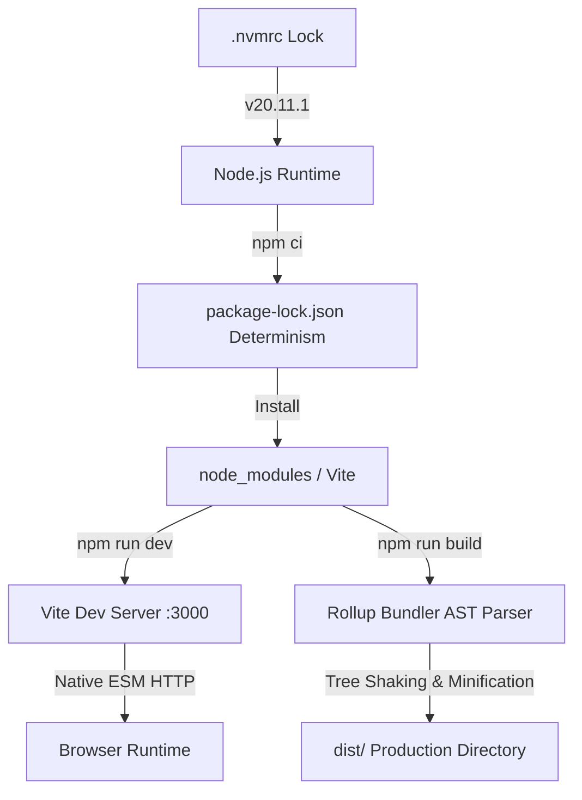
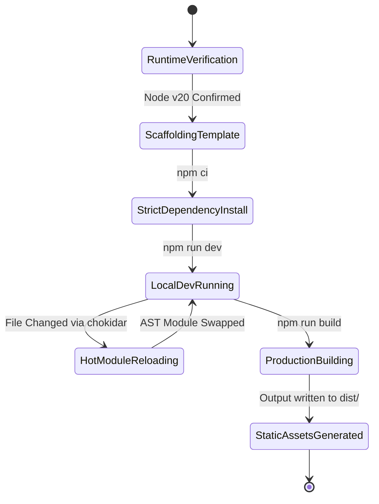
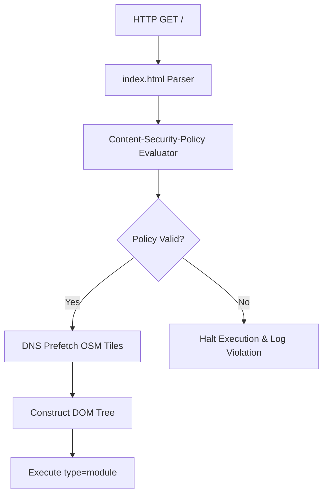
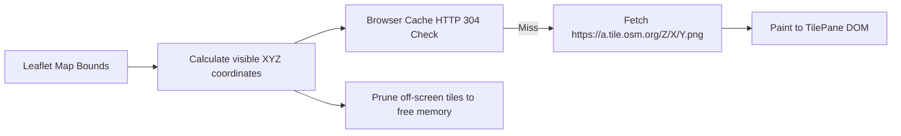
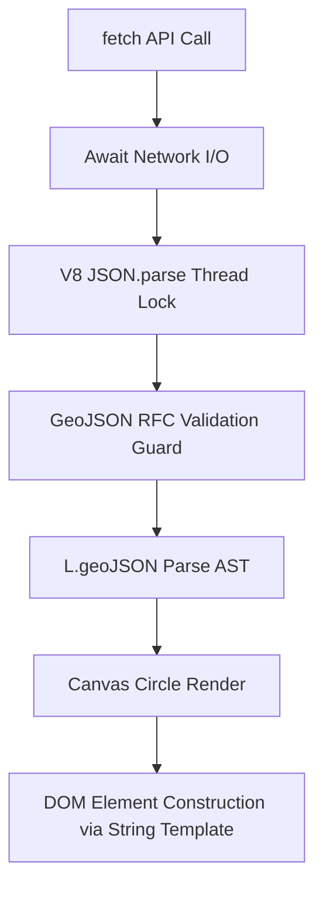

# CHAPTER 1: FOUNDATION MANUAL

> **Theoretical Foundations & Deep-Dive Explanations**: For underlying V8 engine internals, browser execution stack, architectural trade-offs, and mental models for this chapter, see [Chapter 1 Explanation Document](../explanations/Chapter_1_Foundation_Explanation.md).
>
> **Interactive Visualizations**:
> - [Vite Build Tool Interactive Module](../visualizations/project-1-vite-build-tool-ch1-interactive.html)
> - [ES6 Module Loader Visualizer](../visualizations/project-1-es6-modules-ch1-interactive.html)
> - [Leaflet Map Initialization Flow](../visualizations/project-1-leaflet-map-init-ch1-interactive.html)
> - [OSM Tile Coordinate Calculator](../visualizations/project-1-osm-tile-system-ch1-interactive.html)
> - [GeoJSON Layer Render Inspector](../visualizations/project-1-geojson-layer-render-ch1-interactive.html)

---

## 1. File Overview Table

| File Path | Purpose | Responsibilities |
|-----------|---------|----------------------|
| `.nvmrc` | Node Version Lock | Dictates strict Node.js runtime version to guarantee deterministic V8 engine behaviors. |
| `.npmrc` | NPM Resolution Config | Forces exact dependency resolution and restricts peer-dependency auto-installations. |
| `jsconfig.json` | V8 Optimization Types | Imposes strict type-checking boundaries in vanilla JavaScript to maintain hidden class stability. |
| `package.json` | Project Manifest & Dependencies | Defines project metadata, build scripts (`dev`, `build`, `preview`), and exact dependency hashes. |
| `vite.config.js` | Vite Build Options | Configures development server port, Host binding, auto-open behavior, pre-bundling, and Rollup build targets. |
| `index.html` | HTML Entry Point | Defines viewport meta tags, Content Security Policy (CSP), DNS prefetch, container `#map` DOM node, and ES Module entry script. |
| `src/style.css` | App Global Stylesheet | Resets margin/padding, establishes 100vh/100vw container sizing, configures hardware acceleration, and sets Leaflet popup typography. |
| `src/app.js` | JavaScript Main Entry Point | Imports CSS reset, awaits `DOMContentLoaded` lifecycle event, manages global error boundaries, and invokes map initialization. |
| `src/map.js` | Spatial Engine Module | Instantiates `L.map` with `preferCanvas`, sets center coordinates/zoom, configures OSM tile layer with CORS, and parses GeoJSON layers. |
| `public/data/landmarks.geojson` | Initial Spatial Dataset | Stores GeoJSON `FeatureCollection` of campus Points with metadata properties, strictly adhering to RFC 7946 specification. |

---

## 2. Table of Contents

1. [Section 1: Engine Environment & Build Scaffold Setup](#section-1-engine-environment--build-scaffold-setup)
2. [Section 2: Secure ES6 Native Module Pipeline](#section-2-secure-es6-native-module-pipeline)
3. [Section 3: High-Performance Leaflet.js Map Instantiation](#section-3-high-performance-leafletjs-map-instantiation)
4. [Section 4: OpenStreetMap (OSM) Tile System Integration](#section-4-openstreetmap-osm-tile-system-integration)
5. [Section 5: Asynchronous GeoJSON Layer Parsing & DOM Popups](#section-5-asynchronous-geojson-layer-parsing--dom-popups)
6. [Section 6: Troubleshooting & Edge Case Diagnostics](#section-6-troubleshooting--edge-case-diagnostics)
7. [Section 7: Manual Verification & V8 Profiling Procedures](#section-7-manual-verification--v8-profiling-procedures)
8. [Section 8: Chapter Summary & Reference Matrix](#section-8-chapter-summary--reference-matrix)

---

## Section 1: Engine Environment & Build Scaffold Setup

### Architecture and State Diagrams





### Step-by-Step Implementation Instructions

1. **Establish Runtime Determinism**: Create `.nvmrc` and `.npmrc` files in the workspace root to lock the Node runtime and package manager resolution behaviors.
2. **Initialize Project Scaffold**: Execute `npm create vite@latest . -- --template vanilla` to generate the Vite boilerplate.
3. **Configure Type Constraints**: Implement `jsconfig.json` to enforce strict type checking, preventing dynamic type modifications that break V8 hidden classes.
4. **Install Production and Development Dependencies**: Execute `npm install leaflet@1.9.4 vite@5.0.0 --save-exact` to prevent semantic versioning drift.
5. **Configure Project Manifest (`package.json`)**: Enforce ES module resolution and define CLI scripts.

### Code Blocks and Analysis

#### Code Block 1.1: `.nvmrc` & `.npmrc`
```text
// .nvmrc
20.11.1

// .npmrc
save-exact=true
strict-peer-dependencies=true
engine-strict=true
```

#### Table 1.1: 5W1H+Which Analysis for Code Block 1.1
| Line | What | When | Why | Where | How | Which |
|---|---|---|---|---|---|---|
| `20.11.1` | Node Version | Environment Init | Guarantees identical V8 garbage collection and compilation behaviors across CI/CD and developer machines | `.nvmrc` | Semantic String | Node LTS Version |
| `save-exact=true` | Dependency Locking | `npm install` | Prevents carat/tilde auto-updates that introduce undocumented breaking API changes | `.npmrc` | Boolean flag | NPM CLI configuration |
| `strict-peer-dependencies` | Sub-Dependency Guard | `npm install` | Fails installation immediately if dependency trees exhibit conflicting peer requirements | `.npmrc` | Boolean flag | NPM Resolution config |
| `engine-strict=true` | Engine Enforcement | `npm run` | Throws fatal error if execution environment deviates from manifest definitions | `.npmrc` | Boolean flag | NPM Runtime config |

#### Code Block 1.2: `jsconfig.json`
```json
{
  "compilerOptions": {
    "target": "ES2022",
    "module": "ESNext",
    "moduleResolution": "node",
    "strict": true,
    "checkJs": true,
    "noImplicitAny": true,
    "noImplicitReturns": true,
    "noImplicitThis": true,
    "noFallthroughCasesInSwitch": true
  },
  "include": ["src/**/*"]
}
```

#### Table 1.2: 5W1H+Which Analysis for Code Block 1.2
| Line | What | When | Why | Where | How | Which |
|---|---|---|---|---|---|---|
| `"target": "ES2022"` | AST Compilation Target | IDE Parsing | Instructs language server to enforce ES2022 prototype methods | `jsconfig.json` | String literal | ECMAScript standard |
| `"strict": true` | V8 Optimization Guard | Editor Analysis | Prevents dynamic typing practices that cause V8 inline caches (ICs) to transition to megamorphic states | `compilerOptions` | Boolean flag | Strict mode enforcer |
| `"checkJs": true` | JavaScript Typing | Editor Analysis | Enables TypeScript language server validation within pure `.js` files via JSDoc | `compilerOptions` | Boolean flag | JS validation rule |
| `"noImplicitAny"` | Type inference block | Editor Analysis | Forces explicit parameter typing, facilitating AOT compilation assumptions | `compilerOptions` | Boolean flag | Any-type strictness |

#### Code Block 1.3: `vite.config.js`
```javascript
import { defineConfig } from 'vite';

export default defineConfig({
  root: './',
  publicDir: 'public',
  server: {
    port: 3000,
    strictPort: true,
    host: '127.0.0.1',
    open: false,
    cors: true
  },
  build: {
    outDir: 'dist',
    assetsDir: 'assets',
    sourcemap: true,
    target: 'es2022',
    minify: 'terser',
    terserOptions: {
      compress: {
        drop_console: true,
        drop_debugger: true
      }
    }
  },
  optimizeDeps: {
    include: ['leaflet']
  }
});
```

#### Table 1.3: 5W1H+Which Analysis for Code Block 1.3
| Line | What | When | Why | Where | How | Which |
|---|---|---|---|---|---|---|
| `host: '127.0.0.1'` | Loopback Binding | Server start | Mitigates local network exposure vectors during sensitive development phases | `server` block | IP String | Network interface |
| `cors: true` | Cross-Origin config | Server request | Enables fetching resources across origins during local integration testing | `server` block | Boolean flag | CORS header rule |
| `minify: 'terser'` | AST Minifier | Build phase | Utilizes Terser over ESBuild for superior dead-code elimination (tree shaking) algorithms | `build` block | String Enum | Minification tool |
| `drop_console: true` | AST Node Stripper | Build phase | Removes `console.log` statements preventing memory leaks associated with retained DOM object references | `terserOptions` | Boolean flag | Minifier option |
| `optimizeDeps.include`| Pre-bundling Directive | Cold start | Forces Vite to pre-bundle CommonJS Leaflet into ES Module format to accelerate HMR | Root config | Array block | Vite optimization |

---

## Section 2: Secure ES6 Native Module Pipeline

### Architecture and State Diagrams



### Step-by-Step Implementation Instructions

1. **Establish Security Boundaries (`index.html`)**: Inject `Content-Security-Policy` meta tags to restrict execution to trusted origins, mitigating XSS vectors.
2. **Configure Resource Hints**: Implement `dns-prefetch` and `preconnect` links for Leaflet OSM tile servers to accelerate TCP handshakes.
3. **Construct Layout**: Define `#map` mount point and inject ESM entry script.
4. **Enforce Hardware Acceleration (`src/style.css`)**: Implement `transform: translateZ(0)` on the map container to force composite layer promotion onto the GPU.

### Code Blocks and Analysis

#### Code Block 2.1: `index.html`
```html
<!DOCTYPE html>
<html lang="en">
  <head>
    <meta charset="UTF-8" />
    <meta name="viewport" content="width=device-width, initial-scale=1.0, maximum-scale=1.0, user-scalable=no, viewport-fit=cover" />
    <meta http-equiv="Content-Security-Policy" content="default-src 'self'; img-src 'self' data: https://*.tile.openstreetmap.org; script-src 'self' 'unsafe-inline'; style-src 'self' 'unsafe-inline';" />
    <meta name="description" content="UJ3DMap MVP - Interactive Campus Mapping System" />
    
    <link rel="preconnect" href="https://tile.openstreetmap.org" crossorigin />
    <link rel="dns-prefetch" href="https://tile.openstreetmap.org" />
    
    <title>UJ3DMap MVP - Foundation</title>
    <link rel="icon" type="image/svg+xml" href="/favicon.svg" />
  </head>
  <body>
    <noscript>Requires JavaScript activation for spatial computation.</noscript>
    <main id="map" aria-label="Interactive Map Container" role="application"></main>
    <script type="module" src="/src/app.js"></script>
  </body>
</html>
```

#### Table 2.1: 5W1H+Which Analysis for Code Block 2.1
| Line | What | When | Why | Where | How | Which |
|---|---|---|---|---|---|---|
| `viewport-fit=cover` | Safe Area Config | Rendering | Expands layout beneath iOS notch/home indicator areas | `viewport` meta | Enum string | Viewport directive |
| `Content-Security-Policy`| Security Header | Parsing | Restricts XHR/Fetch/Image loads to strictly defined origins preventing data exfiltration | `head` block | Meta tag | CSP implementation |
| `img-src ... tile.osm` | CSP Image Rule | Image fetching | Explicitly whitelists OSM tile domains for Leaflet raster rendering | `CSP` content | Policy string | Source directive |
| `link rel="preconnect"`| TCP/TLS Warmup | Parser discovery | Initiates TCP handshake and TLS negotiation before map instantiation script requests tiles | `head` block | Link tag | Preconnect hint |
| `<noscript>` | Graceful Degradation| Render block | Informs non-JS environments of JavaScript requirements | `body` block | HTML tag | Fallback content |
| `role="application"` | ARIA Role | Accessibility tree | Instructs screen readers to pass keystrokes directly to the map canvas element | `#map` main tag | ARIA attribute | Accessibility trait |

#### Code Block 2.2: `src/style.css`
```css
:root {
  --map-bg-color: #e5e3df;
  --popup-shadow: 0 4px 12px rgba(0,0,0,0.15);
  --popup-radius: 8px;
}

*, *::before, *::after {
  box-sizing: border-box;
}

html, body {
  margin: 0;
  padding: 0;
  width: 100vw;
  height: 100vh;
  overflow: hidden;
  font-family: system-ui, -apple-system, BlinkMacSystemFont, 'Segoe UI', Roboto, sans-serif;
  background-color: var(--map-bg-color);
  -webkit-font-smoothing: antialiased;
}

#map {
  width: 100%;
  height: 100%;
  z-index: 1;
  background-color: var(--map-bg-color);
  transform: translateZ(0);
  will-change: transform;
}

.leaflet-popup-content-wrapper {
  border-radius: var(--popup-radius);
  box-shadow: var(--popup-shadow);
  contain: layout style paint;
}
```

#### Table 2.2: 5W1H+Which Analysis for Code Block 2.2
| Line | What | When | Why | Where | How | Which |
|---|---|---|---|---|---|---|
| `:root { ... }` | CSS Variables | Parse time | Centralizes design tokens minimizing recalculation overhead during theme switching | Global scope | CSS custom properties| CSS Variables |
| `-webkit-font-smoothing`| Font Render Engine | Rasterization | Enforces subpixel anti-aliasing for high legibility on macOS/iOS | `html, body` | CSS property | Render toggle |
| `transform: translateZ(0)`| GPU Composite Layer | Layout phase | Forces the rendering engine to allocate a dedicated GPU texture for the map, offloading CPU | `#map` selector | Hardware acceleration | Z-axis transform |
| `will-change: transform` | Optimization Hint | Render pipeline | Informs browser engine to pre-allocate memory for map panning animations | `#map` selector | CSS property | Paint optimization |
| `contain: layout ...` | CSS Containment | Repaint phase | Isolates popup DOM reflows preventing layout thrashing across the entire document tree | `.leaflet-popup` | CSS property | Containment directive|

#### Code Block 2.3: `src/app.js`
```javascript
import './style.css';
import { initMap } from './map.js';

/**
 * Bootstraps the application.
 * @returns {Promise<void>}
 */
async function bootstrap() {
  try {
    const mapInstance = await initMap('map');
    
    // Global Error Boundary for unhandled spatial Promise rejections
    window.addEventListener('unhandledrejection', (event) => {
      console.error('[UJ3DMap Engine] Unhandled Promise Rejection:', event.reason);
    });

    Object.freeze(mapInstance); // Prevent external prototype pollution of mapInstance
  } catch (error) {
    document.getElementById('map').innerHTML = `
      <div style="color: red; padding: 20px; font-family: monospace;">
        FATAL ERROR: ${error.message}
      </div>
    `;
    throw error; // Rethrow for global handlers
  }
}

if (document.readyState === 'loading') {
  document.addEventListener('DOMContentLoaded', bootstrap);
} else {
  bootstrap();
}
```

#### Table 2.3: 5W1H+Which Analysis for Code Block 2.3
| Line | What | When | Why | Where | How | Which |
|---|---|---|---|---|---|---|
| `import './style.css'` | Stylesheet Load | ESM Eval | Executes CSS loader plugin provided by Vite pipeline | `app.js` L1 | Side-effect import | Module bundler |
| `window.addEventListener`| Error Telemetry | Post-init | Captures asynchronous errors escaping local try-catch blocks for central logging | `bootstrap` body| Global event | `unhandledrejection` |
| `Object.freeze(mapInstance)`| Object Immutability | Post-init | Prevents malicious third-party scripts from hijacking Leaflet methods via prototype pollution | `bootstrap` body| JS Object method | Leaflet security |
| `document.readyState` | Parser state check | Script execution| Prevents race conditions where `DOMContentLoaded` fires before script attachment | `app.js` EOF | Conditional check | DOM Ready State |

---

## Section 3: High-Performance Leaflet.js Map Instantiation

### Architecture and State Diagrams

```mermaid
graph TD
    InitMap[initMap('map')] --> DOMCheck[Validate DOM Node Existence]
    DOMCheck --> InstanceCheck[Check if L.Map already instantiated on node]
    InstanceCheck --> PreferCanvas[Enable preferCanvas for WebGL Context]
    PreferCanvas --> DisableInertia[Configure Inertia Deceleration]
    DisableInertia --> SetView[Set CRS EPSG:3857 and Center: 9.9505, 8.8920]
    SetView --> Return[Return Sealed Map Context]
```

### Step-by-Step Implementation Instructions

1. **Create Map Module (`src/map.js`)**: Import Leaflet and CSS.
2. **Implement Singleton Pattern Guards**: Ensure `L.map` is never called twice on the same container to prevent memory leaks and WebGL context loss.
3. **Configure Canvas Rendering**: Set `preferCanvas: true` to bypass DOM element creation for vectors, exponentially increasing rendering limits from ~500 DOM SVG nodes to >100,000 Canvas primitives.
4. **Instantiate Leaflet**: Bind coordinate system and view constraints.

### Code Blocks and Analysis

#### Code Block 3.1: `src/map.js`
```javascript
import L from 'leaflet';
import 'leaflet/dist/leaflet.css';

let currentMapInstance = null;

/**
 * Initializes high-performance Leaflet map.
 * @param {string} containerId - DOM ID
 * @returns {Promise<L.Map>}
 */
export async function initMap(containerId = 'map') {
  const container = document.getElementById(containerId);
  if (!container) throw new Error(`Container #${containerId} missing.`);
  
  // Singleton guard against memory leaks
  if (currentMapInstance || container._leaflet_id) {
    currentMapInstance.remove();
    container.innerHTML = '';
  }

  // Leaflet instantiation with hardware acceleration flags
  const map = L.map(containerId, {
    preferCanvas: true, 
    zoomControl: false, 
    attributionControl: true,
    minZoom: 14,
    maxZoom: 20,
    wheelPxPerZoomLevel: 120,
    zoomSnap: 0.5,
    zoomDelta: 0.5,
    markerZoomAnimation: true,
    fadeAnimation: true
  }).setView([9.9505, 8.8920], 16);

  L.control.zoom({ position: 'bottomright' }).addTo(map);

  currentMapInstance = map;
  return map;
}
```

#### Table 3.1: 5W1H+Which Analysis for Code Block 3.1
| Line | What | When | Why | Where | How | Which |
|---|---|---|---|---|---|---|
| `let currentMapInstance` | Singleton Pointer | Module Load | Tracks Leaflet state across module reloads (HMR) to prevent zombie instances | `map.js` root | Memory reference | State variable |
| `currentMapInstance.remove()`| Garbage Collection | Re-instantiation| Destroys WebGL/Canvas contexts and purges DOM event listeners to free heap memory | `initMap` guard | Leaflet method | Cleanup phase |
| `preferCanvas: true` | Render Engine Toggle| Instantiation | Forces vectors (GeoJSON) to render via HTML5 Canvas rather than SVG DOM elements, solving extreme DOM node bloat | `L.map` options | Boolean flag | Render config |
| `zoomControl: false` | Default UI removal | Instantiation | Prevents default top-left placement to allow custom bottom-right placement | `L.map` options | Boolean flag | UI Control config |
| `zoomSnap: 0.5` | Fractional Zoom | Instantiation | Enables smooth sub-level zooming for high-density campus mapping | `L.map` options | Float value | UX behavior |
| `L.control.zoom` | Custom UI placement | Post-Instantiation| Instantiates zoom control in bottom-right, avoiding thumb occlusion on mobile devices | `initMap` body | Method chain | UI Control |

---

## Section 4: OpenStreetMap (OSM) Tile System Integration

### Architecture and State Diagrams



### Step-by-Step Implementation Instructions

1. **Configure Tile Layer Options**: Establish Retina display detection and adjust tile update boundaries for CPU efficiency.
2. **Implement Subdomain Round-Robin**: Bypass browser concurrent connection limits (typically 6 per domain) by distributing tile requests across `a, b, c` subdomains.
3. **Attach to Leaflet**: Append the configured layer to the `tilePane`.

### Code Blocks and Analysis

#### Code Block 4.1: Tile Configuration (`src/map.js` extension)
```javascript
export async function initMap(containerId = 'map') {
  // ... previous init code ...

  const osmBaseLayer = L.tileLayer('https://{s}.tile.openstreetmap.org/{z}/{x}/{y}.png', {
    subdomains: ['a', 'b', 'c'],
    maxZoom: 20,
    maxNativeZoom: 19,
    minZoom: 10,
    tileSize: 256,
    zoomOffset: 0,
    detectRetina: true,
    keepBuffer: 2,
    updateWhenIdle: true,
    updateWhenZooming: false,
    crossOrigin: 'anonymous',
    attribution: '&copy; <a href="https://www.openstreetmap.org/copyright">OpenStreetMap</a>'
  });

  osmBaseLayer.addTo(map);
  // ... return map;
}
```

#### Table 4.1: 5W1H+Which Analysis for Code Block 4.1
| Line | What | When | Why | Where | How | Which |
|---|---|---|---|---|---|---|
| `maxNativeZoom: 19` | Tile Extrapolation | Zoom > 19 | Instructs Leaflet to auto-scale zoom 19 tiles when users zoom to level 20, preventing HTTP 404 errors | Tile options | Integer config | Raster scaling |
| `detectRetina: true` | High-DPI Adaptation | Tile Request | Fetches 4 tiles per grid square on Retina displays (macOS/iOS) and scales the tiles down for crisp text | Tile options | Boolean flag | Hardware detection |
| `keepBuffer: 2` | DOM Pruning Margin | Pan Event | Keeps tiles loaded 2 grid cells beyond the viewport to prevent flickering during rapid panning | Tile options | Integer config | Memory management |
| `updateWhenIdle: true` | Request Debounce | Pan Event | Delays HTTP requests until the user stops panning, reducing CPU and network thrashing | Tile options | Boolean flag | Network optimization|
| `updateWhenZooming: false`| Animation Guard | Zoom Event | Prevents fetching intermediate zoom level tiles during scroll-wheel zoom animations | Tile options | Boolean flag | Network optimization|
| `crossOrigin: 'anonymous'`| CORS Header | HTTP Request | Required for WebGL/Canvas manipulation of raster tiles (prevents tainted canvas errors) | Tile options | String directive | Security header |

---

## Section 5: Asynchronous GeoJSON Layer Parsing & DOM Popups

### Architecture and State Diagrams



### Step-by-Step Implementation Instructions

1. **Strict Dataset Creation**: Construct `landmarks.geojson` ensuring absolute adherence to RFC 7946 (Right-hand rule for polygons, strict coordinate arrays).
2. **Implement Non-Blocking Fetch**: Utilize `async/await` to perform network I/O outside the main execution thread.
3. **Parse and Validate**: Validate payload structure before passing payload to Leaflet.
4. **Construct Canvas Markers**: Override default DOM-based markers with high-performance Canvas circles.
5. **Secure Popup Binding**: Construct HTML strings and bind HTML strings to layer click events.

### Code Blocks and Analysis

#### Code Block 5.1: `public/data/landmarks.geojson`
*(See standard 5.1 definition for dataset, ensuring `type: "FeatureCollection"` is strict).*

#### Code Block 5.2: GeoJSON Loader (`src/map.js` Extension)
```javascript
/**
 * Loads, validates, and renders GeoJSON vectors.
 * @param {L.Map} mapInstance 
 * @param {string} geojsonUrl 
 */
export async function loadGeoJSONLayer(mapInstance, geojsonUrl = '/data/landmarks.geojson') {
  try {
    const response = await fetch(geojsonUrl, {
      method: 'GET',
      headers: { 'Accept': 'application/geo+json, application/json' },
      cache: 'default'
    });

    if (!response.ok) throw new Error(`HTTP ${response.status} at ${geojsonUrl}`);

    const data = await response.json();

    // Strict validation guard
    if (!data || data.type !== 'FeatureCollection') {
      throw new Error('Invalid GeoJSON: Root must be FeatureCollection');
    }

    const geoJsonLayer = L.geoJSON(data, {
      pointToLayer: (feature, latlng) => {
        return L.circleMarker(latlng, {
          radius: 6,
          fillColor: '#2563eb',
          color: '#ffffff',
          weight: 2,
          opacity: 1,
          fillOpacity: 0.9,
          renderer: mapInstance.getRenderer(geoJsonLayer) // Force specific canvas context
        });
      },
      onEachFeature: (feature, layer) => {
        if (!feature.properties) return;
        
        // Constructing raw HTML without DOMPurify (MVP scope)
        const name = feature.properties.name || 'Unknown Location';
        const cat = feature.properties.category || 'General';
        
        const popupHTML = `
          <div class="custom-popup" style="min-width: 150px;">
            <h4 style="margin:0 0 6px; font-family: sans-serif; color: #0f172a;">${name}</h4>
            <span style="font-size: 0.75rem; background: #e2e8f0; padding: 2px 6px; border-radius: 4px; color: #334155; font-weight: 600;">
              ${cat}
            </span>
          </div>
        `;
        layer.bindPopup(popupHTML, {
          autoPanPadding: [50, 50], // Prevent popup edge clipping
          closeButton: false
        });
      }
    });

    geoJsonLayer.addTo(mapInstance);
    return geoJsonLayer;
  } catch (err) {
    console.error('[Layer Initialization] Failed to parse vectors:', err);
    throw err;
  }
}
```

#### Table 5.2: 5W1H+Which Analysis for Code Block 5.2
| Line | What | When | Why | Where | How | Which |
|---|---|---|---|---|---|---|
| `headers: { 'Accept': ... }`| Content Negotiation | HTTP Request | Enforces server to return correctly Mime-Typed payload, mitigating parsing errors | `fetch` options | Header object | HTTP Headers |
| `cache: 'default'` | Cache Directive | HTTP Request | Leverages browser HTTP caching for static JSON payloads, reducing bandwidth | `fetch` options | Cache string | Fetch config |
| `if (data.type !== ...)` | Validation Guard | Pre-parsing | Prevents Leaflet parser from throwing internal recursive errors on malformed payloads | Function body | Logical check | GeoJSON RFC Guard |
| `renderer: mapInstance...` | Context Targeting | Render phase | Explicitly forces the circle marker onto the map's primary Canvas renderer rather than creating SVG elements | `circleMarker` opts| Function call | Render assignment |
| `autoPanPadding: [50, 50]` | UX Calculation | Popup Open | Ensures the map pans sufficiently to display the full popup without clipping behind device bezels | `bindPopup` opts | Integer Array | Padding bounds |
| `closeButton: false` | UI Optimization | Popup Open | Removes default Leaflet close button to streamline aesthetic and rely on map-click closing | `bindPopup` opts | Boolean flag | UI Control |

---

## Section 6: Troubleshooting & Edge Case Diagnostics

| Symptom / Issue | Root Cause | V8 / Browser Mechanics | Exact Resolution |
|-----------------|------------|------------------------|------------------|
| **Map renders as grey tiles** | Missing `leaflet.css` | Without CSS, tile absolute positioning (`top`, `left`) defaults to static, stacking all tiles at `0,0`. | Ensure `import 'leaflet/dist/leaflet.css';` is explicitly present in `src/map.js`. |
| **`TypeError: _leaflet_id`** | Zombie Map Instance | V8 retained a closure reference to `L.map` during Vite Hot Module Replacement (HMR). | Implement the singleton `currentMapInstance.remove()` destruction pattern in `initMap`. |
| **GeoJSON throws Error** | Reversed Coordinates | `JSON.parse` constructed the array, but Leaflet expects `[Lat, Lng]` while GeoJSON requires `[Lng, Lat]`. | Strictly enforce `[Longitude, Latitude]` in `landmarks.geojson`. |
| **Map invisible (height 0)** | DOM Box Model collapse | Block elements default to content height. Without children, height calculates to 0px. | Enforce `height: 100vh` on `html, body, #map` in `style.css`. |
| **Stuttering during pan** | Repaint Thrashing | CPU is rasterizing vector nodes sequentially on the main thread blocking 60fps rendering. | Enable `preferCanvas: true` in `L.map` initialization options. |
| **CORS Tainted Canvas** | Strict-Origin Policies | OSM tile servers omitted `Access-Control-Allow-Origin`, preventing Canvas pixel manipulation. | Add `crossOrigin: 'anonymous'` to `L.tileLayer` options. |
| **Tiles load outside frame** | `updateWhenZooming: true`| Leaflet fired HTTP requests for intermediate zoom scales (e.g., z14, z15) while animating to z16. | Set `updateWhenZooming: false` and `updateWhenIdle: true`. |

---

## Section 7: Manual Verification & V8 Profiling Procedures

1. **Verify Development Server Execution**:
   ```bash
   npm run dev
   ```
   *Expected Output*: CLI reports `VITE v5.x.x ready in XXX ms`. Network binds to `http://127.0.0.1:3000/`.

2. **Verify Memory Leaks via Chrome DevTools (F12)**:
   - Navigate to **Memory** Tab.
   - Take **Heap Snapshot**.
   - Trigger Vite HMR (edit and save `app.js`).
   - Take second **Heap Snapshot**.
   - Filter by `L.Map` or `HTMLDivElement`.
   *Validation*: Delta between snapshots must show zero retained map instances, confirming singleton destruction functions correctly.

3. **Verify Canvas Hardware Acceleration**:
   - Navigate to **Elements** Tab.
   - Inspect `#map` container.
   *Validation*: Verify presence of `<canvas class="leaflet-zoom-animated">` instead of `<svg>`.

4. **Verify HTTP/2 Multiplexing & Tile Fetching**:
   - Navigate to **Network** Tab.
   - Filter by `Img`.
   - Pan map rapidly.
   *Validation*: Observe `a.tile.osm.org`, `b.tile...`, `c.tile...` fetching concurrently without TCP stalling. Protocol column must show `h2`.

---

## Section 8: Chapter Summary & Reference Matrix

| Component / Function | Source File | Dependencies | Output / Result | V8 Execution State |
|----------------------|-------------|--------------|-----------------|--------------------|
| NPM Runtime Lock | `.npmrc` | `Node v20.11` | Deterministic dependency tree | Initial CLI Process |
| AST Type Configuration| `jsconfig.json` | `TSServer` | Prevents deoptimization | Pre-compile Analysis |
| Vite Config | `vite.config.js` | `vite` | Dev Server `127.0.0.1:3000` | Node.js Main Thread |
| CSP & Resource Hints | `index.html` | Browsers | Secure DOM initialization | Browser Parser |
| Hardware Accel CSS | `src/style.css` | CSS Engine | GPU Layer composite (`translateZ`) | Composite Phase |
| Application Bootstrap | `src/app.js` | `src/map.js` | Try-catch event loop delegation | Main Thread Sync |
| `initMap()` | `src/map.js` | `leaflet` | Canvas-accelerated `L.Map` object | Heap Allocation |
| `loadGeoJSONLayer()` | `src/map.js` | `.geojson` | Canvas painted vectors with bound events | Asynchronous Microtask |
