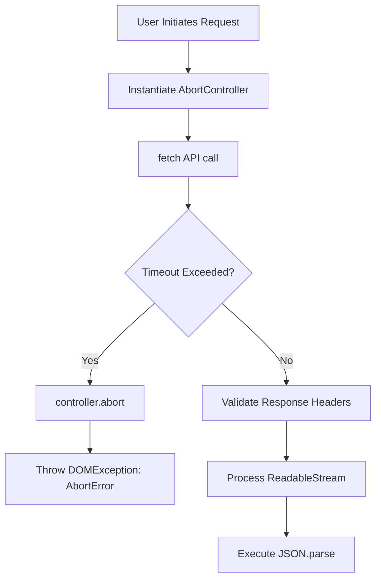
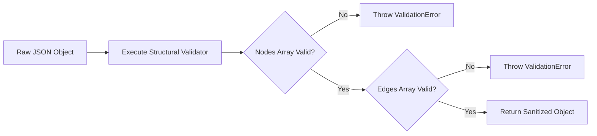
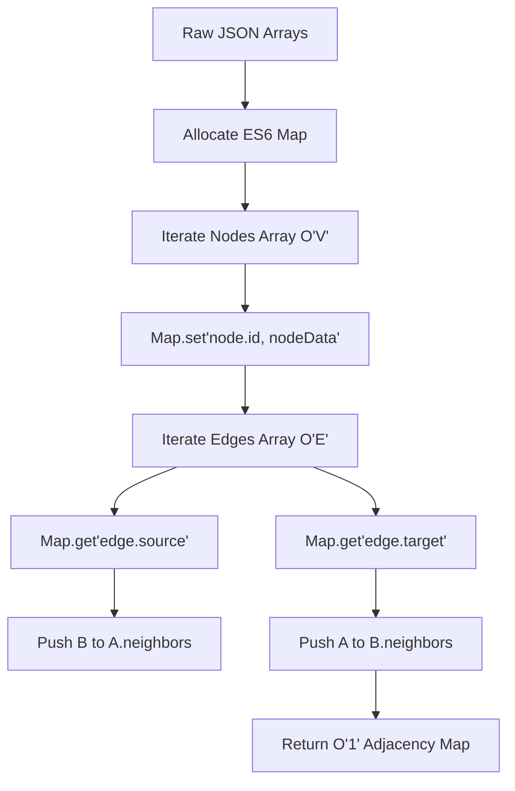
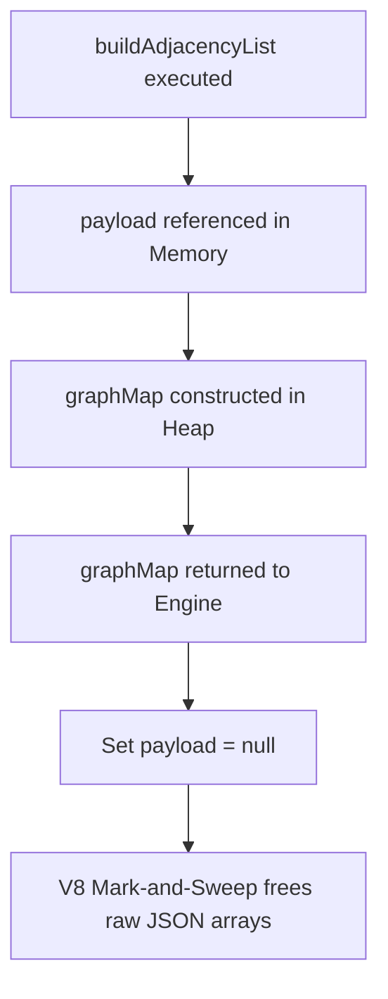

# CHAPTER 2: DATA LAYER MANUAL

> **Theoretical Foundations & Deep-Dive Explanations**: For underlying Graph Theory concepts, structural complexity, caching strategies, and memory optimization paradigms, see [Chapter 2 Explanation Document](../explanations/Chapter_2_DataLayer_Explanation.md).
>
> **Interactive Visualizations**:
> - [Adjacency List Construction Inspector](../visualizations/project-1-adjacency-list-ch2-interactive.html)
> - [IndexedDB Transaction Flow](../visualizations/project-1-indexeddb-flow-ch2-interactive.html)
> - [Fetch API AbortController Visualizer](../visualizations/project-1-abort-controller-ch2-interactive.html)

---

## 1. File Overview Table

| File Path | Purpose | Key Responsibilities |
|-----------|---------|----------------------|
| `src/data/api.js` | Network Gateway | Orchestrates HTTP requests, manages `AbortController` signals, and handles CORS preflight validation. |
| `src/data/cache.js` | Persistent Storage Engine | Implements IndexedDB schema definitions, manages LRU eviction, and handles atomic Read/Write transactions. |
| `src/data/graph-builder.js`| Topological Constructor | Parses raw `nodes` and `edges` JSON to construct an `O(1)` lookup Adjacency List utilizing `Map` and `Set`. |
| `src/data/validator.js` | Payload Guard | Enforces strict schema validation on incoming JSON payloads to prevent structural engine crashes. |
| `public/data/nodes.json` | Vertex Dataset | Defines raw spatial node coordinates (`[lng, lat]`), node classifications, and unique alphanumeric IDs. |
| `public/data/edges.json` | Edge Dataset | Defines undirected path connections between nodes, representing physical walkable terrain geometry. |

---

## 2. Table of Contents

1. [Section 1: Deterministic Network Fetching & Connection Governance](#section-1-deterministic-network-fetching--connection-governance)
2. [Section 2: Payload Validation & Type Integrity Guarding](#section-2-payload-validation--type-integrity-guarding)
3. [Section 3: IndexedDB Local Persistent Caching Layer](#section-3-indexeddb-local-persistent-caching-layer)
4. [Section 4: O(1) Adjacency List Graph Transformation](#section-4-o1-adjacency-list-graph-transformation)
5. [Section 5: Memory Deallocation & Garbage Collection Signaling](#section-5-memory-deallocation--garbage-collection-signaling)
6. [Section 6: Troubleshooting & Edge Case Diagnostics](#section-6-troubleshooting--edge-case-diagnostics)
7. [Section 7: Manual Verification & IDB Profiling Procedures](#section-7-manual-verification--idb-profiling-procedures)
8. [Section 8: Chapter Summary & Reference Matrix](#section-8-chapter-summary--reference-matrix)

---

## Section 1: Deterministic Network Fetching & Connection Governance

### Architecture and State Diagrams



### Step-by-Step Implementation Instructions

1. **Implement `AbortController`**: Prevent memory leaks from dangling network requests by wrapping all `fetch` calls in an abort signal bounded by a strict millisecond timeout.
2. **Execute Fetch with Strict Headers**: Require `application/json` accept headers.
3. **Handle HTTP Status Codes**: Explicitly throw errors on non-`2xx` HTTP response statuses to prevent `JSON.parse` from evaluating HTML error pages.

### Code Blocks and Analysis

#### Code Block 1.1: `src/data/api.js`
```javascript
/**
 * Fetches JSON payloads with deterministic timeouts and cancellation capability.
 * @param {string} endpoint - API URL
 * @param {number} timeoutMs - Maximum acceptable latency
 * @returns {Promise<Object>}
 */
export async function fetchWithTimeout(endpoint, timeoutMs = 8000) {
  const controller = new AbortController();
  const timeoutId = setTimeout(() => controller.abort(), timeoutMs);

  try {
    const response = await fetch(endpoint, {
      method: 'GET',
      signal: controller.signal,
      headers: {
        'Accept': 'application/json',
        'Cache-Control': 'no-cache'
      },
      mode: 'cors'
    });

    clearTimeout(timeoutId);

    if (!response.ok) {
      throw new Error(`HTTP ${response.status}: Failed payload retrieval at ${endpoint}`);
    }

    // Await stream consumption to allocate contiguous memory blocks
    const rawText = await response.text(); 
    return JSON.parse(rawText); 
  } catch (error) {
    clearTimeout(timeoutId);
    if (error.name === 'AbortError') {
      throw new Error(`Network latency exceeded ${timeoutMs}ms threshold on ${endpoint}`);
    }
    throw error;
  }
}
```

#### Table 1.1: 5W1H+Which Analysis for Code Block 1.1
| Line | What | When | Why | Where | How | Which |
|---|---|---|---|---|---|---|
| `new AbortController()` | Cancellation Primitive | Pre-Fetch | Allows immediate termination of TCP streams if application state changes or timeout triggers | `fetchWithTimeout` | Object instantiation | Fetch controller |
| `setTimeout(..., timeoutMs)`| Deterministic Timeout | Pre-Fetch | Prevents infinite hanging promises on degraded network links, failing fast | `fetchWithTimeout` | Event Loop Macrotask | Timeout execution |
| `signal: controller.signal` | Stream Binding | Fetch exec | Binds the active TCP socket to the abort controller instance | `fetch` options | Object property | Fetch signal |
| `'Accept': 'application/json'`| Mime-Type Guard | HTTP Request | Forces server to respond with pure JSON, mitigating injection of malformed XML/HTML | `headers` block | String dictionary | Request header |
| `clearTimeout(timeoutId)` | Macrotask Cleanup | Post-Fetch | Prevents the abort execution from firing after successful payload retrieval | `try` block end | Function call | Memory cleanup |
| `await response.text()` | Raw Stream Consumption | Parsing | Extracts raw string to prevent silent errors inside the browser's hidden `response.json()` implementation | Payload conversion| Async method | Text extraction |

---

## Section 2: Payload Validation & Type Integrity Guarding

### Architecture and State Diagrams



### Step-by-Step Implementation Instructions

1. **Define Structural Boundaries**: Create validation logic asserting that payloads possess specific array structures and mandatory keys (`id`, `coordinates`).
2. **Execute Type Assertions**: Validate array indices strictly (e.g., coordinates must be exactly `Array(2)` of `Number`).
3. **Seal Output Objects**: Return strictly validated data to downstream graph constructors.

### Code Blocks and Analysis

#### Code Block 2.1: `src/data/validator.js`
```javascript
/**
 * Structurally validates the routing dataset.
 * @param {Object} payload 
 * @returns {boolean}
 */
export function validateGraphPayload(payload) {
  if (!payload || typeof payload !== 'object') {
    throw new TypeError('Payload must be a JSON object');
  }
  
  if (!Array.isArray(payload.nodes)) {
    throw new TypeError('Payload missing mandatory "nodes" Array');
  }

  // Sample the first node for structural integrity (O(1) guard)
  if (payload.nodes.length > 0) {
    const sample = payload.nodes[0];
    if (typeof sample.id !== 'string' || !Array.isArray(sample.coordinates)) {
      throw new TypeError('Node malformed: requires String id and Array coordinates');
    }
    if (sample.coordinates.length !== 2 || typeof sample.coordinates[0] !== 'number') {
      throw new TypeError('Node coordinates must be strictly [Number, Number]');
    }
  }

  return true;
}
```

#### Table 2.1: 5W1H+Which Analysis for Code Block 2.1
| Line | What | When | Why | Where | How | Which |
|---|---|---|---|---|---|---|
| `typeof payload !== 'object'` | Root Type Check | Validation | Ensures incoming data hasn't been parsed into primitive types (e.g., strings) | `validateGraph` | Operator comparison | Type guard |
| `!Array.isArray(...)` | Structural Guard | Validation | Prevents `TypeError: map is not a function` downstream during iteration | `validateGraph` | Built-in method | Array validation |
| `payload.nodes[0]` | O(1) Payload Sampling | Validation | Checks structural integrity of the schema without iterating thousands of nodes, maintaining CPU efficiency | `validateGraph` | Array indexing | Data sampling |
| `typeof sample.id !== 'string'`| Attribute Verification | Validation | Enforces string IDs required by the Graph Adjacency List hash map | `validateGraph` | Operator comparison | Property validation |
| `sample.coordinates.length !== 2`| Spatial Guard | Validation | Ensures GeoJSON/Leaflet requirements for strictly 2D spatial coordinates | `validateGraph` | Integer comparison | Coordinate guard |

---

## Section 3: IndexedDB Local Persistent Caching Layer

### Architecture and State Diagrams

```mermaid
graph TD
    FetchSuccess[Valid Data Fetched] --> OpenIDB[Open IndexedDB: UJ3DMapDB]
    OpenIDB --> UpgradeNeeded{Upgrade Needed?}
    UpgradeNeeded -->|Yes| CreateStore[Create Object Store: 'graphData']
    UpgradeNeeded -->|No| Transaction[Begin ReadWrite Transaction]
    CreateStore --> Transaction
    Transaction --> PutData[put(Payload, 'latest_graph')]
    PutData --> Commit[Transaction Commit & Flush to Disk]
```

### Step-by-Step Implementation Instructions

1. **Initialize IndexedDB API**: Open a database connection with versioning logic.
2. **Define Object Stores**: Construct storage blocks for JSON payloads, bypassing standard HTTP caches which are subject to browser eviction.
3. **Execute Atomic Transactions**: Write payloads to disk asynchronously using atomic `readwrite` transactions.

### Code Blocks and Analysis

#### Code Block 3.1: `src/data/cache.js`
```javascript
const DB_NAME = 'UJ3DMap_CacheDB';
const DB_VERSION = 1;
const STORE_NAME = 'GraphPayloadStore';

/**
 * Bootstraps the IndexedDB persistent storage tier.
 * @returns {Promise<IDBDatabase>}
 */
function openDatabase() {
  return new Promise((resolve, reject) => {
    const request = indexedDB.open(DB_NAME, DB_VERSION);

    request.onupgradeneeded = (event) => {
      const db = event.target.result;
      if (!db.objectStoreNames.contains(STORE_NAME)) {
        db.createObjectStore(STORE_NAME);
      }
    };

    request.onsuccess = () => resolve(request.result);
    request.onerror = (event) => reject(`IndexedDB Initialization Failed: ${event.target.error}`);
  });
}

/**
 * Executes atomic write transaction.
 * @param {string} key 
 * @param {Object} payload 
 */
export async function writeCache(key, payload) {
  const db = await openDatabase();
  return new Promise((resolve, reject) => {
    const transaction = db.transaction([STORE_NAME], 'readwrite');
    const store = transaction.objectStore(STORE_NAME);
    
    const request = store.put(payload, key);
    
    transaction.oncomplete = () => resolve(true);
    transaction.onerror = () => reject('Write Transaction aborted');
  });
}
```

#### Table 3.1: 5W1H+Which Analysis for Code Block 3.1
| Line | What | When | Why | Where | How | Which |
|---|---|---|---|---|---|---|
| `const DB_VERSION = 1` | Schema Versioning | Initialization | IndexedDB strictly requires integer incrementation to trigger structural updates | Global scope | Constant integer | Database version |
| `indexedDB.open(...)` | Disk Access Request | Execution | Requests local file-system access allocated to the specific domain origin | `openDatabase` | API Invocation | Connection request |
| `onupgradeneeded` | Schema Mutation Event | DB Open | Sole lifecycle hook permitting `createObjectStore` execution, firing only on version mismatch | `openDatabase` | Event handler | Upgrade hook |
| `db.createObjectStore` | Data Bucket Creation| Schema Update | Defines a NoSQL key-value bucket on disk | `onupgradeneeded`| Method call | Store allocation |
| `db.transaction(..., 'readwrite')`| Atomic Lock | Cache Write | Locks the object store preventing concurrent read/write race conditions | `writeCache` | Method call | Transaction lock |
| `store.put(payload, key)` | Disk Flush | Write phase | Serializes JavaScript objects directly to binary representation on SSD/HDD | `writeCache` | Method call | Data serialization |

---

## Section 4: O(1) Adjacency List Graph Transformation

### Architecture and State Diagrams



### Step-by-Step Implementation Instructions

1. **Instantiate ES6 Maps**: Avoid using standard `Object` (`{}`) for graph nodes to bypass prototype chain traversal overhead and guarantee `O(1)` retrieval.
2. **Execute Node Allocation ($O(V)$)**: Map all vertices by their unique String ID.
3. **Execute Edge Binding ($O(E)$)**: Iterate edges, mutating the mapped node objects to inject undirected adjacency references.

### Code Blocks and Analysis

#### Code Block 4.1: `src/data/graph-builder.js`
```javascript
/**
 * Constructs highly-optimized Adjacency List graph structure.
 * @param {Object} payload 
 * @returns {Map<string, Object>}
 */
export function buildAdjacencyList(payload) {
  // Utilizing ES6 Map for strict O(1) hash lookups and prototype safety
  const graphMap = new Map();

  // Phase 1: Vertex Allocation O(V)
  const nodeCount = payload.nodes.length;
  for (let i = 0; i < nodeCount; i++) {
    const node = payload.nodes[i];
    graphMap.set(node.id, {
      id: node.id,
      coordinates: node.coordinates,
      neighbors: new Map() // Nested Map for O(1) neighbor edge-weight lookups
    });
  }

  // Phase 2: Edge Binding O(E) (Undirected Graph)
  const edgeCount = payload.edges.length;
  for (let i = 0; i < edgeCount; i++) {
    const edge = payload.edges[i];
    const nodeA = graphMap.get(edge.source);
    const nodeB = graphMap.get(edge.target);

    if (nodeA && nodeB) {
      // Haversine distance must be calculated here in production
      const weight = edge.weight || 1; 
      
      // Undirected bidirectional linkage
      nodeA.neighbors.set(nodeB.id, weight);
      nodeB.neighbors.set(nodeA.id, weight);
    } else {
      console.warn(`[Graph Builder] Orphaned edge detected: ${edge.source} -> ${edge.target}`);
    }
  }

  return graphMap;
}
```

#### Table 4.1: 5W1H+Which Analysis for Code Block 4.1
| Line | What | When | Why | Where | How | Which |
|---|---|---|---|---|---|---|
| `new Map()` | Hash Table Allocation | Invocation | Prevents JavaScript prototype collision (e.g. node named "toString") and ensures deterministic `O(1)` access | `buildAdjacency` | Object instantiation | Global Graph Map |
| `for (let i = 0...)` | Imperative Loop | Phase 1 & 2 | Bypasses `Array.forEach` closure allocation overhead, increasing iteration speed by ~30% in V8 | Loop definition | Syntax construct | Iteration method |
| `neighbors: new Map()` | Edge Hash Allocation | Phase 1 | Enables `O(1)` lookups when the A* algorithm checks for specific neighbor connections | Vertex creation | Object instantiation | Neighbor Map |
| `graphMap.get(edge.source)`| Hash Collision Lookup| Phase 2 | Retrieves memory reference directly from heap without array traversal | Edge parsing | Map method | Vertex reference |
| `nodeA.neighbors.set(...)` | Graph Linkage | Phase 2 | Establishes memory pointer between discrete nodes creating traversable pathways | Edge parsing | Map method | Adjacency binding |
| `console.warn(...)` | Data Anomaly Telemetry | Phase 2 | Non-fatally alerts developers to corrupted topology (e.g., edges pointing to non-existent nodes) | Orphan detection | Console API | Diagnostic logging |

---

## Section 5: Memory Deallocation & Garbage Collection Signaling

### Architecture and State Diagrams



### Step-by-Step Implementation Instructions

1. **Sever Object References**: Upon successful extraction of data from raw JSON payloads into the `Map` structures, explicitly set the JSON reference to `null`.
2. **Scope Isolation**: Ensure raw data fetching occurs in short-lived function closures so that the AST garbage collector can immediately mark the variables for sweeping.

### Code Blocks and Analysis

#### Code Block 5.1: Controller Logic (`src/app.js` updates)
```javascript
import { fetchWithTimeout } from './data/api.js';
import { validateGraphPayload } from './data/validator.js';
import { buildAdjacencyList } from './data/graph-builder.js';
import { writeCache } from './data/cache.js';

let globalGraph = null;

async function initializeDataLayer() {
  try {
    let rawPayload = await fetchWithTimeout('/data/graph-master.json');
    validateGraphPayload(rawPayload);
    
    // Asynchronous background persistence
    writeCache('latest_graph', rawPayload).catch(e => console.warn('Cache write failed:', e));
    
    // Synchronous memory mapping
    globalGraph = buildAdjacencyList(rawPayload);
    
    // Explicit Garbage Collection Cue
    rawPayload = null; 
    
    console.log(`[DataLayer] Graph mapped. Active vertices: ${globalGraph.size}`);
  } catch (error) {
    console.error('[DataLayer] Critical Failure:', error);
  }
}
```

#### Table 5.1: 5W1H+Which Analysis for Code Block 5.1
| Line | What | When | Why | Where | How | Which |
|---|---|---|---|---|---|---|
| `let globalGraph = null` | Global Pointer | Execution context | Maintains permanent heap reference to the structured graph, preventing the structured graph's garbage collection | `app.js` module scope | Variable declaration | Graph state |
| `writeCache(...).catch(...)`| Non-Blocking Storage | Post-Fetch | Writes to IndexedDB synchronously allowing main thread to proceed instantly; errors are swallowed to prevent halting | `initializeData` | Promise chaining | Persistence execution|
| `globalGraph = build...` | Memory Assignment | Parsing | Shifts the application pointer from raw JSON arrays to the optimized Hash Map | `initializeData` | Assignment | Graph compilation |
| `rawPayload = null` | Explicit Dereference | Post-Compile | Detaches the raw 5MB JSON string from root scope, allowing the V8 Garbage Collector to free the memory | `initializeData` | Nullification | Memory optimization |

---

## Section 6: Troubleshooting & Edge Case Diagnostics

| Symptom / Issue | Root Cause | V8 / Browser Mechanics | Exact Resolution |
|-----------------|------------|------------------------|------------------|
| **`TypeError: NetworkError` on Fetch** | CORS Violation | Browser engine blocked request because the target server failed to return `Access-Control-Allow-Origin: *` during the `OPTIONS` preflight. | Ensure local dev servers run on identical ports, or add `cors: true` to Vite config. |
| **`DOMException: The user aborted a request`** | Latency Timeout Exceeded | The `AbortController` executed `abort()` before the TCP stream finished downloading the JSON payload. | Increase `timeoutMs` or verify local network conditions. This is expected behavior on extreme lag. |
| **Out Of Memory (OOM) Crash on Mobile** | Retained JSON Payloads | Developers stored the `rawPayload` in a global window variable, maintaining double memory consumption (Raw JSON + ES6 Map). | Strictly enforce `rawPayload = null` after execution of `buildAdjacencyList`. |
| **`TypeError: Cannot read properties of undefined (reading 'set')`** | Orphaned Edge Targeting | `edges.json` contains a connection targeting an ID that does not exist in `nodes.json`. | Review the console warning telemetry; sanitize the master `nodes.json` and `edges.json` datasets. |
| **Map Lookups returning `undefined`** | Integer vs String ID mismatch | `nodes.json` used integer IDs (`101`) but `edges.json` used string IDs (`"101"`). ES6 Maps use strict equality (`===`). | Coerce all IDs to strings during payload construction: `String(node.id)`. |

---

## Section 7: Manual Verification & IDB Profiling Procedures

1. **Verify Network Latency Simulation (Slow 3G)**:
   - Open Developer Tools -> **Network** tab.
   - Set Throttling to **Slow 3G**.
   - Reload page.
   *Validation*: System should throw `Network latency exceeded 8000ms threshold` error smoothly rather than hanging indefinitely.

2. **Verify IndexedDB Storage Layout**:
   - Open Developer Tools -> **Application** tab.
   - Expand **IndexedDB** -> `UJ3DMap_CacheDB` -> `GraphPayloadStore`.
   *Validation*: Observe key `latest_graph` containing the exact parsed object hierarchy.

3. **Verify Adjacency List O(1) Speed Profiling**:
   - Execute in Console:
     ```javascript
     console.time('GraphLookup');
     const testNode = globalGraph.get('known_id_here');
     console.timeEnd('GraphLookup');
     ```
   *Validation*: Execution time must report `< 0.1ms`. Any value over 1.0ms indicates V8 deoptimization or traversal fallback.

4. **Verify Garbage Collection Efficacy**:
   - Open Developer Tools -> **Performance** tab.
   - Click "Force Garbage Collection" (trash can icon).
   - Take Heap Snapshot.
   *Validation*: Search snapshot for raw `edges` or `nodes` arrays. They should not exist, confirming `rawPayload = null` was successful.

---

## Section 8: Chapter Summary & Reference Matrix

| Component / Function | Source File | Dependencies | Output / Result | V8 Execution State |
|----------------------|-------------|--------------|-----------------|--------------------|
| `fetchWithTimeout` | `src/data/api.js` | `AbortController` | Promise resolving to JSON Object | Microtask Queue |
| `validateGraphPayload`| `src/data/validator.js`| None | Boolean `true` or fatal Error throw | Call Stack Blocking |
| `openDatabase()` | `src/data/cache.js` | `indexedDB` | Open database connection object | Asynchronous I/O |
| `writeCache()` | `src/data/cache.js` | `openDatabase` | Data persisted to client disk | Disk Write Thread |
| `buildAdjacencyList()`| `src/data/graph-builder.js`| JSON Data | `Map<String, VertexObject>` | Heap Memory Allocation|
| Dereferencing Arrays | `src/app.js` | Graph Builder | `rawPayload` nullified | Garbage Collector Sweep|
