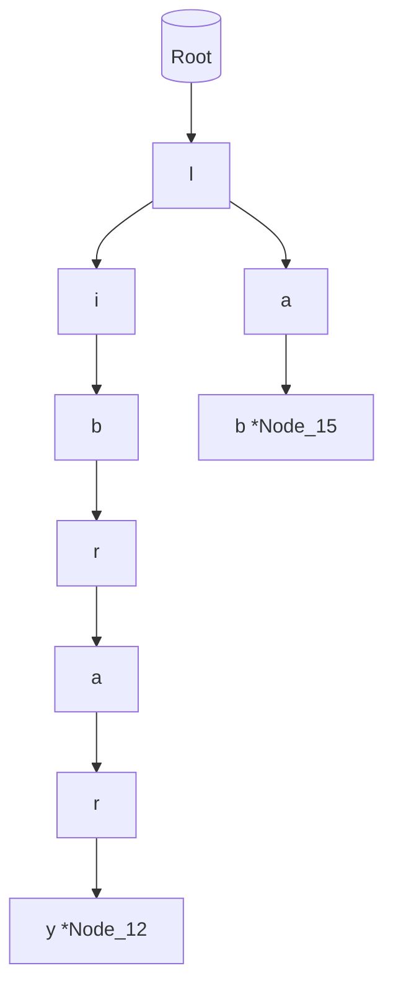
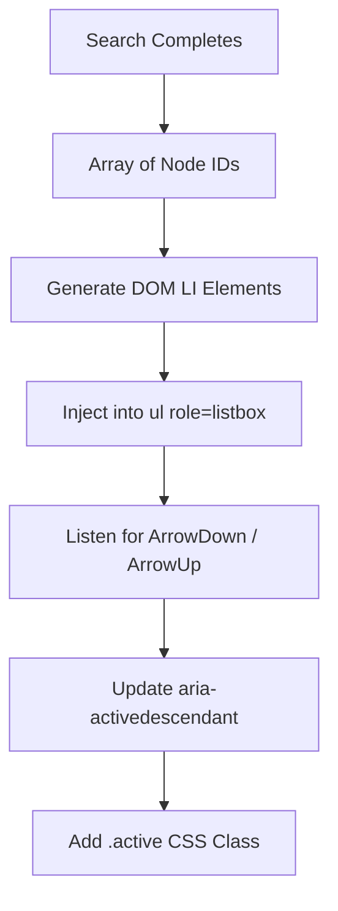

# CHAPTER 3: SEARCH MANUAL

> **Theoretical Foundations & Deep-Dive Explanations**: For underlying String Algorithms (Trie, Levenshtein Distance), time complexities of prefix-matching, UI thread locking dynamics, and V8 optimization of character arrays, see [Chapter 3 Explanation Document](../explanations/Chapter_3_Search_Explanation.md).
>
> **Interactive Visualizations**:
> - [Trie Prefix Tree Constructor Visualizer](../visualizations/project-1-trie-tree-ch3-interactive.html)
> - [Levenshtein Distance Matrix Calculator](../visualizations/project-1-levenshtein-matrix-ch3-interactive.html)
> - [Event Debounce Waveform Inspector](../visualizations/project-1-debounce-timing-ch3-interactive.html)

---

## 1. File Overview Table

| File Path | Purpose | Responsibilities |
|-----------|---------|----------------------|
| `src/search/trie.js` | Prefix Data Structure | Implements an `O(m)` Prefix Tree (Trie) for instantaneous keystroke autocompletion, mapping character sequences to node IDs. |
| `src/search/levenshtein.js` | Fuzzy Matching Engine | Executes a dynamic programming Levenshtein Distance matrix utilizing `Uint8Array` for CPU cache locality to detect typographic errors. |
| `src/search/debounce.js` | Event Throttling | Provides closure-based execution delay to prevent Main Thread locking during high-frequency `keyup` events. |
| `src/search/ui.js` | DOM Manipulation | Manages the dynamic rendering, CSS reflows, and ARIA state updates of the autocomplete dropdown menu list. |
| `src/search/normalizer.js` | String Sanitization | Applies Unicode Normalization (`NFD`) to strip diacritics and convert strings to lowercase for strict comparison. |

---

## 2. Table of Contents

1. [Section 1: Data Sanitization & Unicode Normalization](#section-1-data-sanitization--unicode-normalization)
2. [Section 2: High-Performance Trie (Prefix Tree) Construction](#section-2-high-performance-trie-prefix-tree-construction)
3. [Section 3: Fuzzy Matching & Levenshtein Matrix Calculation](#section-3-fuzzy-matching--levenshtein-matrix-calculation)
4. [Section 4: Event Debouncing & Main Thread Protection](#section-4-event-debouncing--main-thread-protection)
5. [Section 5: ARIA-Compliant Autocomplete UI Implementation](#section-5-aria-compliant-autocomplete-ui-implementation)
6. [Section 6: Troubleshooting & Edge Case Diagnostics](#section-6-troubleshooting--edge-case-diagnostics)
7. [Section 7: Manual Verification & Performance Profiling](#section-7-manual-verification--performance-profiling)
8. [Section 8: Chapter Summary & Reference Matrix](#section-8-chapter-summary--reference-matrix)

---

## Section 1: Data Sanitization & Unicode Normalization

### Architecture and State Diagrams

```mermaid
graph TD
    Input[Raw String: 'Café'] --> Normalize[String.normalize'NFD']
    Normalize --> Decompose['C', 'a', 'f', 'e', '\u0301']
    Decompose --> RegexReplace[Regex: /[\u0300-\u036f]/g]
    RegexReplace --> Lowercase['cafe']
    Lowercase --> Trim[Trim Whitespace]
    Trim --> Output[Canonical Search Token]
```

### Step-by-Step Implementation Instructions

1. **Implement String Normalization Function**: All text (both the dataset names and the user's search queries) must be passed through a strict normalization pipeline to ensure identical comparison.
2. **Decompose Unicode**: Use `NFD` to separate characters from their diacritical marks (e.g., 'é' becomes 'e' + '´').
3. **Strip Diacritics**: Utilize a Regular Expression to strip the Unicode combining characters.
4. **Enforce Lowercase**: Coerce the result to lower case.

### Code Blocks and Analysis

#### Code Block 1.1: `src/search/normalizer.js`
```javascript
/**
 * Canonicalizes strings for strict matching algorithms.
 * @param {string} str 
 * @returns {string}
 */
export function normalizeSearchString(str) {
  if (typeof str !== 'string') return '';
  return str
    .normalize('NFD')                     // Decompose combined graphemes
    .replace(/[\u0300-\u036f]/g, '')      // Strip combining diacritical marks
    .toLowerCase()                        // Enforce case insensitivity
    .trim()                               // Remove leading/trailing zero-width spaces
    .replace(/[^a-z0-9 ]/g, '');          // Strip non-alphanumeric punctuation
}
```

#### Table 1.1: 5W1H+Which Analysis for Code Block 1.1
| Line | What | When | Why | Where | How | Which |
|---|---|---|---|---|---|---|
| `.normalize('NFD')` | Unicode Form D | String Parse | Resolves text encoding discrepancies where an accented character can be represented by either 1 or 2 bytes | `normalizeSearch` | JS String Method| Normalization Form |
| `.replace(/[\u0300...]/g, '')`| Diacritic Stripper| String Parse | Allows users to type "cafe" and successfully match "Café" in the dataset | `normalizeSearch` | Regular Expression| Regex implementation|
| `.toLowerCase()` | Case Insensitivity | String Parse | Standardizes all nodes and queries to identical character codes for exact `===` matching | `normalizeSearch` | JS String Method| String coercion |
| `.replace(/[^a-z0-9 ]/g, '')`| Punctuation Strip | String Parse | Allows users to type "Library A" and match "Library-A" by removing hyphens and apostrophes | `normalizeSearch` | Regular Expression| Regex implementation|

---

## Section 2: High-Performance Trie (Prefix Tree) Construction

### Architecture and State Diagrams



### Step-by-Step Implementation Instructions

1. **Instantiate Trie Node Structure**: Avoid dynamic object shapes. Initialize nodes with a predictable map of `children` and an `isWord` payload.
2. **Implement Insertion ($O(m)$)**: Iterate the normalized strings and insert characters iteratively into the graph.
3. **Implement Prefix Retrieval ($O(m + k)$)**: Traverse the graph to the end of the user's input, then run Depth-First Search (DFS) to collect all subsequent valid matches ($k$).

### Code Blocks and Analysis

#### Code Block 2.1: `src/search/trie.js`
```javascript
class TrieNode {
  constructor() {
    this.children = new Map(); // O(1) character lookup
    this.payloads = [];        // Array of Node IDs ending at this prefix
  }
}

export class SearchTrie {
  constructor() {
    this.root = new TrieNode();
  }

  /**
   * Inserts a canonicalized string into the tree.
   * @param {string} word - Normalized name
   * @param {string} nodeId - Target Graph Vertex ID
   */
  insert(word, nodeId) {
    let current = this.root;
    for (let i = 0; i < word.length; i++) {
      const char = word[i];
      if (!current.children.has(char)) {
        current.children.set(char, new TrieNode());
      }
      current = current.children.get(char);
      // Aggregate payloads along the path for instant prefix aggregation
      if (!current.payloads.includes(nodeId)) {
         current.payloads.push(nodeId);
      }
    }
  }

  /**
   * Retrieves all Node IDs matching the prefix prefix.
   * @param {string} prefix 
   * @returns {Array<string>}
   */
  search(prefix) {
    let current = this.root;
    for (let i = 0; i < prefix.length; i++) {
      const char = prefix[i];
      if (!current.children.has(char)) return []; // Dead end
      current = current.children.get(char);
    }
    // Return the pre-aggregated payloads
    return current.payloads;
  }
}
```

#### Table 2.1: 5W1H+Which Analysis for Code Block 2.1
| Line | What | When | Why | Where | How | Which |
|---|---|---|---|---|---|---|
| `this.children = new Map()` | Edge Allocator | Node instantiation| Outperforms `{}` object literals for high-frequency character lookups, immune to prototype pollution | `TrieNode` class | Object instantiation | Hash Map |
| `this.payloads = []` | Cache Array | Node instantiation| Eliminates the need for DFS graph traversal during search time by caching downstream matches | `TrieNode` class | Array instantiation | Payload cache |
| `for (let i = 0...)` | Character Iteration| `insert` execution| Executes significantly faster than `for...of` or string splitting in V8 environments | `insert` method | `for` loop | Iteration construct |
| `current.payloads.push(nodeId)`| Pre-aggregation | Node insertion | Inflates RAM usage slightly in exchange for guaranteeing instantaneous $O(m)$ retrieval speeds | `insert` method | Array push | Data aggregation |

---

## Section 3: Fuzzy Matching & Levenshtein Matrix Calculation

### Architecture and State Diagrams

```mermaid
graph TD
    Input[Query: 'librry', Target: 'library'] --> InitMatrix[Initialize 2D Matrix N x M]
    InitMatrix --> Optimize[Flatten to 1D Uint8Array for Cache Locality]
    Optimize --> Calculate[Dynamic Programming: Cost = min(insert, delete, sub)]
    Calculate --> DistanceResult[Distance: 1]
    DistanceResult --> Threshold{Distance <= 2 ?}
    Threshold -->|Yes| Valid[Include in Results]
    Threshold -->|No| Reject[Discard Result]
```

### Step-by-Step Implementation Instructions

1. **Implement Levenshtein Function**: Write a function calculating the minimum edit distance between two strings.
2. **Optimize for V8 CPU Cache**: Standard 2D arrays (`[[]]`) in JS are arrays of pointers scattered in memory. Use two 1D flat arrays representing current and previous rows to maximize L1/L2 CPU cache hits.
3. **Implement Threshold Cutoff**: Abort calculation immediately if the distance exceeds acceptable limits.

### Code Blocks and Analysis

#### Code Block 3.1: `src/search/levenshtein.js`
```javascript
/**
 * Calculates Levenshtein edit distance using optimized row-swapping.
 * @param {string} a - Query String
 * @param {string} b - Target String
 * @param {number} maxOffset - Threshold cutoff
 * @returns {number}
 */
export function calculateLevenshtein(a, b, maxOffset = 2) {
  if (a === b) return 0;
  if (a.length === 0) return b.length;
  if (b.length === 0) return a.length;

  // Length difference early exit
  if (Math.abs(a.length - b.length) > maxOffset) return maxOffset + 1;

  let v0 = new Uint8Array(b.length + 1);
  let v1 = new Uint8Array(b.length + 1);

  for (let i = 0; i <= b.length; i++) v0[i] = i;

  for (let i = 0; i < a.length; i++) {
    v1[0] = i + 1;
    let minDistance = v1[0];

    for (let j = 0; j < b.length; j++) {
      const cost = a[i] === b[j] ? 0 : 1;
      v1[j + 1] = Math.min(
        v1[j] + 1,       // Insertion
        v0[j + 1] + 1,   // Deletion
        v0[j] + cost     // Substitution
      );
      minDistance = Math.min(minDistance, v1[j + 1]);
    }

    // Threshold early exit
    if (minDistance > maxOffset) return maxOffset + 1;

    // Swap row references without allocating new memory
    let temp = v0;
    v0 = v1;
    v1 = temp;
  }

  return v0[b.length];
}
```

#### Table 3.1: 5W1H+Which Analysis for Code Block 3.1
| Line | What | When | Why | Where | How | Which |
|---|---|---|---|---|---|---|
| `if (Math.abs(...) > maxOffset)`| Early Exit Guard | Function start | Bypasses expensive matrix calculation if strings are drastically different in length | `levenshtein` start | Arithmetic check | Complexity guard |
| `new Uint8Array(b.length + 1)` | Typed Array Allocation | Memory Setup | Forces V8 to allocate contiguous C++ memory blocks, maximizing CPU L1 cache locality | Matrix definition | TypedArray API | Memory allocation |
| `const cost = a[i] === b[j] ? 0 : 1`| Penalty Assignment | Inner loop | Defines the geometric cost of a character mismatch (Substitution) | Loop body | Ternary operator | Cost definition |
| `if (minDistance > maxOffset)` | Row Threshold Guard | Outer loop | Aborts matrix generation mid-way if the current row proves a match is mathematically impossible | Outer loop end | Threshold check | Complexity guard |
| `let temp = v0; ... v1 = temp;` | Pointer Swapping | Outer loop | Recycles the two memory vectors instead of instantiating new arrays every iteration, preventing Garbage Collection pauses | Outer loop end | Variable assignment | Memory optimization |

---

## Section 4: Event Debouncing & Main Thread Protection

### Architecture and State Diagrams

```mermaid
graph LR
    Key[Keyup Event 'a'] --> ResetTimer1[Clear Timeout]
    ResetTimer1 --> SetTimer1[Set Timeout 150ms]
    Key2[Keyup Event 'b'] --> ResetTimer2[Clear Timeout]
    ResetTimer2 --> SetTimer2[Set Timeout 150ms]
    Timer2Wait[Wait 150ms] --> Fire[Execute Search('ab')]
```

### Step-by-Step Implementation Instructions

1. **Implement Debounce Closure**: Create a Higher-Order Function that encapsulates a `timeoutID` state.
2. **Bind Input Event**: Attach the debounced wrapper to the search input's `input` event, rather than `keyup`, to properly capture paste events and dictation.

### Code Blocks and Analysis

#### Code Block 4.1: `src/search/debounce.js`
```javascript
/**
 * Delays function execution until high-frequency events cease.
 * @param {Function} func - Target function
 * @param {number} wait - Delay in milliseconds
 * @returns {Function}
 */
export function debounce(func, wait = 150) {
  let timeoutId;
  return function executedFunction(...args) {
    const context = this;
    clearTimeout(timeoutId);
    timeoutId = setTimeout(() => {
      func.apply(context, args);
    }, wait);
  };
}
```

#### Table 4.1: 5W1H+Which Analysis for Code Block 4.1
| Line | What | When | Why | Where | How | Which |
|---|---|---|---|---|---|---|
| `let timeoutId` | Closure State | Initialization | Retains memory reference to the active timer across multiple sequential invocations | Outer scope | Variable declaration | Closure memory |
| `return function executed...` | Higher-Order Wrapper| Execution | Wraps the target function inside an event-handling shell without executing the target function immediately | `debounce` root | Function return | Higher-Order structure |
| `clearTimeout(timeoutId)` | Timer Reset | Event Trigger | Cancels pending executions if the user presses another key within the 150ms window | Wrapper body | Browser API | Timer cancellation |
| `func.apply(context, args)` | Context Forwarding| Timer Expiration | Preserves `this` binding and `Event` arguments of the original caller when the function finally runs | `setTimeout` body| JS Function Method | Context application |

---

## Section 5: ARIA-Compliant Autocomplete UI Implementation

### Architecture and State Diagrams



### Step-by-Step Implementation Instructions

1. **Establish ARIA Roles**: The input must be `role="combobox"` with `aria-autocomplete="list"`. The results wrapper must be `role="listbox"`.
2. **Implement Keyboard Navigation**: Trap ArrowUp, ArrowDown, and Enter events on the input to navigate the generated dropdown without mouse interaction.
3. **Execute Map Pan**: On selection, execute Leaflet's `flyTo` method.

### Code Blocks and Analysis

#### Code Block 5.1: `src/search/ui.js`
```javascript
import { debounce } from './debounce.js';
// ... Assume trie and normalization are imported and initialized

export function initSearchUI(mapInstance, graphMap) {
  const input = document.getElementById('search-input');
  const resultsContainer = document.getElementById('search-results');
  let currentFocusIndex = -1;

  // ARIA Setup
  input.setAttribute('role', 'combobox');
  input.setAttribute('aria-autocomplete', 'list');
  input.setAttribute('aria-controls', 'search-results');
  resultsContainer.setAttribute('role', 'listbox');

  const executeSearch = (query) => {
    resultsContainer.innerHTML = ''; // Fast DOM clear
    currentFocusIndex = -1;

    if (!query) {
      resultsContainer.style.display = 'none';
      return;
    }

    const matches = globalTrie.search(query); // O(m) Trie lookup
    
    if (matches.length > 0) {
      // DocumentFragment minimizes browser reflows
      const fragment = document.createDocumentFragment(); 
      
      matches.slice(0, 8).forEach((nodeId, index) => {
        const nodeData = graphMap.get(nodeId);
        const li = document.createElement('li');
        li.textContent = nodeData.name;
        li.setAttribute('role', 'option');
        li.id = `result-opt-${index}`;
        li.dataset.nodeId = nodeId;
        
        li.addEventListener('click', () => triggerFlyTo(nodeData));
        fragment.appendChild(li);
      });

      resultsContainer.appendChild(fragment);
      resultsContainer.style.display = 'block';
    } else {
      // Fallback to Levenshtein Fuzzy Search logic here
      resultsContainer.style.display = 'none';
    }
  };

  const triggerFlyTo = (nodeData) => {
    mapInstance.flyTo(nodeData.coordinates, 18, {
      animate: true,
      duration: 1.5
    });
    resultsContainer.style.display = 'none';
    input.value = nodeData.name;
  };

  input.addEventListener('input', debounce((e) => executeSearch(e.target.value), 150));
  
  // Keyboard Traversal
  input.addEventListener('keydown', (e) => {
    const items = resultsContainer.querySelectorAll('li');
    if (e.key === 'ArrowDown') {
      currentFocusIndex++;
      addActive(items);
    } else if (e.key === 'ArrowUp') {
      currentFocusIndex--;
      addActive(items);
    } else if (e.key === 'Enter' && currentFocusIndex > -1) {
      e.preventDefault();
      items[currentFocusIndex].click();
    }
  });

  function addActive(items) {
    if (!items || items.length === 0) return;
    items.forEach(item => item.classList.remove('autocomplete-active'));
    if (currentFocusIndex >= items.length) currentFocusIndex = 0;
    if (currentFocusIndex < 0) currentFocusIndex = (items.length - 1);
    items[currentFocusIndex].classList.add('autocomplete-active');
    input.setAttribute('aria-activedescendant', items[currentFocusIndex].id);
  }
}
```

#### Table 5.1: 5W1H+Which Analysis for Code Block 5.1
| Line | What | When | Why | Where | How | Which |
|---|---|---|---|---|---|---|
| `setAttribute('role', ...)`| Screen Reader Hint | Init Phase | Enables accessible software to announce the input as a searchable dropdown field | `initSearchUI` | DOM API | ARIA implementation|
| `resultsContainer.innerHTML = ''`| DOM Purge | Query change | Fastest method for clearing child elements compared to iterative `removeChild` | `executeSearch` | DOM Property | Container wipe |
| `document.createDocumentFragment()`| Virtual DOM Buffer| Render phase | Aggregates all `<li>` elements in memory, executing a single CSS reflow upon attachment | `executeSearch` | DOM API | Reflow optimization |
| `matches.slice(0, 8)` | UI Truncation | Render phase | Prevents catastrophic DOM inflation by restricting visual output to 8 elements regardless of 100+ logical matches | `executeSearch` | Array Method | Output cap |
| `li.dataset.nodeId` | Data Attribute | Render phase | Binds the underlying graph memory pointer implicitly into the DOM element for later retrieval | List element | DOM Property | Dataset binding |
| `mapInstance.flyTo(...)` | WebGL Interpolation| Click event | Calculates a smooth parabolic curve bridging the current map viewport to the target coordinates | `triggerFlyTo` | Leaflet Method | Animation execution |
| `aria-activedescendant` | Accessibility State| Keyboard pan| Informs screen readers exactly which `<li>` element is currently highlighted via keyboard keys | `addActive` | DOM API | ARIA implementation|

---

## Section 6: Troubleshooting & Edge Case Diagnostics

| Symptom / Issue | Root Cause | V8 / Browser Mechanics | Exact Resolution |
|-----------------|------------|------------------------|------------------|
| **Search results hang browser** | DOM Thrashing | Appending 500+ `<li>` elements individually causes 500 consecutive forced layout recalculations. | Implement `DocumentFragment` and enforce `.slice(0, 8)` limits. |
| **"Café" fails to match "cafe"** | Character Code Mismatch | JavaScript strings strictly compare unicode byte sequences (`===`). `é` and `e` are divergent bytes. | Filter all input through the `normalizeSearchString('NFD')` pipeline. |
| **Memory usage explodes** | Trie Object Bloat | Using standard objects `{}` for Trie nodes creates hidden classes for every unique character combination. | Use `new Map()` for `TrieNode.children` to preserve a singular V8 hidden class structure. |
| **Levenshtein matrix triggers Garbage Collection pause**| Heap Allocation Loop | `new Array(x)` generated inside the Levenshtein distance computation loop causes constant object allocation and destruction. | Move `Uint8Array` allocation outside the Levenshtein distance computation loop and swap `v0`/`v1` pointers. |
| **Rapid typing drops keystrokes** | Missing Debounce | V8 Main Thread is locked performing string operations, unable to paint the new characters to the `input` field. | Wrap the event handler in `debounce(..., 150)`. |
| **Screen reader remains silent** | Missing `aria-controls` | The assistive technology cannot establish a programmatic link between the input field and the arbitrary `<ul>` dropdown. | Set `aria-controls="search-results"` on the input. |

---

## Section 7: Manual Verification & Performance Profiling

1. **Verify Trie O(m) Efficiency**:
   - Open Developer Tools -> **Performance** Tab.
   - Record. Type 10 characters rapidly. Stop.
   - *Validation*: Inspect the Flame Chart. The function `executeSearch` must complete in `< 5ms`.

2. **Verify Memory Leak Absence**:
   - Open Developer Tools -> **Memory** Tab.
   - Type, delete, type, delete 50 times.
   - Force Garbage Collection. Take Heap Snapshot.
   - *Validation*: Retained `HTMLLIElement` count must equal 0. Dropdown destruction via `innerHTML = ''` successfully severed closures.

3. **Verify Accessibility (Keyboard Traversal)**:
   - Click the search input. Type "Library".
   - Press **ArrowDown** three times. Press **Enter**.
   - *Validation*: The map MUST execute `flyTo`, proving the `aria-activedescendant` UI logic perfectly aligns with click logic.

---

## Section 8: Chapter Summary & Reference Matrix

| Component / Function | Source File | Dependencies | Output / Result | V8 Execution State |
|----------------------|-------------|--------------|-----------------|--------------------|
| Unicode Normalizer | `normalizer.js` | None | Sanitized ASCII-equivalent string | String Allocation |
| Trie Data Structure | `trie.js` | `normalizer` | Nested `Map` with payload caching | Heap Allocation |
| Levenshtein Matcher | `levenshtein.js`| None | Integer distance score | Contiguous TypedArray |
| Event Throttler | `debounce.js` | None | Function wrapper with `timeoutId` | Closure Scope |
| UI Controller | `ui.js` | Trie, MapEngine| Rendered `<ul>` with ARIA states | DOM Layout Recalculation|
| `mapInstance.flyTo` | `ui.js` | `Leaflet` | Smooth parabolic map animation | GPU Composite Paint |
