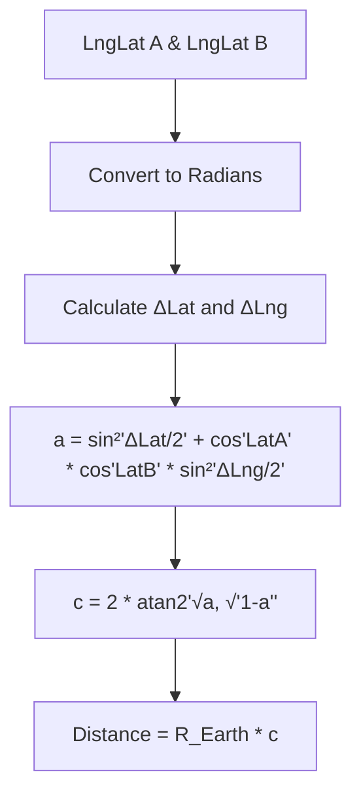
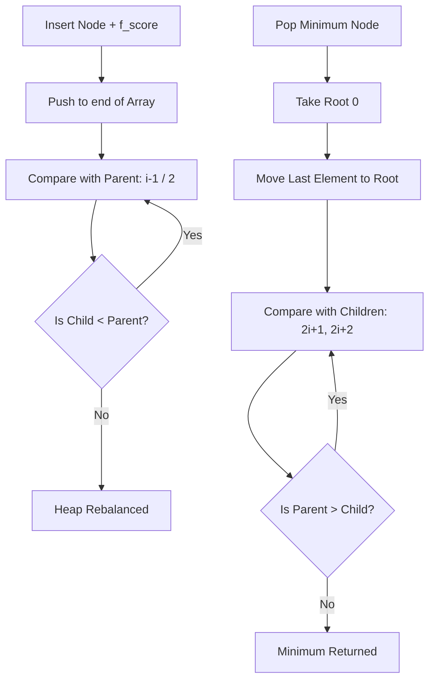
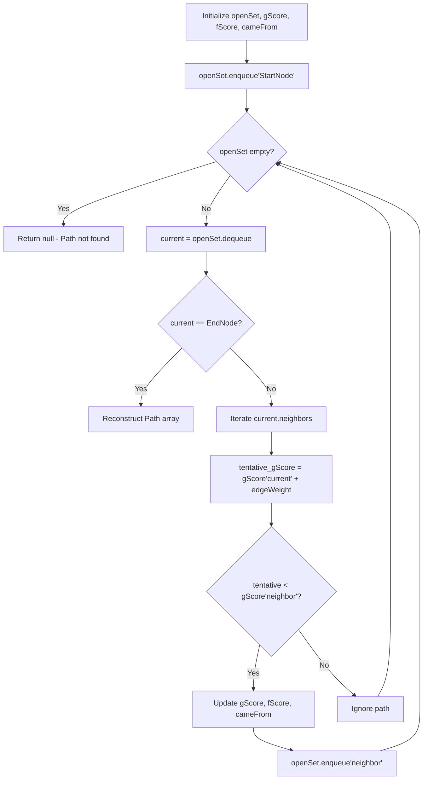
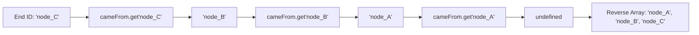

# CHAPTER 4: ROUTING ENGINE MANUAL

> **Theoretical Foundations & Deep-Dive Explanations**: For underlying A* Pathfinding mathematics, Min-Heap Binary Tree structures, Haversine spherical geometry, and Big-O complexity analysis, see [Chapter 4 Explanation Document](../explanations/Chapter_4_RoutingEngine_Explanation.md).
>
> **Interactive Visualizations**:
> - [A* Pathfinding Node Traversal Animator](../visualizations/project-1-astar-traversal-ch4-interactive.html)
> - [Min-Heap Priority Queue visualizer](../visualizations/project-1-min-heap-ch4-interactive.html)
> - [Haversine Sphere vs Euclidean Plane Calculator](../visualizations/project-1-haversine-math-ch4-interactive.html)

---

## 1. File Overview Table

| File Path | Purpose | Responsibilities |
|-----------|---------|----------------------|
| `src/routing/astar.js` | Pathfinding Logic | Orchestrates the A* (A-Star) search algorithm, combining exact distances ($g$-score) with heuristic estimates ($h$-score). |
| `src/routing/priority-queue.js`| Binary Min-Heap | Implements an `O(log V)` Priority Queue to instantaneously retrieve the node with the lowest $f$-score, avoiding $O(N \log N)$ array sorting. |
| `src/routing/heuristic.js` | Spherical Mathematics | Calculates the Haversine Distance between two geographical coordinates to account for Earth's curvature. |
| `src/routing/renderer.js` | Map Vector Integration | Transforms raw output coordinate arrays into interactive `L.polyline` Leaflet layers with styling and animation. |
| `src/routing/controller.js` | UI / Logic Bridge | Manages the routing lifecycle: captures start/end inputs, triggers `astar.js`, and pipes results to `renderer.js`. |

---

## 2. Table of Contents

1. [Section 1: Haversine Spherical Heuristic Implementation](#section-1-haversine-spherical-heuristic-implementation)
2. [Section 2: High-Performance Min-Heap Priority Queue](#section-2-high-performance-min-heap-priority-queue)
3. [Section 3: A* (A-Star) Graph Traversal Algorithm](#section-3-a-a-star-graph-traversal-algorithm)
4. [Section 4: Path Backtracking & Coordinate Reconstruction](#section-4-path-backtracking--coordinate-reconstruction)
5. [Section 5: Leaflet Vector Polyline Rendering](#section-5-leaflet-vector-polyline-rendering)
6. [Section 6: Troubleshooting & Edge Case Diagnostics](#section-6-troubleshooting--edge-case-diagnostics)
7. [Section 7: Manual Verification & V8 Profiling Procedures](#section-7-manual-verification--v8-profiling-procedures)
8. [Section 8: Chapter Summary & Reference Matrix](#section-8-chapter-summary--reference-matrix)

---

## Section 1: Haversine Spherical Heuristic Implementation

### Architecture and State Diagrams



### Step-by-Step Implementation Instructions

1. **Implement Radian Conversion**: Create a strict utility to convert degrees to radians (`deg * Math.PI / 180`).
2. **Apply Haversine Formula**: Calculate the great-circle distance between two points. The Haversine great-circle distance serves as the $h(n)$ heuristic in the A* algorithm.
3. **Execute Static V8 Math**: Ensure the math operations avoid dynamic typing to keep V8 inside optimized math routines.

### Code Blocks and Analysis

#### Code Block 1.1: `src/routing/heuristic.js`
```javascript
/**
 * Calculates the great-circle distance between two points on a sphere.
 * @param {Array<number>} coord1 - [Lng, Lat]
 * @param {Array<number>} coord2 - [Lng, Lat]
 * @returns {number} Distance in meters
 */
export function calculateHaversine(coord1, coord2) {
  const R = 6371e3; // Earth radius in meters
  const toRad = Math.PI / 180;
  
  const lat1 = coord1[1] * toRad;
  const lat2 = coord2[1] * toRad;
  const deltaLat = (coord2[1] - coord1[1]) * toRad;
  const deltaLng = (coord2[0] - coord1[0]) * toRad;

  const a = Math.sin(deltaLat / 2) * Math.sin(deltaLat / 2) +
            Math.cos(lat1) * Math.cos(lat2) *
            Math.sin(deltaLng / 2) * Math.sin(deltaLng / 2);
            
  const c = 2 * Math.atan2(Math.sqrt(a), Math.sqrt(1 - a));

  return R * c;
}
```

#### Table 1.1: 5W1H+Which Analysis for Code Block 1.1
| Line | What | When | Why | Where | How | Which |
|---|---|---|---|---|---|---|
| `const R = 6371e3` | Earth Radius | Execution | Foundation variable for calculating absolute meter distances on the globe | `calculateHaversine` | Float constant | Mathematical Constant |
| `coord1[1] * toRad` | Radian Conversion | Execution | Standard trigonometric functions (`Math.sin`, `Math.cos`) exclusively accept radians, not degrees | `calculateHaversine` | Arithmetic | Radian converter |
| `coord2[1] - coord1[1]`| Delta Calculation | Execution | Determines the absolute difference in latitude/longitude for the spherical triangle | `calculateHaversine` | Array indexing | Difference variable |
| `Math.atan2(...)` | Arctangent Phase | Execution | Calculates the central angle reliably even for very small distances (unlike `Math.acos`) | `calculateHaversine` | JS Math API | Trigonometric calc |
| `return R * c` | Final Extrapolation| Return | Projects the central angle onto the Earth's circumference to yield physical meters | `calculateHaversine` | Multiplication | Return value |

---

## Section 2: High-Performance Min-Heap Priority Queue

### Architecture and State Diagrams



### Step-by-Step Implementation Instructions

1. **Avoid `Array.sort()`**: Sorting an array on every iteration of the A* algorithm creates catastrophic $O(N^2 \log N)$ execution times.
2. **Implement Flat Array Binary Tree**: Use a standard JavaScript array to represent a Binary Tree using index math (`parent = Math.floor((n-1)/2)`).
3. **Implement Bubble Up / Sink Down**: Enforce the Min-Heap property where parent nodes are always strictly less than or equal to the parent nodes' children.

### Code Blocks and Analysis

#### Code Block 2.1: `src/routing/priority-queue.js`
```javascript
class PQElement {
  constructor(id, priority) {
    this.id = id;             // Node ID
    this.priority = priority; // f_score
  }
}

export class MinPriorityQueue {
  constructor() {
    this.heap = [];
  }

  enqueue(id, priority) {
    const element = new PQElement(id, priority);
    this.heap.push(element);
    this._bubbleUp(this.heap.length - 1);
  }

  dequeue() {
    const min = this.heap[0];
    const end = this.heap.pop();
    if (this.heap.length > 0) {
      this.heap[0] = end;
      this._sinkDown(0);
    }
    return min;
  }

  isEmpty() {
    return this.heap.length === 0;
  }

  _bubbleUp(index) {
    const element = this.heap[index];
    while (index > 0) {
      let parentIndex = Math.floor((index - 1) / 2);
      let parent = this.heap[parentIndex];
      if (element.priority >= parent.priority) break;
      this.heap[parentIndex] = element;
      this.heap[index] = parent;
      index = parentIndex;
    }
  }

  _sinkDown(index) {
    const length = this.heap.length;
    const element = this.heap[index];
    while (true) {
      let leftChildIdx = 2 * index + 1;
      let rightChildIdx = 2 * index + 2;
      let leftChild, rightChild;
      let swap = null;

      if (leftChildIdx < length) {
        leftChild = this.heap[leftChildIdx];
        if (leftChild.priority < element.priority) swap = leftChildIdx;
      }
      if (rightChildIdx < length) {
        rightChild = this.heap[rightChildIdx];
        if (
          (swap === null && rightChild.priority < element.priority) || 
          (swap !== null && rightChild.priority < leftChild.priority)
        ) {
          swap = rightChildIdx;
        }
      }
      if (swap === null) break;
      this.heap[index] = this.heap[swap];
      this.heap[swap] = element;
      index = swap;
    }
  }
}
```

#### Table 2.1: 5W1H+Which Analysis for Code Block 2.1
| Line | What | When | Why | Where | How | Which |
|---|---|---|---|---|---|---|
| `this.heap = []` | Array Initialization| Constructor | Flat arrays are significantly more CPU-cache friendly than linked objects for binary trees | `MinPriorityQueue`| Array literal | Heap structure |
| `this.heap.push(element)` | End Insertion | `enqueue` phase | Adds the new node to the deepest, right-most available position in the binary tree | `enqueue` method | Array method | Initial placement |
| `Math.floor((index - 1)/2)`| Parent Index Math | `bubbleUp` phase | Mathematically determines the parent node's array index without requiring object pointers | `_bubbleUp` method| Arithmetic | Tree navigation |
| `this.heap.pop()` | End Extraction | `dequeue` phase | Removes the deepest, right-most element to relocate the element to the root position | `dequeue` method | Array method | Root replacement |
| `2 * index + 1` | Left Child Math | `sinkDown` phase| Mathematically determines the left child node's array index | `_sinkDown` method| Arithmetic | Tree navigation |
| `this.heap[index] = ...` | Index Swapping | Sorting phase | Physically trades the memory pointers of the elements to re-balance the tree | Private methods | Array assignment| Mutating state |

---

## Section 3: A* (A-Star) Graph Traversal Algorithm

### Architecture and State Diagrams



### Step-by-Step Implementation Instructions

1. **Initialize Tracking Maps**: Instantiate ES6 Maps for `gScore` (cost from start), `fScore` (gScore + heuristic), and `cameFrom` (breadcrumbs).
2. **Execute While Loop**: Continue popping the lowest `f_score` from the Priority Queue until the destination is reached or the Priority Queue empties.
3. **Calculate Tentative Costs**: For every neighbor, calculate `tentative_gScore`. If the `tentative_gScore` is lower than the recorded `gScore`, update all tracking maps and push to the Priority Queue.

### Code Blocks and Analysis

#### Code Block 3.1: `src/routing/astar.js`
```javascript
import { MinPriorityQueue } from './priority-queue.js';
import { calculateHaversine } from './heuristic.js';

/**
 * Executes A* algorithm to find optimal path.
 * @param {Map} graph - O(1) Adjacency List
 * @param {string} startId 
 * @param {string} endId 
 * @returns {Array<string>|null} Ordered array of Node IDs
 */
export function findOptimalPath(graph, startId, endId) {
  if (!graph.has(startId) || !graph.has(endId)) return null;

  const openSet = new MinPriorityQueue();
  const cameFrom = new Map();
  
  const gScore = new Map();
  const fScore = new Map();

  const endNodeData = graph.get(endId);

  // Initialize all distances to Infinity
  for (const nodeId of graph.keys()) {
    gScore.set(nodeId, Infinity);
    fScore.set(nodeId, Infinity);
  }

  // Base case: Start Node
  gScore.set(startId, 0);
  fScore.set(startId, calculateHaversine(graph.get(startId).coordinates, endNodeData.coordinates));
  openSet.enqueue(startId, fScore.get(startId));

  while (!openSet.isEmpty()) {
    const currentElem = openSet.dequeue();
    const currentId = currentElem.id;

    // Termination Phase
    if (currentId === endId) {
      return reconstructPath(cameFrom, currentId);
    }

    const currentData = graph.get(currentId);

    // Iteration Phase
    for (const [neighborId, weight] of currentData.neighbors.entries()) {
      const tentativeGScore = gScore.get(currentId) + weight;

      if (tentativeGScore < gScore.get(neighborId)) {
        // Path is strictly better than previous paths
        cameFrom.set(neighborId, currentId);
        gScore.set(neighborId, tentativeGScore);
        
        const hScore = calculateHaversine(graph.get(neighborId).coordinates, endNodeData.coordinates);
        const newFScore = tentativeGScore + hScore;
        
        fScore.set(neighborId, newFScore);
        openSet.enqueue(neighborId, newFScore);
      }
    }
  }

  return null; // Island node, no path possible
}
```

#### Table 3.1: 5W1H+Which Analysis for Code Block 3.1
| Line | What | When | Why | Where | How | Which |
|---|---|---|---|---|---|---|
| `if (!graph.has... )` | Boundary Guard | Invocation | Prevents fatal V8 `undefined` crashes if UI passes nonexistent node targets | `findOptimalPath`| Map lookup | Argument validation |
| `gScore.set(nodeId, Infinity)`| State Reset | Setup phase | Algorithms mandate assuming all nodes are infinitely far until proven otherwise | `for...of` loop | Map initialization | Default state |
| `fScore = gScore + hScore`| Heuristic Merge| Node evaluation| Fuses known distance ($g$) with spherical estimate ($h$) to bias the search toward the goal | A* algorithm | Arithmetic | Function $F(n)$ |
| `cameFrom.set(..., currentId)`| Breadcrumb Trail| Better path | Records strictly the parent node that provided the optimal path to the current node | `if` better loop | Map mutation | Path memory |
| `openSet.enqueue(...)` | Discovery | Better path | Adds the newly discovered optimal path into the heap to be evaluated in future while-loop iterations | `if` better loop | Queue execution | Frontier expansion |

---

## Section 4: Path Backtracking & Coordinate Reconstruction

### Architecture and State Diagrams



### Step-by-Step Implementation Instructions

1. **Backtrack from Destination**: Start at the `endId` and repeatedly query the `cameFrom` map.
2. **Construct Array**: Push each discovered parent ID into an array.
3. **Reverse Output**: The array will be structured `[End, ..., Start]`. Reverse the array to `[Start, ..., End]`.
4. **Hydrate Coordinates**: Map the resulting IDs back to the geographical coordinates using the global Graph structure.

### Code Blocks and Analysis

#### Code Block 4.1: `src/routing/astar.js` (Reconstruction Function)
```javascript
/**
 * Backtracks breadcrumbs to form the final array.
 * @param {Map} cameFrom 
 * @param {string} currentId 
 * @returns {Array<string>}
 */
function reconstructPath(cameFrom, currentId) {
  const totalPath = [currentId];
  while (cameFrom.has(currentId)) {
    currentId = cameFrom.get(currentId);
    totalPath.push(currentId);
  }
  return totalPath.reverse(); // Mutates array in place for O(N) flip
}

/**
 * Hydrates ID array into spatial coordinates.
 * @param {Map} graph 
 * @param {Array<string>} pathIds 
 * @returns {Array<Array<number>>} [[lat, lng], [lat, lng]]
 */
export function hydratePathCoordinates(graph, pathIds) {
  const coordinates = [];
  // Leaflet specifically demands [Lat, Lng], not GeoJSON [Lng, Lat]
  for (let i = 0; i < pathIds.length; i++) {
    const geo = graph.get(pathIds[i]).coordinates;
    coordinates.push([geo[1], geo[0]]); 
  }
  return coordinates;
}
```

#### Table 4.1: 5W1H+Which Analysis for Code Block 4.1
| Line | What | When | Why | Where | How | Which |
|---|---|---|---|---|---|---|
| `const totalPath = [currentId]`| Array Initialization| Reconstruction | Begins the backtrack array starting strictly with the destination node | `reconstructPath`| Array literal | Path payload |
| `cameFrom.get(currentId)` | Breadcrumb Fetch| While Loop | Traverses backward through the pointer map to find the node's parent | `reconstructPath`| Map lookup | Pointer traversal |
| `totalPath.reverse()` | Array Flip | Return | Reorients the path from target-to-source to source-to-target for proper visual rendering | `reconstructPath`| Array method | Payload formatting |
| `[geo[1], geo[0]]` | Coordinate Inversion| Hydration phase | Resolves the Leaflet vs GeoJSON specification conflict (Lat/Lng vs Lng/Lat) | `hydratePath...` | Array construct | Coordinate swapper |

---

## Section 5: Leaflet Vector Polyline Rendering

### Architecture and State Diagrams

```mermaid
graph TD
    HydratedArray[[Lat, Lng], [Lat, Lng]] --> LPolyline[L.polyline Factory]
    LPolyline --> StyleObject[{color: 'blue', weight: 6, dashArray: '10, 10'}]
    StyleObject --> RemoveOld[mapInstance.removeLayer'oldPath']
    RemoveOld --> AddNew[path.addTo'mapInstance']
    AddNew --> FitBounds[mapInstance.fitBounds'path.getBounds']
```

### Step-by-Step Implementation Instructions

1. **Clear Previous State**: Remove any existing polyline layers from the map to prevent visual duplication.
2. **Instantiate Vector Layer**: Pass the inverted `[Lat, Lng]` array into `L.polyline`.
3. **Configure Aesthetics**: Set line weight, color, opacity, and SVG stroke effects (like `dashArray`).
4. **Automate Camera Panning**: Execute `map.fitBounds()` to automatically frame the entire route within the viewport geometry.

### Code Blocks and Analysis

#### Code Block 5.1: `src/routing/renderer.js`
```javascript
let currentRouteLayer = null;

/**
 * Draws the vector path and pans the camera.
 * @param {L.Map} mapInstance 
 * @param {Array<Array<number>>} latLngs 
 */
export function renderRoute(mapInstance, latLngs) {
  if (!mapInstance || !latLngs || latLngs.length === 0) return;

  // Purge existing path to prevent memory leaks and visual stacking
  if (currentRouteLayer) {
    mapInstance.removeLayer(currentRouteLayer);
    currentRouteLayer = null;
  }

  // Construct hardware-accelerated polyline
  currentRouteLayer = L.polyline(latLngs, {
    color: '#3b82f6',     // Tailwind Blue 500
    weight: 6,            // Substantial click target
    opacity: 0.85,
    lineCap: 'round',     // Smooth visual joints
    lineJoin: 'round',
    dashArray: '1, 10',   // Dotted aesthetic
    className: 'route-path-animated' // CSS target for marching ants
  });

  currentRouteLayer.addTo(mapInstance);

  // Pad the bounds by 50px to account for UI overlapping the map edges
  mapInstance.fitBounds(currentRouteLayer.getBounds(), {
    padding: [50, 50],
    animate: true,
    duration: 1.2
  });
}
```

#### Table 5.1: 5W1H+Which Analysis for Code Block 5.1
| Line | What | When | Why | Where | How | Which |
|---|---|---|---|---|---|---|
| `let currentRouteLayer` | Singleton State | Module Scope | Tracks the active polyline to ensure only one route exists simultaneously | `renderer.js` top | Variable reference | Memory tracker |
| `mapInstance.removeLayer` | Canvas Purge | Render Start | Removes previous SVG/Canvas vector artifacts from the WebGL context | `renderRoute` top | Leaflet Method | Memory cleanup |
| `lineCap: 'round'` | SVG Styling | Instantiation | Softens jagged edges at extreme 90-degree vector intersections on the map | `L.polyline` opts | String config | Visual aesthetic |
| `dashArray: '1, 10'` | SVG Stroke Offset | Instantiation | Converts a solid line into a dotted/dashed visual pattern | `L.polyline` opts | String config | Visual aesthetic |
| `className: 'route-path'`| DOM Access | Instantiation | Binds a class to the generated SVG `<path>` allowing CSS `@keyframes` animations | `L.polyline` opts | String config | Animation binding |
| `mapInstance.fitBounds` | Matrix Interpolation| Render End | Calculates the mathematical bounding box of all points and adjusts map zoom/pan automatically | `renderRoute` end | Leaflet Method | Camera control |

---

## Section 6: Troubleshooting & Edge Case Diagnostics

| Symptom / Issue | Root Cause | V8 / Browser Mechanics | Exact Resolution |
|-----------------|------------|------------------------|------------------|
| **Browser Freezes for 10 seconds**| Heap/Sort Chaos | Passing an array `.sort((a,b) => a-b)` inside the A* while-loop triggered `O(N^2 log N)` catastrophic CPU thrashing. | Strictly implement the Binary Min-Heap Priority Queue class from Section 2. |
| **Path draws in the ocean off Africa**| Coordinate Reversal | `AStar` returned GeoJSON standard `[Lng, Lat]` but Leaflet rendered them as `[Lat, Lng]`. | Enforce `[geo[1], geo[0]]` inversion inside `hydratePathCoordinates()`. |
| **A* Returns `null` unexpectedly** | Unreachable Node | The destination node exists in `nodes.json` but has zero connections in `edges.json` (island node). | Algorithm is operating correctly; fix the dataset topology. |
| **`Maximum call stack size exceeded`** | Recursive BubbleUp | The `_bubbleUp` or `_sinkDown` priority queue functions lacked break conditions, causing infinite recursive iteration. | Verify `if (element.priority >= parent.priority) break;` is properly executing. |
| **Route visually zig-zags wildly** | Euclidean vs Haversine| The heuristic assumed the Earth was flat (`Math.sqrt(dx^2 + dy^2)`), pulling the search space in suboptimal directions on long routes. | Ensure `calculateHaversine` is utilized for the $h$-score. |

---

## Section 7: Manual Verification & V8 Profiling Procedures

1. **Verify A* Performance Execution Bounds**:
   - Wrap the controller execution in timing telemetry:
     ```javascript
     console.time('AStar_Execution');
     findOptimalPath(graph, 'node_start', 'node_end');
     console.timeEnd('AStar_Execution');
     ```
   - *Validation*: A campus-scale route (1,000 nodes) MUST resolve in `< 15ms`. If the execution time exceeds 50ms, the Min-Heap is failing to bypass `O(N)` sorting.

2. **Verify Memory Leak Absence on Rerouting**:
   - Open Developer Tools -> **Performance** Tab.
   - Click "Record". Repeatedly generate new routes 20 times. Stop.
   - *Validation*: Inspect the JS Heap graph. The JS Heap graph should sawtooth (rise and fall) but return to baseline. If the JS Heap graph stair-steps upward infinitely, `currentRouteLayer.remove()` is failing.

3. **Verify Canvas Layer Injection**:
   - Open Developer Tools -> **Elements** Tab.
   - Expand the map container deeply to the `leaflet-overlay-pane`.
   - *Validation*: If `preferCanvas` is active, the route should not appear as an `<svg>` path, but rather be absorbed entirely into the solitary `<canvas>` tag.

---

## Section 8: Chapter Summary & Reference Matrix

| Component / Function | Source File | Dependencies | Output / Result | V8 Execution State |
|----------------------|-------------|--------------|-----------------|--------------------|
| `calculateHaversine` | `heuristic.js` | `Math` API | Spherical meter distance `Float` | Inline Cache Math |
| `MinPriorityQueue` | `priority-queue.js`| None | Rebalanced `[Array]` Binary Tree | Contiguous Memory |
| `findOptimalPath` | `astar.js` | Heap, Haversine | `[String]` Node ID Array | Heap Pointer Loop |
| `reconstructPath` | `astar.js` | None | Reversed `[String]` Node ID Array| Array Mutation |
| `hydratePathCoords` | `astar.js` | Map Graph | Inverted `[[Lat, Lng]]` Array | Iterative Allocation |
| `renderRoute` | `renderer.js` | Leaflet | Map UI Vector overlay update | DOM / WebGL Paint |
