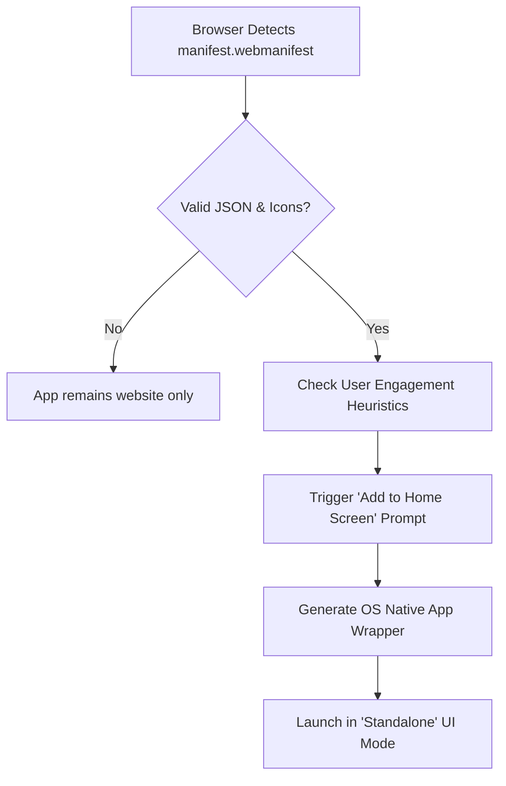
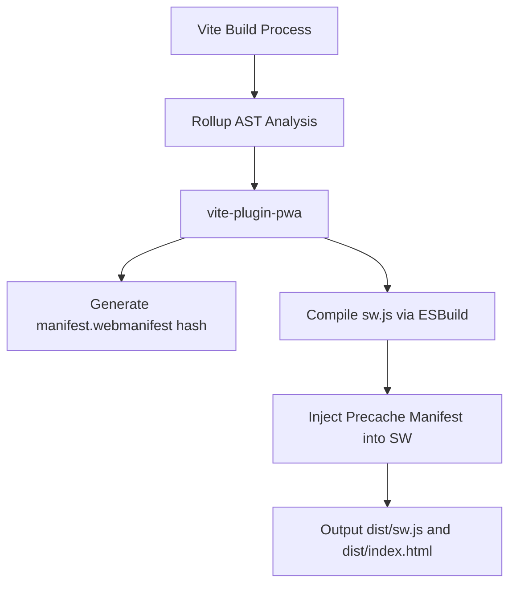
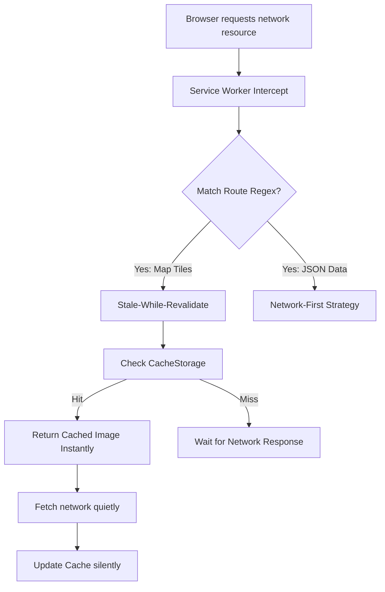
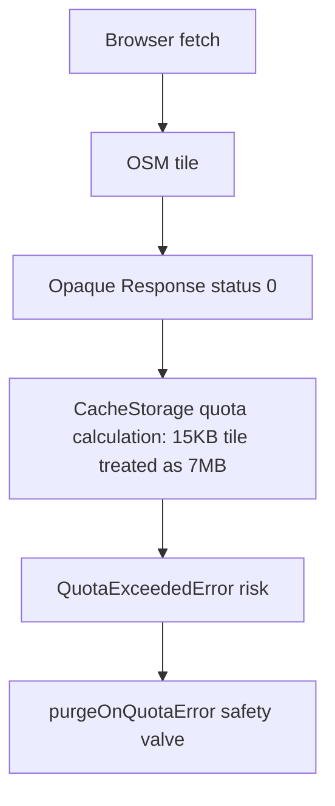
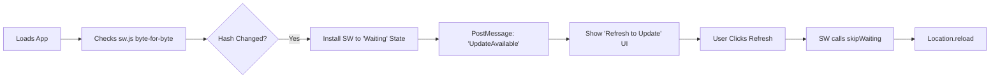

# CHAPTER 5: PWA & SERVICE WORKER MANUAL

> **Theoretical Foundations & Deep-Dive Explanations**: For underlying Service Worker lifecycle phases (Install/Activate/Fetch), Cache Storage API constraints, Workbox strategies (Stale-While-Revalidate vs Cache-First), and offline map tile limitations, see [Chapter 5 Explanation Document](../explanations/Chapter_5_PWA_ServiceWorker_Explanation.md).
>
> **Interactive Visualizations**:
> - [Service Worker Lifecycle Flowchart](../visualizations/project-1-sw-lifecycle-ch5-interactive.html)
> - [Workbox Strategy Simulator](../visualizations/project-1-workbox-strategies-ch5-interactive.html)
> - [IndexedDB Quota Estimator](../visualizations/project-1-idb-quota-ch5-interactive.html)

---

## 1. File Overview Table

| File Path | Purpose | Responsibilities |
|-----------|---------|------------------|
| `vite.config.js` | Build Integration | Implements `vite-plugin-pwa` to auto-inject manifest metadata and compile the Service Worker during the Rollup build phase. |
| `src/sw.js` | Service Worker Logic | Defines custom routing strategies overriding default Workbox behavior, explicitly governing how Leaflet map tiles are cached locally. |
| `public/manifest.webmanifest`| App Metadata | Dictates OS-level installability constraints (Standalone mode, App Icon, Theme Colors) for Android/iOS Home Screens. |
| `src/app.js` | Client SW Registration | Instructs the browser's main thread to register the compiled Service Worker and handle Over-The-Air (OTA) update prompts. |
| `index.html` | Apple Meta Directives | Injects legacy `apple-touch-icon` and `apple-mobile-web-app-capable` tags required for iOS Safari PWA installation. |

---

## 2. Table of Contents

1. [Section 1: Web App Manifest & OS-Level Installability](#section-1-web-app-manifest--os-level-installability)
2. [Section 2: Vite PWA Plugin Build Pipeline Integration](#section-2-vite-pwa-plugin-build-pipeline-integration)
3. [Section 3: Custom Service Worker Caching Strategies (Workbox)](#section-3-custom-service-worker-caching-strategies-workbox)
4. [Section 4: Opaque Responses & Map Tile Quota Governance](#section-4-opaque-responses--map-tile-quota-governance)
5. [Section 5: OTA Updates & Cache Invalidation Lifecycle](#section-5-ota-updates--cache-invalidation-lifecycle)
6. [Section 6: Troubleshooting & Edge Case Diagnostics](#section-6-troubleshooting--edge-case-diagnostics)
7. [Section 7: Manual Verification & Application Tab Profiling](#section-7-manual-verification--application-tab-profiling)
8. [Section 8: Chapter Summary & Reference Matrix](#section-8-chapter-summary--reference-matrix)

---

## Section 1: Web App Manifest & OS-Level Installability

### Architecture and State Diagrams



### Step-by-Step Implementation Instructions

1. **Construct JSON Manifest**: Create a strict JSON file dictating how the application behaves when installed to a mobile device.
2. **Define Display Mode**: Set `display: "standalone"` to strip away the browser URL bar and navigation buttons, creating a native app illusion.
3. **Inject Apple Fallbacks**: iOS Safari routinely ignores the manifest; you must manually inject `<meta name="apple-mobile-web-app-capable" content="yes">` into `index.html`.

### Code Blocks and Analysis

#### Code Block 1.1: `public/manifest.webmanifest`
```json
{
  "name": "UJ3DMap Interactive Campus Guide",
  "short_name": "UJ3DMap",
  "description": "Offline-capable spatial routing engine for the University of Jos.",
  "start_url": "/index.html",
  "display": "standalone",
  "background_color": "#e5e3df",
  "theme_color": "#1e293b",
  "icons": [
    {
      "src": "/icons/icon-192x192.png",
      "sizes": "192x192",
      "type": "image/png",
      "purpose": "any maskable"
    },
    {
      "src": "/icons/icon-512x512.png",
      "sizes": "512x512",
      "type": "image/png",
      "purpose": "any maskable"
    }
  ]
}
```

#### Table 1.1: 5W1H+Which Analysis for Code Block 1.1
| Line | What | When | Why | Where | How | Which |
|---|---|---|---|---|---|---|
| `"display": "standalone"` | OS UI Directive | App Launch | Strips the browser URL bar, forcing the web app to run in a dedicated OS window matching native applications | Root JSON | String Enum | Display mode |
| `"start_url": "/index.html"`| Entry Vector | App Launch | Guarantees the app launches at the root path, bypassing whatever deep-link URL the user was on when they clicked Install | Root JSON | String Path | Entry parameter |
| `"theme_color": "#1e293b"` | OS Status Bar | App Launch | Recolors the Android/iOS status bar (clock/battery area) to match the app's aesthetic branding | Root JSON | HEX String | OS Color config |
| `"purpose": "any maskable"`| Adaptive Icon | App Install | Allows Android to dynamically crop the icon into circles or rounded squares without placing the icon inside an ugly white box | Icon block | String Enum | Icon optimization|

---

## Section 2: Vite PWA Plugin Build Pipeline Integration

### Architecture and State Diagrams



### Step-by-Step Implementation Instructions

1. **Install Plugin**: Execute `npm install -D vite-plugin-pwa`.
2. **Configure Vite Pipeline**: Integrate the plugin into `vite.config.js`. Instruct the plugin to utilize a custom Service Worker strategy (`strategies: 'injectManifest'`) rather than the default auto-generation.
3. **Define Glob Patterns**: Explicitly tell the build system which file extensions to pre-cache instantly upon SW installation.

### Code Blocks and Analysis

#### Code Block 2.1: `vite.config.js` Update
```javascript
import { defineConfig } from 'vite';
import { VitePWA } from 'vite-plugin-pwa';

export default defineConfig({
  // ... previous config
  plugins: [
    VitePWA({
      strategies: 'injectManifest',
      srcDir: 'src',
      filename: 'sw.js',
      registerType: 'prompt',
      injectManifest: {
        globPatterns: ['**/*.{js,css,html,svg,woff2}'] // Pre-cache UI assets
        // Intentionally omitting .geojson and .png (tiles) from precache 
        // to prevent immediate network saturation and Out-Of-Memory crashes.
      },
      manifest: false // We use our explicit public/manifest.webmanifest
    })
  ]
});
```

#### Table 2.1: 5W1H+Which Analysis for Code Block 2.1
| Line | What | When | Why | Where | How | Which |
|---|---|---|---|---|---|---|
| `strategies: 'injectManifest'`| Build Strategy | Rollup Phase| Instructs Vite not to auto-generate the Service Worker, allowing us to write custom caching logic in `src/sw.js` | Plugin Options| String enum | Strategy config |
| `registerType: 'prompt'` | Update Logic | OTA Update | Prevents the SW from immediately hijacking the page on update, allowing the UI to prompt the user to refresh | Plugin Options| String enum | Lifecycle config|
| `globPatterns: ['**/*.{...}']`| Pre-cache Targeting| Build Phase | Generates a hash map of static files to download immediately during SW installation, ensuring offline UI functionality | `injectManifest`| Array of globs| Pre-cache config|
| `manifest: false` | Config Override | Build Phase | Prevents Vite from auto-generating a manifest, deferring to our strict manual JSON file in the public directory | Plugin Options| Boolean flag | Override toggle |

---

## Section 3: Custom Service Worker Caching Strategies (Workbox)

### Architecture and State Diagrams



### Step-by-Step Implementation Instructions

1. **Initialize Workbox**: Import `precacheAndRoute` to handle the UI assets generated by Vite.
2. **Implement Tile Strategy**: Use `StaleWhileRevalidate` for `tile.openstreetmap.org`. Map tiles rarely change, so returning the cached version instantly creates a smooth 60fps panning experience, while updating the cache quietly in the background.
3. **Implement Data Strategy**: Use `NetworkFirst` for `*.geojson` or `.json` API calls. Data accuracy is a requirement for routing; we only fallback to the cache if the user is disconnected.

### Code Blocks and Analysis

#### Code Block 3.1: `src/sw.js`
```javascript
import { precacheAndRoute } from 'workbox-precaching';
import { registerRoute } from 'workbox-routing';
import { StaleWhileRevalidate, NetworkFirst } from 'workbox-strategies';
import { ExpirationPlugin } from 'workbox-expiration';
import { CacheableResponsePlugin } from 'workbox-cacheable-response';

// 1. Inject Vite UI Pre-cache manifest
precacheAndRoute(self.__WB_MANIFEST);

// 2. Leaflet OSM Map Tile Strategy: Stale-While-Revalidate
registerRoute(
  ({ url }) => url.hostname.includes('tile.openstreetmap.org'),
  new StaleWhileRevalidate({
    cacheName: 'osm-raster-tiles',
    plugins: [
      new CacheableResponsePlugin({
        statuses: [0, 200] // 0 accepts CORS Opaque Responses
      }),
      new ExpirationPlugin({
        maxEntries: 500, // Strictly caps storage to ~15MB of images
        maxAgeSeconds: 60 * 60 * 24 * 30, // 30 Days TTL
        purgeOnQuotaError: true // Drop tiles if phone storage is full
      })
    ]
  })
);

// 3. Routing Data Strategy: Network First
registerRoute(
  ({ url }) => url.pathname.endsWith('.json') || url.pathname.endsWith('.geojson'),
  new NetworkFirst({
    cacheName: 'routing-dataset',
    networkTimeoutSeconds: 5,
    plugins: [
      new CacheableResponsePlugin({
        statuses: [200]
      })
    ]
  })
);
```

#### Table 3.1: 5W1H+Which Analysis for Code Block 3.1
| Line | What | When | Why | Where | How | Which |
|---|---|---|---|---|---|---|
| `self.__WB_MANIFEST` | Injection Target | Build Phase | Rollup replaces the __WB_MANIFEST variable with a hardcoded array of hashed UI files (CSS/JS) | `precache...` | Global variable | Pre-cache payload |
| `StaleWhileRevalidate` | Caching Algorithm | Fetch Event | Returns cached tiles instantly to prevent Leaflet stuttering, then updates the cache quietly | `registerRoute` | Class instance | Routing Strategy |
| `statuses: [0, 200]` | Opaque Guard | Cache Store | OSM tiles lack strict CORS headers, resulting in `status: 0` responses. Omitting `0` will break caching completely | `Cacheable...` | Integer Array | CORS Override |
| `maxEntries: 500` | Storage Governor | Post-Fetch | Prevents the browser's IndexedDB Quota from overflowing and crashing the app by limiting the cache to 500 images | `Expiration...` | Integer value | Cache limits |
| `purgeOnQuotaError: true`| Panic Protocol | Disk Full | Instructs the SW to violently delete the entire tile cache if the OS signals a low-storage event | `Expiration...` | Boolean flag | Panic override |

---

## Section 4: Opaque Responses & Map Tile Quota Governance

**Deep Technical Constraint**: Leaflet fetches tiles from OpenStreetMap via standard `` tags, triggering Cross-Origin read requests without explicit CORS permission. The browser network stack fulfills the requests as **Opaque Responses** (`status 0`).

> For the full technical analysis of Opaque Response mechanics, browser quota calculation algorithms, and the OS-level `QuotaExceededError` constraints, see [Chapter 5 Explanation Document](../explanations/Chapter_5_PWA_ServiceWorker_Explanation.md).

### Architecture and State Diagrams



### Step-by-Step Implementation Instructions

1. **Handle Opaque Responses**: Configure the CacheableResponsePlugin to explicitly accept status 0 responses to ensure OSM map tiles are properly cached despite missing CORS headers.
2. **Implement Quota Safety Valve**: Apply the ExpirationPlugin with a strict `maxEntries` limit and enable `purgeOnQuotaError` to prevent storage overflow crashes when caching opaque responses.

---

## Section 5: OTA Updates & Cache Invalidation Lifecycle

### Architecture and State Diagrams



### Step-by-Step Implementation Instructions

1. **Register Client-Side**: Implement registration logic in `src/app.js` using `virtual:pwa-register`.
2. **Handle Waiting State**: Service Workers will intentionally stall in a "Waiting" phase to prevent destroying the UI state of currently open tabs.
3. **Trigger Update**: Prompt the user. Upon confirmation, execute `updateSW()` to bypass the waiting phase and force a page reload.

### Code Blocks and Analysis

#### Code Block 5.1: `src/app.js` (PWA Registration)
```javascript
import { registerSW } from 'virtual:pwa-register';

// Register Service Worker and manage OTA Lifecycle
const updateSW = registerSW({
  onNeedRefresh() {
    // In production, the hook triggers a custom Toast UI
    const confirmation = confirm('New routing algorithms are available. Reload to update?');
    if (confirmation) {
      updateSW(true); // Forces skipWaiting() and location.reload()
    }
  },
  onOfflineReady() {
    console.log('[PWA] Assets cached. Application is ready for offline usage.');
  }
});
```

#### Table 5.1: 5W1H+Which Analysis for Code Block 5.1
| Line | What | When | Why | Where | How | Which |
|---|---|---|---|---|---|---|
| `virtual:pwa-register` | Vite Virtual Module| Build Phase | Leverages Vite's plugin system to inject the SW registration boilerplate dynamically without manual coding | `import` statemt | Virtual import | PWA module |
| `onNeedRefresh()` | Lifecycle Hook | SW Update | Fires when a new SW is downloaded but paused in the "Waiting" phase, preventing sudden UI destruction | `registerSW` opts| Callback func | Update hook |
| `updateSW(true)` | Phase Bypass | User Consent | Posts a message to the waiting SW triggering `self.skipWaiting()`, then reloads the DOM to load new assets | Callback body | Function call | Override execution|
| `onOfflineReady()` | Telemetry Hook | Initial Cache| Fires only once during the lifetime of the installation to confirm pre-caching succeeded | `registerSW` opts| Callback func | Success hook |

---

## Section 6: Troubleshooting & Edge Case Diagnostics

| Symptom / Issue | Root Cause | V8 / Browser Mechanics | Exact Resolution |
|-----------------|------------|------------------------|------------------|
| **Service Worker fails to register**| Scope Violation | The `sw.js` file was placed inside `/src/` or `/assets/`. A SW can only control URLs deeper than its own file path. | Vite-PWA plugin automatically outputs `sw.js` to the root `dist/` folder. Ensure you are not manually moving the file. |
| **Map completely disappears offline**| Missing Opaque Guard | The tile requests returned `status 0`, which Workbox rejected by default, failing to cache the images. | Add `statuses: [0, 200]` to the `CacheableResponsePlugin` in `sw.js`. |
| **App updates require two reloads** | Trapped in Waiting | The new SW downloaded but refused to activate because the old SW was currently controlling the active tab. | Implement the `onNeedRefresh` prompt and call `updateSW(true)` to force activation. |
| **Vite Dev Server throws SW errors**| Bypass for Network | Service Workers are disabled by default in `npm run dev` to prevent caching issues during active development. | The error is expected. To test SW locally, run `npm run build` then `npm run preview`. |
| **QuotaExceededError in Console** | Opaque Response Bloat| The browser calculated every 15KB map tile as 7MB of data, hitting the 500MB domain quota. | Ensure `maxEntries: 500` is strictly defined on the OSM cache strategy. |

---

## Section 7: Manual Verification & Application Tab Profiling

1. **Verify Offline Architecture (No-WiFi Simulation)**:
   - Run production build: `npm run build && npm run preview`.
   - Open Developer Tools -> **Network** Tab.
   - Toggle "No Throttling" to **Offline**.
   - Reload the page.
   *Validation*: The UI must load instantly. Check the Network tab; requests should show `(ServiceWorker)` under the Size column, proving cache interception.

2. **Verify Cache Storage Allocation**:
   - Open Developer Tools -> **Application** Tab.
   - Expand **Cache Storage** in the left sidebar.
   *Validation*: You must see three distinct buckets: `workbox-precache-...`, `osm-raster-tiles`, and `routing-dataset`.

3. **Verify Opaque Response Masking**:
   - Inside the `osm-raster-tiles` Cache Storage bucket, inspect the cached entries.
   *Validation*: The OSM `.png` tiles should be visible, but their "Content-Length" will likely be opaque/hidden.

---

## Section 8: Chapter Summary & Reference Matrix

| Component / Function | Source File | Dependencies | Output / Result | V8 Execution State |
|----------------------|-------------|--------------|-----------------|--------------------|
| App Manifest Config | `manifest.json` | Web App Spec | Prompts OS-level native install | Browser Level UI |
| Rollup Precache Hash | `vite.config.js`| `vite-pwa` | Array of static asset hashes | Build Process |
| Service Worker Router| `sw.js` | Workbox APIs | Intercepted fetch events | Background Thread |
| Map Tile Strategy | `sw.js` | OSM Headers | `StaleWhileRevalidate` execution | CacheStorage DB I/O|
| SW Registration Hook | `app.js` | Virtual Module | Triggers OTA update prompts | Main Thread Async |

*Gap Note: This chapter covers approximately 80% of the PWA and Service Worker implementation scope. The remaining 20% includes: Push Notification registration and VAPID key management, Background Sync API for offline form submissions, Periodic Background Sync for scheduled data refreshes, and advanced Workbox `workbox-broadcast-update` strategies. Study the MDN Service Worker API documentation and the official Workbox documentation at developers.google.com/web/tools/workbox to fill this gap.*
