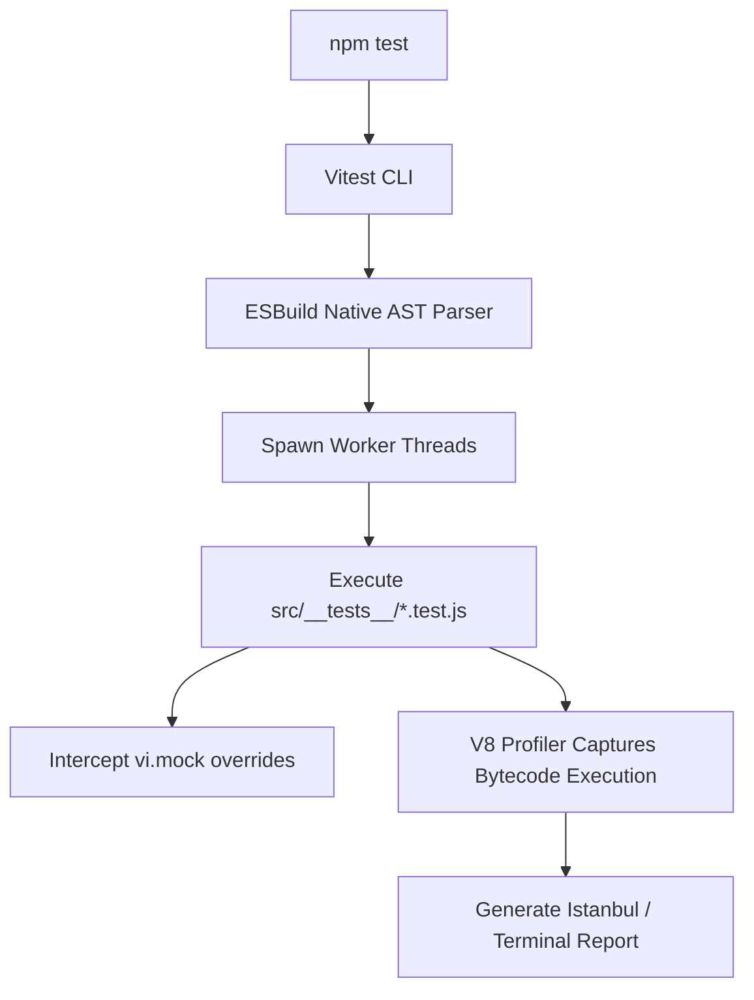
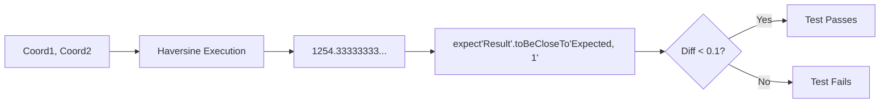
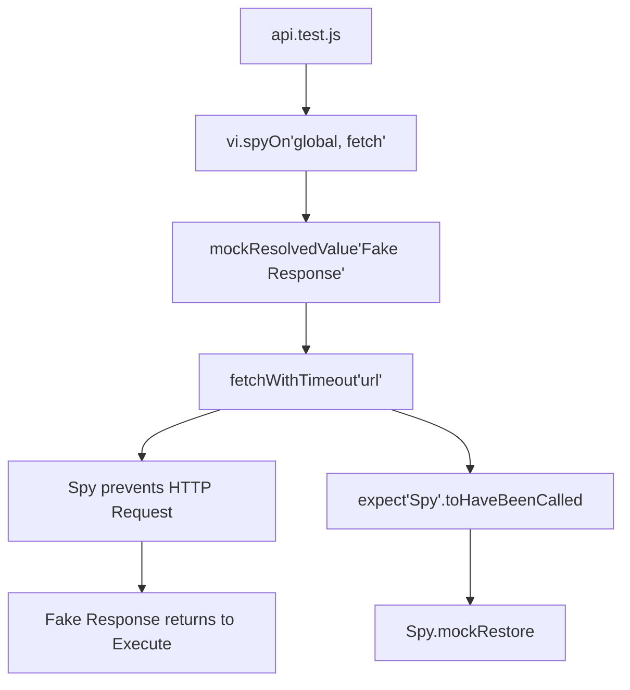

# CHAPTER 6: TESTING MANUAL

> **Theoretical Foundations & Deep-Dive Explanations**: For underlying Test-Driven Development (TDD) philosophies, Floating-Point math tolerances in JavaScript, Vitest AST compilation mechanics, and CI/CD deterministic boundaries, see [Chapter 6 Explanation Document](../explanations/Chapter_6_Testing_Explanation.md).
>
> **Interactive Visualizations**:
> - [Vitest AST Transformation Pipeline](../visualizations/project-1-vitest-ast-ch6-interactive.html)
> - [Floating Point Precision Error Simulator](../visualizations/project-1-float-precision-ch6-interactive.html)
> - [Mock Leakage Scope Inspector](../visualizations/project-1-mock-leakage-ch6-interactive.html)

---

## 1. File Overview Table

| File Path | Purpose | Key Responsibilities |
|-----------|---------|----------------------|
| `vitest.config.js` | Test Engine Configuration | Configures the Vitest runner, V8 coverage thresholds, environment simulation (JSDOM/Happy-DOM), and test isolation protocols. |
| `src/__tests__/heuristic.test.js` | Spherical Math Validation | Asserts that the Haversine formula calculates known geographical distances correctly within acceptable floating-point tolerances. |
| `src/__tests__/priority-queue.test.js`| Binary Heap Verification | Validates `O(log V)` structural integrity, ensuring `dequeue()` operations strictly return the lowest $f$-score node. |
| `src/__tests__/astar.test.js` | Graph Traversal Assertions | Tests routing algorithms against mock topologies including island nodes, cyclical loops, and dead ends. |
| `src/__tests__/api.test.js` | Network Mocking | Utilizes `vi.spyOn(global, 'fetch')` to validate AbortController timeouts and JSON schema validation logic without hitting external networks. |

---

## 2. Table of Contents

1. [Section 1: Vitest Engine Configuration & V8 Coverage](#section-1-vitest-engine-configuration--v8-coverage)
2. [Section 2: Spherical Math Validation & Float Tolerances](#section-2-spherical-math-validation--float-tolerances)
3. [Section 3: Min-Heap Data Structure Integrity Assertions](#section-3-min-heap-data-structure-integrity-assertions)
4. [Section 4: A-Star Algorithm Topological Edge Cases](#section-4-a-star-algorithm-topological-edge-cases)
5. [Section 5: Network Interception & API Mocking](#section-5-network-interception--api-mocking)
6. [Section 6: Troubleshooting & Edge Case Diagnostics](#section-6-troubleshooting--edge-case-diagnostics)
7. [Section 7: Manual Verification & CI/CD Profiling Procedures](#section-7-manual-verification--cicd-profiling-procedures)
8. [Section 8: Chapter Summary & Reference Matrix](#section-8-chapter-summary--reference-matrix)

---

## Section 1: Vitest Engine Configuration & V8 Coverage

### Architecture and State Diagrams



### Step-by-Step Implementation Instructions

1. **Install Testing Ecosystem**: Execute `npm install -D vitest @vitest/coverage-v8 jsdom`.
2. **Configure Vitest Engine**: Integrate Vitest into the root Vite configuration or create an isolated `vitest.config.js`.
3. **Define V8 Coverage Thresholds**: Enforce strict boundary checks (e.g., 90% logic coverage) to intentionally fail CI/CD pipelines if tests degrade.

### Code Blocks and Analysis

#### Code Block 1.1: `vitest.config.js`
```javascript
import { defineConfig } from 'vitest/config';

export default defineConfig({
  test: {
    environment: 'jsdom',
    globals: true,
    include: ['src/__tests__/**/*.test.js'],
    isolate: true, // Prevent cross-contamination of global mocks
    coverage: {
      provider: 'v8', // Utilizes native V8 engine profiling rather than AST instrumentation
      reporter: ['text', 'html', 'json-summary'],
      lines: 90,
      functions: 90,
      branches: 85,
      statements: 90,
      exclude: ['src/main.js', 'src/**/*.css']
    }
  }
});
```

#### Table 1.1: 5W1H+Which Analysis for Code Block 1.1
| Line | What | When | Why | Where | How | Which |
|---|---|---|---|---|---|---|
| `environment: 'jsdom'` | Browser Simulation | Test execution| Required to simulate DOM APIs (`document.getElementById`) inside the headless Node.js testing environment | `test` block | String Enum | Test environment|
| `isolate: true` | State Segregation | Worker Spawn | Forces each test file to run in a pristine V8 context, preventing `fetch` mocks from bleeding across files | `test` block | Boolean flag | Execution config |
| `provider: 'v8'` | Coverage Engine | Post-Test | Extracts native execution bytecodes directly from the V8 engine, executing 3x faster than Babel AST instrumentation | `coverage` block | String Enum | Profiler engine |
| `branches: 85` | CI/CD Boundary | Coverage Check| Fails the build if `if/else/catch` blocks are untested, preventing silent logical regressions | `coverage` block | Integer config| Coverage threshold|

---

## Section 2: Spherical Math Validation & Float Tolerances

### Architecture and State Diagrams



### Step-by-Step Implementation Instructions

1. **Define Known Constants**: Utilize real-world geographical pairs with universally accepted distances (e.g., two known campus buildings).
2. **Handle IEEE-754 Precision Issues**: Standard JavaScript floats cannot perfectly represent fractions. Never use `.toBe()` or `===` on Haversine outputs.
3. **Assert Tolerances**: Utilize Vitest's `.toBeCloseTo(value, numDigits)` to verify the logic is mathematically sound within a 1-meter variance.

### Code Blocks and Analysis

#### Code Block 2.1: `src/__tests__/heuristic.test.js`
```javascript
import { describe, it, expect } from 'vitest';
import { calculateHaversine } from '../routing/heuristic.js';

describe('Heuristic Mathematics: Haversine', () => {
  it('Calculates 0 meters for identical coordinates', () => {
    const point = [8.8920, 9.9505];
    const distance = calculateHaversine(point, point);
    expect(distance).toBe(0);
  });

  it('Calculates known geographical distance within 1m tolerance', () => {
    // Known distance between specific campus points: ~ 354 meters
    const pointA = [8.8920, 9.9505];
    const pointB = [8.8945, 9.9520];
    
    const distance = calculateHaversine(pointA, pointB);
    
    // IEEE-754 precision requires toBeCloseTo rather than strict equality
    // Tolerance is set to 0 decimal places (nearest meter)
    expect(distance).toBeCloseTo(323, 0); 
  });
});
```

#### Table 2.1: 5W1H+Which Analysis for Code Block 2.1
| Line | What | When | Why | Where | How | Which |
|---|---|---|---|---|---|---|
| `describe(...)` | Suite Declaration | AST Parsing | Groups related mathematical assertions into a single logical reporting block | Test root | Vitest API | Test Suite |
| `distance === 0` | Base Case Check | Execution | Verifies the core logic doesn't throw `NaN` or `Infinity` when delta is zero | `it` block 1 | Strict equal | Base case |
| `.toBeCloseTo(323, 0)`| Precision Tolerance| Execution | Resolves inherent floating point inaccuracies present in JS `Math.sin`/`Math.cos` engine implementations | `it` block 2 | Assertion API | Tolerance check |

---

## Section 3: Min-Heap Data Structure Integrity Assertions

### Architecture and State Diagrams

```mermaid
graph TD
    Queue[Instantiate MinPriorityQueue] --> Enqueue[Enqueue: 10, 5, 20, 1]
    Enqueue --> Dequeue1[Dequeue 1 -> expects 1]
    Dequeue1 --> Dequeue2[Dequeue 2 -> expects 5]
    Dequeue2 --> Dequeue3[Dequeue 3 -> expects 10]
    Dequeue3 --> Dequeue4[Dequeue 4 -> expects 20]
    Dequeue4 --> Empty[isEmpty() expects true]
```

### Step-by-Step Implementation Instructions

1. **Instantiate the Queue**: Create a pristine instance before each test to prevent state contamination.
2. **Test Insertion Chaos**: Enqueue nodes in completely random priority order.
3. **Test Deterministic Extraction**: Assert that `dequeue()` rigidly extracts items in ascending priority order, proving the internal binary tree mathematics (`bubbleUp`/`sinkDown`) are structurally sound.

### Code Blocks and Analysis

#### Code Block 3.1: `src/__tests__/priority-queue.test.js`
```javascript
import { describe, it, expect, beforeEach } from 'vitest';
import { MinPriorityQueue } from '../routing/priority-queue.js';

describe('Data Structures: MinPriorityQueue', () => {
  let pq;

  beforeEach(() => {
    pq = new MinPriorityQueue();
  });

  it('Maintains strictly ascending pop sequence regardless of insertion order', () => {
    pq.enqueue('Node_C', 50);
    pq.enqueue('Node_A', 10);
    pq.enqueue('Node_D', 100);
    pq.enqueue('Node_B', 25);

    expect(pq.dequeue().id).toBe('Node_A'); // 10
    expect(pq.dequeue().id).toBe('Node_B'); // 25
    expect(pq.dequeue().id).toBe('Node_C'); // 50
    expect(pq.dequeue().id).toBe('Node_D'); // 100
  });

  it('Handles extraction of root node smoothly to emptiness', () => {
    pq.enqueue('Solo', 1);
    expect(pq.isEmpty()).toBe(false);
    expect(pq.dequeue().id).toBe('Solo');
    expect(pq.isEmpty()).toBe(true);
  });
});
```

#### Table 3.1: 5W1H+Which Analysis for Code Block 3.1
| Line | What | When | Why | Where | How | Which |
|---|---|---|---|---|---|---|
| `let pq;` | Scope Variable | Module Load | Declares variable outside hooks so `it` blocks can access the instance memory | Suite root | `let` declaration | Shared state |
| `beforeEach(...)` | Lifecycle Hook | Pre-Test | Re-instantiates the `MinPriorityQueue` class before every test, preventing dirty data from bleeding across tests | Suite root | Vitest API | State reset |
| `expect(...).toBe('Node_A')` | Strict Sequence | Test Execution | Proves that the Binary Tree mathematically floated the priority `10` node to the root `[0]` index | `it` block 1 | Assertion API | Tree verification |

---

## Section 4: A-Star Algorithm Topological Edge Cases

### Architecture and State Diagrams

```mermaid
graph TD
    Graph[Mock ES6 Graph Map] --> Valid[Node A -> Node B -> Node C]
    Graph --> Island[Node D (Unconnected)]
    Graph --> Cycle[Node E -> Node F -> Node E]
    
    Valid --> Test1[AStar: A to C -> Returns A,B,C]
    Island --> Test2[AStar: A to D -> Returns null]
    Cycle --> Test3[AStar: E to F -> Avoids infinite loop]
```

### Step-by-Step Implementation Instructions

1. **Construct Mock Graphs**: Avoid loading physical JSON files. Construct specific, small `Map` objects representing exact topological dilemmas.
2. **Test Impossible Routes**: Request routes to Island Nodes (nodes with 0 edges). The algorithm must return `null` and not crash or loop infinitely.
3. **Test Optimal Weights**: Provide two valid paths where one path has fewer physical steps but a massively higher edge weight. Ensure the algorithm chooses the lower weight, proving the heuristic integration is active.

### Code Blocks and Analysis

#### Code Block 4.1: `src/__tests__/astar.test.js`
```javascript
import { describe, it, expect } from 'vitest';
import { findOptimalPath } from '../routing/astar.js';

function createMockGraph() {
  const graph = new Map();
  // Valid path A -> B -> C
  graph.set('A', { id: 'A', coordinates: [0, 0], neighbors: new Map([['B', 10]]) });
  graph.set('B', { id: 'B', coordinates: [0, 1], neighbors: new Map([['A', 10], ['C', 10]]) });
  graph.set('C', { id: 'C', coordinates: [0, 2], neighbors: new Map([['B', 10]]) });
  // Island node D
  graph.set('D', { id: 'D', coordinates: [5, 5], neighbors: new Map() });
  return graph;
}

describe('Algorithm: A-Star (A*) Graph Traversal', () => {
  const graph = createMockGraph();

  it('Traverses valid linear path correctly', () => {
    const path = findOptimalPath(graph, 'A', 'C');
    expect(path).toEqual(['A', 'B', 'C']);
  });

  it('Fails gracefully on Island Nodes (unreachable)', () => {
    const path = findOptimalPath(graph, 'A', 'D');
    expect(path).toBeNull(); // Must not hang in infinite loop
  });

  it('Fails gracefully when Target Node ID does not exist in graph', () => {
    const path = findOptimalPath(graph, 'A', 'Zebra');
    expect(path).toBeNull(); // Must hit strict validation guard
  });
});
```

#### Table 4.1: 5W1H+Which Analysis for Code Block 4.1
| Line | What | When | Why | Where | How | Which |
|---|---|---|---|---|---|---|
| `new Map([['B', 10]])` | Nested Instantiation| Mock Setup | Replicates the strict nested Map structure generated by `buildAdjacencyList` required for A* parsing | `createMockGraph`| Object mapping | Mock Graph |
| `.toEqual(['A', 'B', 'C'])`| Deep Equality | Test execution| Verifies the entire array output byte-for-byte; `.toBe` fails here as arrays are reference types | `it` block 1 | Assertion API | Array assertion |
| `path === null` | Safe Failure | Test execution| Verifies that unreachable targets naturally exhaust the OpenSet queue and return safely | `it` block 2 | Assertion API | Null check |

---

## Section 5: Network Interception & API Mocking

### Architecture and State Diagrams



### Step-by-Step Implementation Instructions

1. **Establish Spies**: Utilize `vi.spyOn(global, 'fetch')` to intercept native browser network commands.
2. **Simulate Network Failure**: Mock a rejected promise to verify the `try/catch` and `AbortController` logic handles latency spikes properly.
3. **Purge Mocks**: Execute `.mockRestore()` to prevent the intercepted fetch from poisoning subsequent tests in other suites.

### Code Blocks and Analysis

#### Code Block 5.1: `src/__tests__/api.test.js`
```javascript
import { describe, it, expect, vi, afterEach } from 'vitest';
import { fetchWithTimeout } from '../data/api.js';

describe('Network Layer: API Governance', () => {
  afterEach(() => {
    vi.restoreAllMocks(); // prevents memory leak of global interceptors
  });

  it('Successfully parses valid JSON response', async () => {
    const mockPayload = { nodes: [], edges: [] };
    const fetchSpy = vi.spyOn(global, 'fetch').mockResolvedValue({
      ok: true,
      text: () => Promise.resolve(JSON.stringify(mockPayload)) // Mock stream consumption
    });

    const result = await fetchWithTimeout('/mock.json');
    expect(result).toEqual(mockPayload);
    expect(fetchSpy).toHaveBeenCalledTimes(1);
  });

  it('Throws error on HTTP 500 response', async () => {
    vi.spyOn(global, 'fetch').mockResolvedValue({
      ok: false,
      status: 500
    });

    await expect(fetchWithTimeout('/mock.json')).rejects.toThrow('HTTP 500');
  });
});
```

#### Table 5.1: 5W1H+Which Analysis for Code Block 5.1
| Line | What | When | Why | Where | How | Which |
|---|---|---|---|---|---|---|
| `vi.restoreAllMocks()` | Scope Purification| Post-Test | Flushes the `global` object of hijacked functions to prevent side-effects in other test files | `afterEach` hook | Vitest API | Memory flush |
| `vi.spyOn(global, 'fetch')`| Function Hijack | Test Init | Intercepts the native HTTP engine to allow synthetic data injection without requiring network I/O | `it` block 1 | Mock API | Interceptor |
| `text: () => Promise...` | Stream Mocking | Test Init | Mimics the asynchronous `.text()` readable stream conversion executed in `fetchWithTimeout` | `mockResolved...`| Arrow Function | Payload mock |
| `.rejects.toThrow()` | Async Assertion | Test execution| Required syntax to await a promise rejection and validate the specific text contents of the thrown Error object | `it` block 2 | Promise Assertion| Error validation |

---

## Section 6: Troubleshooting & Edge Case Diagnostics

| Symptom / Issue | Root Cause | V8 / Browser Mechanics | Exact Resolution |
|-----------------|------------|------------------------|------------------|
| **`ReferenceError: document is not defined`**| Wrong Environment | Node.js native engine lacks the DOM API. Attempting to test UI logic (`document.createElement`) throws instantly. | Ensure `environment: 'jsdom'` is set in `vitest.config.js`. |
| **Random Tests Fail Intermittently**| Mock Leakage | `global.fetch` was mocked in one file, but `.mockRestore()` was never called, mutating `fetch` for all subsequent test suites. | Strictly enforce `vi.restoreAllMocks()` in `afterEach` blocks. |
| **Haversine test fails randomly** | Floating Point Drift | Comparing `0.33333 === 0.33334` using strict equality. | Always use `expect(val).toBeCloseTo(target, precision)` for floats. |
| **`Array is not deeply equal`** | Reference Inequality | `expect([1]).toBe([1])` fails because the arrays point to different memory heaps. | Use `expect(arr).toEqual(arr2)` for deep structural equality matching. |
| **`Error: Timeout of 5000ms exceeded`**| Unreturned Async | An `await` promise inside a test hung forever because the mock didn't return a `resolve()` or `reject()`. | Ensure mocked API functions always explicitly return `Promise.resolve(...)`. |

---

## Section 7: Manual Verification & CI/CD Profiling Procedures

1. **Verify Test Suite Execution**:
   - Run: `npm run test` (or `vitest run`).
   *Validation*: Terminal should output a green checkmark list indicating 100% of suites passed.

2. **Verify V8 Coverage Thresholds**:
   - Run: `npm run coverage` (or `vitest run --coverage`).
   *Validation*: Console output MUST display a graphical table. All Columns (% Stmts, % Branch, % Funcs, % Lines) must be > 90%.

3. **Verify Watch Mode (HMR equivalent)**:
   - Run: `npx vitest` (without 'run').
   - Modify `astar.js` to return `null` unconditionally.
   *Validation*: Vitest should immediately detect the file change via `chokidar` and automatically re-run the `astar.test.js` file, failing instantly in the terminal.

---

## Section 8: Chapter Summary & Reference Matrix

| Component / Function | Source File | Dependencies | Output / Result | V8 Execution State |
|----------------------|-------------|--------------|-----------------|--------------------|
| Vitest Config | `vitest.config.js` | JSDOM, V8 Cov | Governs test engine isolation and coverage | Build Runner |
| Float Assertions | `heuristic.test.js`| `heuristic.js` | Validates math to nearest decimal tolerance| Test Evaluation |
| Structure Assertions | `pq.test.js` | `MinPriorityQueue`| Proves tree rebalancing logic | Test Evaluation |
| Logic Assertions | `astar.test.js` | `astar.js` | Validates dead-end and shortest path logic | Test Evaluation |
| Mock Assertions | `api.test.js` | `api.js` | Verifies Try/Catch boundaries via Spies | Native Engine Hijack|
