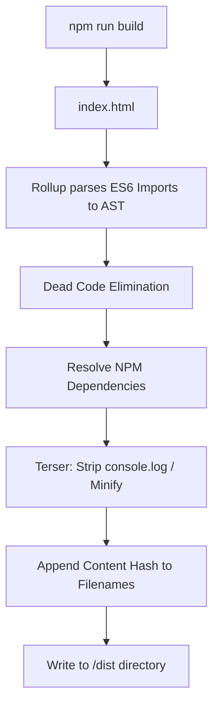
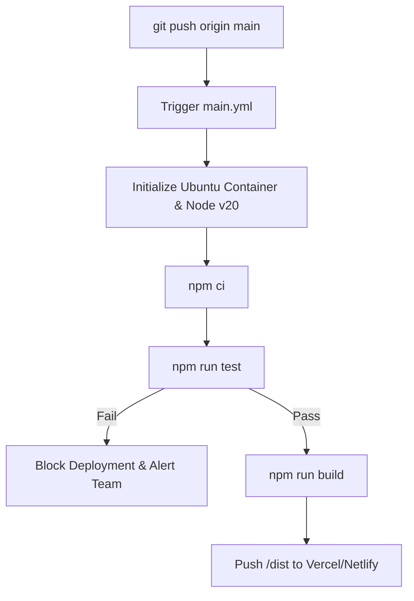
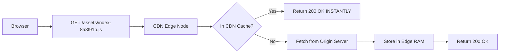

# CHAPTER 8: DEPLOYMENT MANUAL

> **Theoretical Foundations & Deep-Dive Explanations**: For underlying Rollup AST tree-shaking mechanics, Continuous Integration (CI) boundaries, CDN Edge caching protocols, and HTTP header invalidation strategies, see [Chapter 8 Explanation Document](../explanations/Chapter_8_Deployment_Explanation.md).
>
> **Interactive Visualizations**:
> - [Rollup Tree-Shaking AST Parser](../visualizations/project-1-rollup-treeshaking-ch8-interactive.html)
> - [CI/CD Pipeline State Machine](../visualizations/project-1-cicd-pipeline-ch8-interactive.html)
> - [CDN Edge Caching Geolocation Map](../visualizations/project-1-cdn-edge-ch8-interactive.html)

---

## 1. File Overview Table

| File Path | Purpose | Key Responsibilities |
|-----------|---------|----------------------|
| `.github/workflows/main.yml`| CI/CD Pipeline | Orchestrates automated testing, V8 coverage enforcement, and build generation upon code push to the `main` branch. |
| `vite.config.js` | Build Engine Config | Instructs Rollup on AST minification engines (Terser), asset hashing, and dead-code elimination. |
| `dist/` | Production Artifacts | The strictly generated, Git-ignored directory containing the final, minified HTML/CSS/JS payloads deployed to the CDN. |
| `vercel.json` | Edge Server Config | (If using Vercel) Directs the CDN on HTTP caching headers and Single Page Application (SPA) 404 fallback routing. |

---

## 2. Table of Contents

1. [Section 1: Rollup Production AST Bundling & Tree Shaking](#section-1-rollup-production-ast-bundling--tree-shaking)
2. [Section 2: CI/CD Pipeline Implementation (GitHub Actions)](#section-2-cicd-pipeline-implementation-github-actions)
3. [Section 3: CDN Edge Caching & HTTP Header Invalidation](#section-3-cdn-edge-caching--http-header-invalidation)
4. [Section 4: Performance Auditing & Lighthouse CI](#section-4-performance-auditing--lighthouse-ci)
5. [Section 5: Troubleshooting & Edge Case Diagnostics](#section-5-troubleshooting--edge-case-diagnostics)
6. [Section 6: Manual Verification & Pipeline Profiling Procedures](#section-6-manual-verification--pipeline-profiling-procedures)
7. [Section 7: Chapter Summary & Reference Matrix](#section-7-chapter-summary--reference-matrix)

---

## Section 1: Rollup Production AST Bundling & Tree Shaking

### Architecture and State Diagrams



### Step-by-Step Implementation Instructions

1. **Configure Minifier**: Ensure `vite.config.js` is set to use `terser` to explicitly strip `console.log` and `debugger` statements from the AST, preventing memory leaks in production.
2. **Execute Build**: Run `npm run build`.
3. **Verify Artifacts**: Inspect the `/dist` directory. Filenames must contain hashes (e.g., `index-8a3f91b.js`) to break CDN caches automatically on updates.

### Code Blocks and Analysis

#### Code Block 1.1: `vite.config.js` (Build Optimization Block)
```javascript
import { defineConfig } from 'vite';

export default defineConfig({
  build: {
    outDir: 'dist',
    emptyOutDir: true,
    minify: 'terser',
    terserOptions: {
      compress: {
        drop_console: true,
        drop_debugger: true,
        passes: 2 // Perform optimization passes twice for maximum compression
      },
      format: {
        comments: false // Strip all JSDoc and inline comments
      }
    },
    rollupOptions: {
      output: {
        manualChunks: {
          leaflet: ['leaflet'] // Split 3rd party dependency into the dependency's own cacheable chunk
        }
      }
    }
  }
});
```

#### Table 1.1: 5W1H+Which Analysis for Code Block 1.1
| Line | What | When | Why | Where | How | Which |
|---|---|---|---|---|---|---|
| `emptyOutDir: true` | Pre-Build Wipe | Build Start | Deletes stale hashed files from previous builds to prevent the `/dist` folder from infinitely expanding | `build` block | Boolean flag | Cleanup execution |
| `drop_console: true`| AST Node Stripping| Minification | Removes `console.log` statements; un-removed logs hold memory references to objects, causing fatal memory leaks on mobile | `terserOptions` | Boolean flag | Code removal |
| `passes: 2` | Deep Optimization | Minification | Forces Terser to rescan the AST after the first pass to find newly exposed dead code, trading build time for smaller bundles | `terserOptions` | Integer value | Optimization depth |
| `comments: false` | Byte Reduction | Minification | JSDoc comments are read by TSServer but unread by V8; removing JSDoc comments saves bandwidth | `terserOptions` | Boolean flag | Byte reduction |
| `manualChunks: { leaflet... }`| Vendor Splitting | Code Splitting| Isolates Leaflet into `vendor.js`. Since Leaflet updates infrequently, the CDN caches Leaflet permanently across application updates | `rollupOptions` | Object Map | Bundle config |

---

## Section 2: CI/CD Pipeline Implementation (GitHub Actions)

### Architecture and State Diagrams



### Step-by-Step Implementation Instructions

1. **Establish Workflow File**: Create `.github/workflows/main.yml`.
2. **Enforce Deterministic Installs**: Utilize `npm ci` instead of `npm install`. `ci` reads strictly from `package-lock.json` and deletes `node_modules` first, preventing ghost dependencies from passing tests.
3. **Establish Test Boundary**: Execute the Vitest suite. If coverage drops below 90% or a test fails, the CI runner must exit with a non-zero code, halting deployment.

### Code Blocks and Analysis

#### Code Block 2.1: `.github/workflows/main.yml`
```yaml
name: Production CI/CD

on:
  push:
    branches: [ "main" ]

jobs:
  build-and-test:
    runs-on: ubuntu-latest
    steps:
    - name: Checkout Repository
      uses: actions/checkout@v4

    - name: Initialize Deterministic Node Engine
      uses: actions/setup-node@v4
      with:
        node-version: '20.11.1'
        cache: 'npm'

    - name: Enforce Strict Dependency Tree
      run: npm ci

    - name: Execute Vitest Coverage Boundary
      run: npm run coverage

    - name: Generate Production AST Bundle
      run: npm run build

    # Deployment step depends on hosting provider (Vercel, AWS, Firebase, etc.)
    # - name: Deploy to Hosting
    #   run: npx vercel deploy --prebuilt --prod --token=${{ secrets.VERCEL_TOKEN }}
```

#### Table 2.1: 5W1H+Which Analysis for Code Block 2.1
| Line | What | When | Why | Where | How | Which |
|---|---|---|---|---|---|---|
| `on: push: branches: [ "main" ]`| Trigger Boundary | Post-Push | Restricts deployment automation strictly to the production branch | `on` block | YAML Array | Trigger rule |
| `node-version: '20.11.1'` | Environment Lock | Setup Phase | Mirrors local `.nvmrc` to guarantee identical AST compilation and V8 testing conditions in the cloud | `setup-node` step | String literal | Engine version |
| `npm ci` | Strict Install | Install Phase | Throws a fatal error if `package.json` and `package-lock.json` are out of sync, preventing deployment of untested dependency versions | `run` command | CLI invocation | Install method |
| `npm run coverage` | Quality Gate | Testing Phase | Executes Vitest. A non-zero exit code (e.g. failing tests or <90% coverage) instantly terminates the YAML pipeline | `run` command | CLI invocation | Test gate |

---

## Section 3: CDN Edge Caching & HTTP Header Invalidation

### Architecture and State Diagrams



### Step-by-Step Implementation Instructions

1. **Configure Edge Routing**: If hosting on modern CDNs (Vercel, Netlify), Single Page Applications (SPAs) require routing all unknown paths back to `index.html`.
2. **Enforce Cache-Control Headers**:
   - `index.html`: `Cache-Control: no-cache`. Always validate with the server.
   - `/assets/*.js`: `Cache-Control: public, max-age=31536000, immutable`. Cache forever; Rollup hashes the filename on change.

### Code Blocks and Analysis

#### Code Block 3.1: `vercel.json` (Hosting Configuration)
```json
{
  "cleanUrls": true,
  "rewrites": [
    { "source": "/(.*)", "destination": "/index.html" }
  ],
  "headers": [
    {
      "source": "/assets/(.*)",
      "headers": [
        {
          "key": "Cache-Control",
          "value": "public, max-age=31536000, immutable"
        }
      ]
    },
    {
      "source": "/index.html",
      "headers": [
        {
          "key": "Cache-Control",
          "value": "no-cache"
        }
      ]
    }
  ]
}
```

#### Table 3.1: 5W1H+Which Analysis for Code Block 3.1
| Line | What | When | Why | Where | How | Which |
|---|---|---|---|---|---|---|
| `"cleanUrls": true` | Extension Stripping | Edge Routing | Vercel removes .html from URLs for cleaner aesthetics | Root config | Boolean flag | Routing rule |
| `"source": "/(.*)", "dest..."`| SPA Fallback | Edge Routing | Vercel redirects requests to /index.html to support SPA deep linking | `rewrites` block | Regex mapping | Rewrite rule |
| `"max-age=31536000"` | Max Cache TTL | HTTP Response | Vercel instructs the browser to cache asset files for 1 year | `headers` block | String directive | Cache TTL |
| `"immutable"` | Revalidation Guard | HTTP Request | Vercel directs the browser to skip revalidation checks to the server | `headers` block | String directive | Revalidate lock |
| `"no-cache"` | Pointer Validation | HTTP Response | Vercel forces browser validation of the index.html file | `headers` block | String directive | State validation |

---

## Section 4: Troubleshooting & Edge Case Diagnostics

| Symptom / Issue | Root Cause | CI/CD Mechanics | Exact Resolution |
|-----------------|------------|-----------------|------------------|
| **Pipeline fails on `npm ci`** | Lockfile Drift | A developer manually edited `package.json` or ran `npm install` without committing the updated `package-lock.json`. | Run `npm install` locally and commit the `package-lock.json` file. |
| **New code deployed, but old app visible** | `index.html` Caching | The CDN is returning an old `index.html` containing outdated asset hashes. | Enforce `Cache-Control: no-cache` specifically on `index.html`. |
| **404 Error on manual refresh** | Missing SPA Rewrites| The CDN attempted to find a physical file matching the URL path (e.g., `/route/lib`), and the physical file doesn't exist. | Implement a rewrite rule directing `/(.*)` to `/index.html`. |
| **Images/GeoJSON fail to load in prod** | Relative Paths | Fetching `fetch('data.json')` resolved incorrectly on the CDN based on the current URL path. | Always use absolute paths from root: `fetch('/data/landmarks.geojson')`. |
| **Mobile Memory Crash in Prod**| Missing Terser | `console.log` statements containing Graph Maps were left in the bundle, permanently locking the Graph Maps in the heap. | Ensure `drop_console: true` is active in `vite.config.js`. |

---

## Section 5: Manual Verification & Pipeline Profiling Procedures

1. **Verify Bundle Size / Tree Shaking**:
   - Run `npm run build`.
   *Validation*: Terminal output must detail bundle chunks. `index-[hash].js` should ideally be `< 50kb` (excluding Leaflet vendor chunk).

2. **Verify CI/CD Failure Mechanisms**:
   - Intentionally break a unit test locally.
   - Commit and push to a test branch.
   *Validation*: GitHub Actions UI must show a red "Failed" cross. Deployment must NOT execute.

3. **Verify HTTP Caching via DevTools**:
   - Deploy to CDN.
   - Open Developer Tools -> **Network** Tab. Reload page twice.
   *Validation*: The Size column for `index-[hash].js` must explicitly say `(disk cache)`. The `index.html` Size column must say `[Size] B` (indicating it hit the network to validate).

---

## Section 6: Chapter Summary & Reference Matrix

| Component / Function | Source File | Dependencies | Output / Result | Engine Execution State |
|----------------------|-------------|--------------|-----------------|------------------------|
| AST Minification | `vite.config.js` | `Terser` | Stripped `console.log` references | Pre-compilation |
| Vendor Splitting | `vite.config.js` | `Rollup` | Isolated `leaflet.js` chunk | File I/O Thread |
| CI/CD Pipeline | `main.yml` | GitHub Actions | Remote test execution | Cloud Container |
| SPA Fallback Routing | `vercel.json` | Edge CDN | 200 OK for deep links | Edge Network |
| Header Invalidation | `vercel.json` | HTTP Spec | Permanent asset caching | Browser Network Stack |
