# UNIJOS Campus Navigator v2 — Full System Design
## *Applying the RESHADED Framework with a Complete DevOps Lifecycle*

---

> **Document metadata**
> | Field | Value |
> |---|---|
> | Framework applied | RESHADED (Requirements → Estimation → Storage Schema → High-Level Design → API Design → Detailed Design → Evaluation → Distinctive Features) |
> | Project | UNIJOS Campus Navigator v2 |
> | Author | SoriKyo / Antigravity AI |
> | Version | 1.0 |
> | Date | June 2026 |
> | Status | Planning Phase |

---

# Table of Contents

1. [RESHADED Overview](#reshaded-overview)
2. [R — Requirements](#r--requirements)
3. [E — Estimation (Back-of-the-Envelope)](#e--estimation)
4. [S — Storage Schema](#s--storage-schema)
5. [H — High-Level Design](#h--high-level-design)
6. [A — API Design](#a--api-design)
7. [D — Detailed Design](#d--detailed-design)
8. [E — Evaluation & Trade-offs](#e--evaluation--trade-offs)
9. [D — Distinctive Features](#d--distinctive-features)
10. [DevOps Lifecycle](#devops-lifecycle)
11. [Estimations Summary](#estimations-summary)

---

# RESHADED Overview

**RESHADED** is a structured, eight-step system design framework used to produce rigorous, interview-grade and production-grade architecture documentation. Rather than jumping straight to drawing boxes, it forces disciplined thinking in order:


Applied to the UNIJOS Campus Navigator, this document is the definitive blueprint for every engineering decision — from GIS data pipelines to CI/CD pipelines to network topology in a Nigerian university context.

---

# R — Requirements

## 1.1 Problem Statement

The University of Jos (UNIJOS) operates two large campuses — **Main Campus** (established, dense) and **New Campus / Permanent Site** (expanding). Google Maps and OpenStreetMap have virtually no granular data for these campuses: no building outlines, no internal pathways, no accessibility attributes, no naming in local Nigerian languages.

Students, visitors, and staff navigate by memory or word of mouth. The university has no digital wayfinding system. Ground-truth GPS data has been painstakingly collected via **QField** (mobile GIS) and processed in **QGIS** on a laptop — but there is no platform to serve, update, or route on this data.

## 1.2 Functional Requirements (FR)

| ID | Requirement | Priority |
|---|---|---|
| FR-01 | Render both campuses as high-fidelity interactive vector maps | P0 |
| FR-02 | Search for buildings, faculties, amenities, and POIs by name | P0 |
| FR-03 | Multi-modal routing: Pedestrian, Vehicle, Keke Napep | P0 |
| FR-04 | Offline operation — map and routing work without internet | P0 |
| FR-05 | Language switcher: English, Hausa, Yoruba, Igbo | P1 |
| FR-06 | Accessibility mode: highlight ramps, accessible entrances, bathrooms | P1 |
| FR-07 | Admin dashboard: JWT-secured CRUD for POIs | P0 |
| FR-08 | GeoJSON upload portal for QField/QGIS data ingestion | P0 |
| FR-09 | PDF export of current map view + turn-by-turn directions | P2 |
| FR-10 | Analytics: track popular searches and most-viewed POIs | P1 |
| FR-11 | POI detail panel: images, description, hours, floor count | P1 |
| FR-12 | Campus switcher: smooth transition between Main and New Campus | P0 |

## 1.3 Non-Functional Requirements (NFR)

| ID | Requirement | Target |
|---|---|---|
| NFR-01 | **Performance** — Initial map load (3G, 1Mbps) | < 4 seconds |
| NFR-02 | **Routing computation** — Client-side pathfinding | < 500ms |
| NFR-03 | **Availability** — Backend API uptime | ≥ 99.5% |
| NFR-04 | **Offline-first** — PWA cache coverage | 100% of static assets + map tiles |
| NFR-05 | **Scalability** — Concurrent users on campus network | Support 500 concurrent users |
| NFR-06 | **Security** — Admin routes fully guarded | JWT + bcrypt, HTTPS-only |
| NFR-07 | **Accessibility (a11y)** — WCAG 2.1 AA compliance | All interactive elements |
| NFR-08 | **i18n completeness** — UI + POI names | EN, HA, YO, IG |
| NFR-09 | **Storage budget** — PNPM monorepo disk usage | Minimize via shared store |
| NFR-10 | **Database correctness** — Spatial queries | Sub-100ms spatial index hits |

## 1.4 User Personas

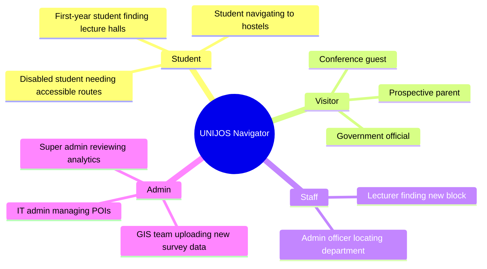

## 1.5 Scope & Out-of-Scope

**In scope (v2):**
- Web app (desktop + mobile browser)
- Main Campus + New Campus vector maps
- Client-side routing and offline PWA
- Admin CRUD + GeoJSON ingestion
- Analytics foundation
- i18n (4 languages)
- Accessibility features

**Out of scope (v2):**
- Native mobile apps (iOS / Android)
- Real-time crowd density / occupancy
- Indoor floor-plan navigation
- Third-party payment or ticketing
- Live traffic data

---

# E — Estimation

## 2.1 Traffic Model

### User Assumption Basis
- UNIJOS total enrolment: ~36,000 students
- Staff: ~3,000
- Realistic DAU (Daily Active Users) at launch: **~5,000** (14% of students + visitors)
- Peak: Semester start / exams. Estimate **3× DAU** spike = **15,000 peak daily users**
- Peak concurrent sessions (15-min granularity): **500 users**

### Request Rate

| Metric | Value | Working |
|---|---|---|
| DAU | 5,000 | Baseline |
| Sessions/user/day | 2 | 2 campus visits |
| Requests/session | 20 | Map load + 5 POI views + search + route |
| Total requests/day | 200,000 | 5,000 × 2 × 20 |
| Requests/second (avg) | **2.3 RPS** | 200K / 86,400s |
| Peak RPS (10× avg) | **23 RPS** | Conservative campus peak |

## 2.2 Storage Estimation

### GeoJSON / Geometry Data

| Entity | Count | Avg Size | Total |
|---|---|---|---|
| Buildings (Polygons) | ~350 | 2 KB | 700 KB |
| Paths / Roads (LineStrings) | ~800 | 1.5 KB | 1.2 MB |
| Point POIs | ~200 | 0.5 KB | 100 KB |
| Routing graph (nodes + edges) | ~1,200 edges | 0.8 KB | ~960 KB |
| **Static GeoJSON total** | | | **~3 MB** |

### Database Storage (PostgreSQL + PostGIS)

| Table | Rows (Year 1) | Avg Row Size | Total |
|---|---|---|---|
| `pois` | 550 | 2 KB | 1.1 MB |
| `routing_edges` | 800 | 1.5 KB | 1.2 MB |
| `admin_users` | 5 | 256 B | 1.3 KB |
| `search_logs` | 3,650,000 (5K/day × 365 × 2) | 128 B | 467 MB |
| `view_logs` | 3,650,000 | 64 B | 234 MB |
| PostGIS geometry indexes | — | — | ~50 MB |
| **Total DB storage (Year 1)** | | | **~750 MB** |

### Map Tile Cache (Service Worker / CDN)

| Asset | Size |
|---|---|
| Base map vector tiles (campus bbox, z12–z19) | ~8 MB |
| PWA bundle (JS, CSS, fonts) | ~2.5 MB |
| Translation JSON files (4 langs) | ~120 KB |
| **Total cached on device** | **~11 MB** |

## 2.3 Bandwidth Estimation

| Event | Size | Daily Volume | Daily Bandwidth |
|---|---|---|---|
| Initial map load (new user) | 3.5 MB | 1,000 users | 3.5 GB |
| Return user (cached) | 150 KB delta | 4,000 users | 600 MB |
| POI data fetch | 5 KB | 100,000 fetches | 500 MB |
| Analytics pings | 200 B | 200,000 events | 40 MB |
| **Total outbound/day** | | | **~4.6 GB/day** |
| **Monthly egress** | | | **~140 GB/month** |

## 2.4 Compute Estimation

| Component | Spec | Rationale |
|---|---|---|
| API Server (Express) | 1 vCPU, 512 MB RAM | Lightweight REST; < 23 RPS |
| PostgreSQL + PostGIS | 1 vCPU, 2 GB RAM | Spatial index queries; ~750 MB DB |
| Nginx / Reverse Proxy | Shared with API | Static file serving + SSL termination |
| CDN (Cloudflare Free) | N/A | Cache static tiles + assets globally |
| **Total infra (Phase 1)** | **2 vCPU, 3 GB RAM** | ~$10–15/month on DigitalOcean/Railway |

---

# S — Storage Schema

## 3.1 Entity Relationship Diagram

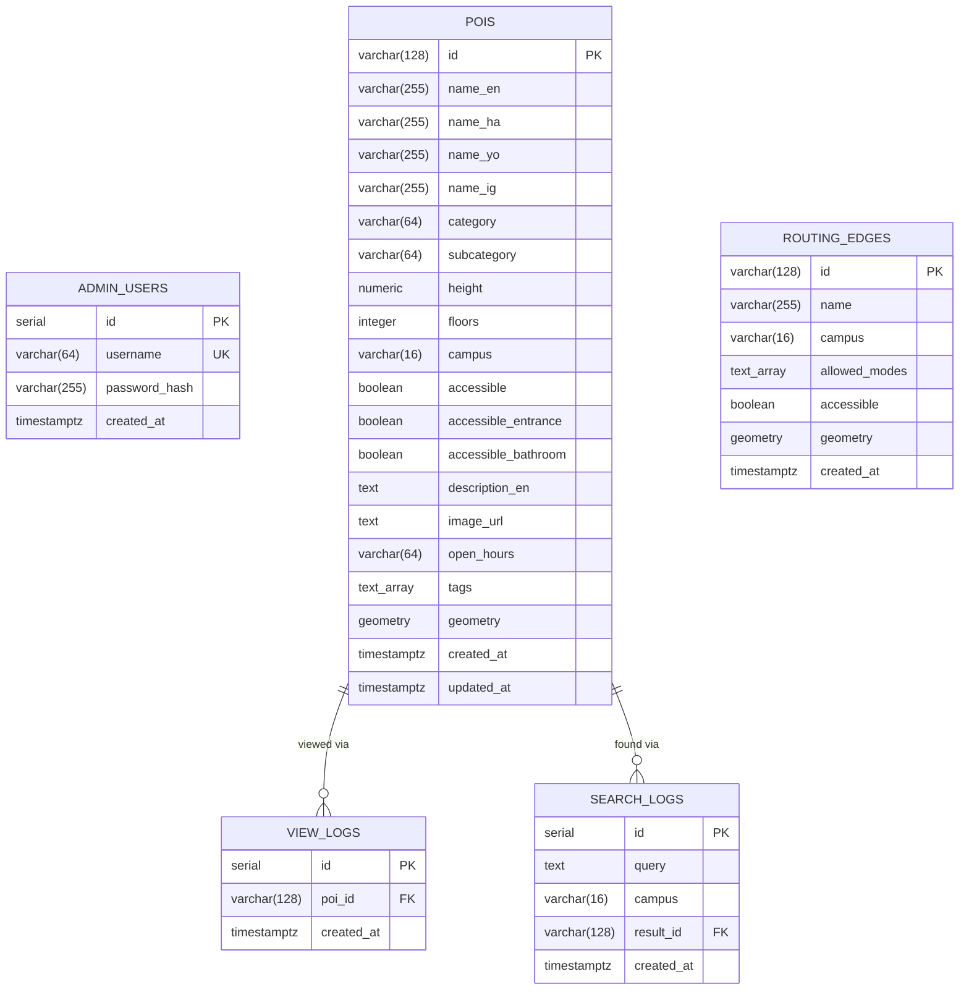

## 3.2 Data Model Deep-Dive

### 3.2.1 `pois` Table

The `pois` table is the core of the system. Every building outline (Polygon), point of interest (Point), or campus gate is stored here. The `geometry` column is a PostGIS `GEOMETRY(Geometry, 4326)` — it accepts both Point and Polygon geometries using WGS84 (lat/lon) coordinates.

**Category enum values:**
- `academic` — Faculties, departments, labs
- `admin` — Senate building, offices
- `amenity` — ATMs, cafeterias, health center, banks
- `hostel` — Student accommodation blocks
- `sports` — Stadium, gym, courts
- `gate` — Campus entrance/exit gates
- `other` — Miscellaneous

**Spatial index strategy:**
```sql
-- GIST index on geometry for fast bbox queries
CREATE INDEX pois_geometry_idx ON pois USING GIST (geometry);

-- B-tree index on campus for fast partition
CREATE INDEX pois_campus_idx ON pois (campus);

-- Composite index for campus + category admin queries
CREATE INDEX pois_campus_category_idx ON pois (campus, category);
```

### 3.2.2 `routing_edges` Table

Stores the road/path network as LineStrings. The routing engine fetches all edges for a given campus, builds an adjacency graph in-memory (JavaScript), and runs Dijkstra/A*.

**`allowed_modes` values:** `pedestrian`, `vehicle`, `keke`

### 3.2.3 Analytics Tables

`search_logs` and `view_logs` are append-only event logs. They are **non-blocking** (fire-and-forget) — the client sends analytics pings after the user-facing response is already delivered. These tables will be the basis for a future analytics dashboard.

**Future analytics schema extensions (Phase 3):**
```sql
-- Planned additions
ALTER TABLE search_logs ADD COLUMN session_id UUID;
ALTER TABLE search_logs ADD COLUMN language VARCHAR(5);
ALTER TABLE view_logs   ADD COLUMN duration_seconds INTEGER;
CREATE TABLE routing_logs (
    id SERIAL PRIMARY KEY,
    from_poi_id VARCHAR(128),
    to_poi_id   VARCHAR(128),
    mode        VARCHAR(20),
    distance_m  NUMERIC(10,2),
    created_at  TIMESTAMPTZ NOT NULL DEFAULT NOW()
);
```

## 3.3 Data Flow: QField → Database

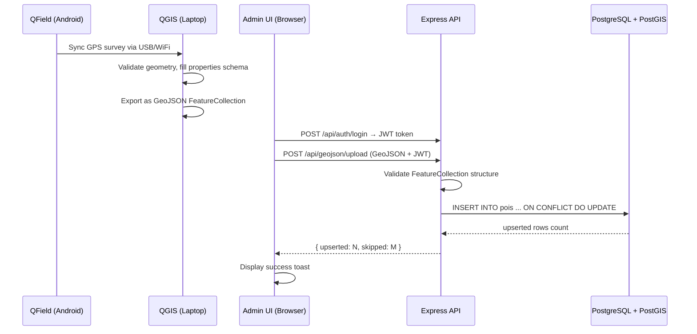

## 3.4 GeoJSON Feature Property Contract

Every GeoJSON feature uploaded from QField/QGIS **must** conform to this schema. The API validates and rejects features missing required fields.

```json
{
  "type": "Feature",
  "properties": {
    "id":                 "string (required, unique, e.g. main-001)",
    "name_en":            "string (required)",
    "name_ha":            "string | null",
    "name_yo":            "string | null",
    "name_ig":            "string | null",
    "category":           "academic|admin|amenity|hostel|sports|gate|other",
    "subcategory":        "string | null",
    "height":             "number (metres, default 6)",
    "floors":             "integer (default 1)",
    "campus":             "main | new",
    "accessible":         "boolean",
    "accessible_entrance":"boolean",
    "accessible_bathroom":"boolean",
    "description_en":     "string | null",
    "image_url":          "string (URL) | null",
    "open_hours":         "HH:MM-HH:MM | null",
    "tags":               "string[]"
  },
  "geometry": {
    "type": "Point | Polygon | LineString",
    "coordinates": [...]
  }
}
```

---

# H — High-Level Design

## 4.1 System Architecture Overview

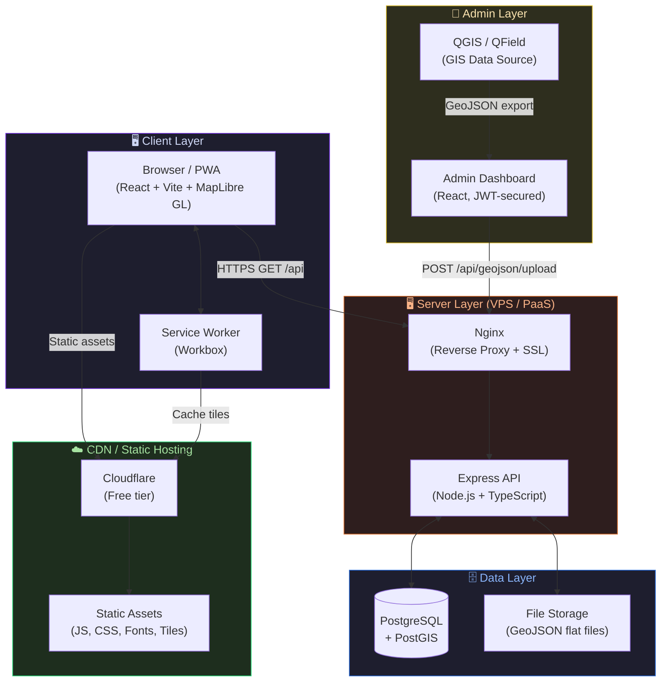

## 4.2 Request Lifecycle

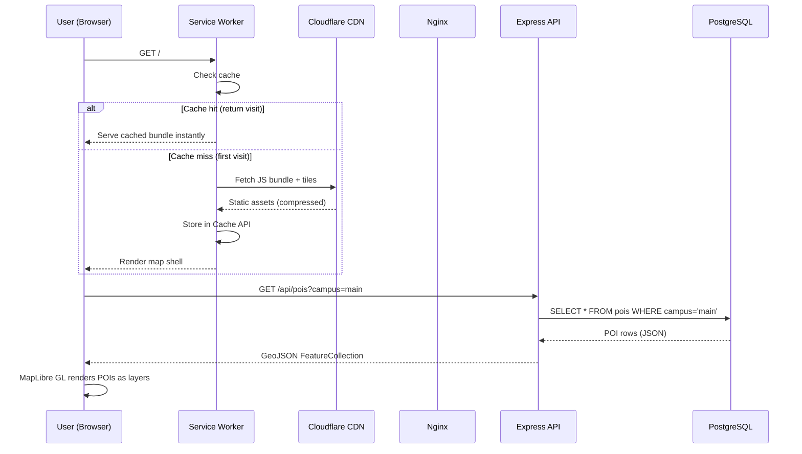

## 4.3 Campus Navigator - Component Breakdown

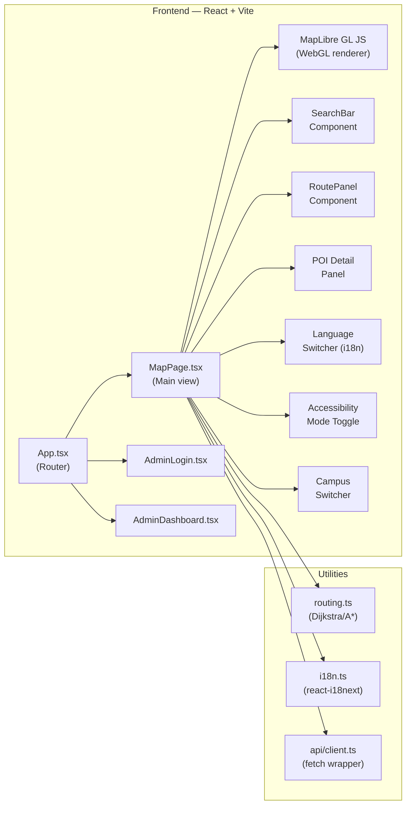

---

# A — API Design

## 5.1 API Principles

- **REST** architecture over HTTP/1.1
- **JSON** request/response bodies
- **JWT Bearer** token for all write/admin routes
- **Versioning**: Implicit v2 (prefix `/api/`)
- **Error format**: `{ "error": "Human-readable message", "details": "optional" }`
- **Rate limiting**: 100 req/min per IP (Phase 2)

## 5.2 Authentication Endpoints

| Method | Path | Auth | Description |
|---|---|---|---|
| `POST` | `/api/auth/login` | None | Authenticate with username/password, receive JWT |
| `GET` | `/api/auth/verify` | Bearer JWT | Verify token validity |

### Login Request/Response
```
POST /api/auth/login
Content-Type: application/json

{
  "username": "admin",
  "password": "s3cur3P@ss"
}

→ 200 OK
{
  "token": "eyJhbGciOiJIUzI1NiIsInR5cCI6IkpXVCJ9...",
  "message": "Login successful"
}

→ 401 Unauthorized (after 300ms delay to prevent timing attacks)
{ "error": "Invalid credentials" }
```

## 5.3 POI Endpoints

| Method | Path | Auth | Description |
|---|---|---|---|
| `GET` | `/api/pois` | None | List all POIs (optional `?campus=main\|new`) |
| `GET` | `/api/pois/:id` | None | Get single POI by ID |
| `POST` | `/api/pois` | Bearer JWT | Create new POI |
| `PUT` | `/api/pois/:id` | Bearer JWT | Update existing POI |
| `DELETE` | `/api/pois/:id` | Bearer JWT | Delete POI |

### GET /api/pois Response
```json
[
  {
    "id": "main-senate",
    "name_en": "Main Campus Administration Building",
    "name_ha": "Gidan Gudanarwa",
    "name_yo": "Ikọlu Alakoso",
    "name_ig": "Ụlọ Nchịkwa",
    "category": "admin",
    "campus": "main",
    "accessible": true,
    "accessible_entrance": true,
    "accessible_bathroom": true,
    "height": 15,
    "floors": 3,
    "open_hours": "08:00-17:00",
    "tags": ["admin", "offices"],
    "geometry": {
      "type": "Polygon",
      "coordinates": [[[8.889, 9.950], ...]]
    }
  }
]
```

## 5.4 GeoJSON Upload Endpoint

| Method | Path | Auth | Description |
|---|---|---|---|
| `POST` | `/api/geojson/upload` | Bearer JWT | Bulk upsert features from QField/QGIS export |

```
POST /api/geojson/upload
Authorization: Bearer <token>
Content-Type: application/json

{
  "geojson": {
    "type": "FeatureCollection",
    "features": [ ... ]
  }
}

→ 200 OK
{
  "message": "GeoJSON ingested. 45 features upserted, 2 skipped.",
  "total": 550
}
```

## 5.5 Routing Data Endpoint

| Method | Path | Auth | Description |
|---|---|---|---|
| `GET` | `/api/routing/edges` | None | Fetch all routing edges for a campus |
| `POST` | `/api/routing/edges` | Bearer JWT | Upload routing network GeoJSON |

```
GET /api/routing/edges?campus=main&mode=pedestrian

→ 200 OK (GeoJSON FeatureCollection of LineStrings)
{
  "type": "FeatureCollection",
  "features": [
    {
      "type": "Feature",
      "properties": {
        "id": "path-001",
        "allowed_modes": ["pedestrian"],
        "accessible": true
      },
      "geometry": { "type": "LineString", "coordinates": [...] }
    }
  ]
}
```

## 5.6 Analytics Endpoints

| Method | Path | Auth | Description |
|---|---|---|---|
| `POST` | `/api/analytics/search` | None | Log a search event (fire and forget) |
| `POST` | `/api/analytics/view` | None | Log a POI view event (fire and forget) |
| `GET` | `/api/analytics` | Bearer JWT | Get analytics summary |

### Analytics Summary Response
```json
{
  "top_searches": [
    { "query": "library", "count": 1240 },
    { "query": "senate building", "count": 890 }
  ],
  "top_views": [
    { "poi_id": "main-senate", "count": 3421 },
    { "poi_id": "new-library", "count": 2109 }
  ]
}
```

## 5.7 API Flow Diagram

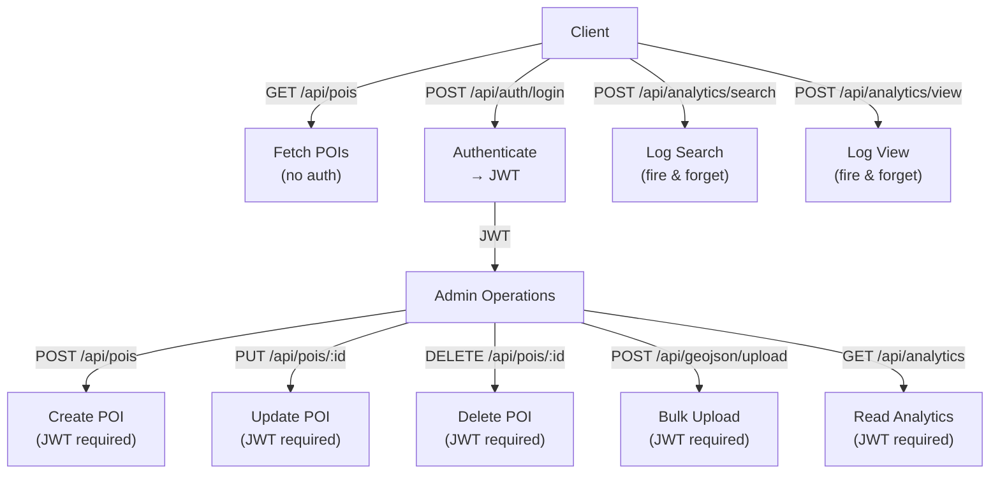

---

# D — Detailed Design

## 6.1 Frontend Architecture

### 6.1.1 Component Tree

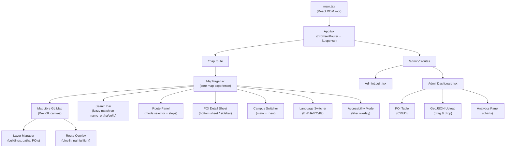

### 6.1.2 MapLibre GL Layer Stack

MapLibre GL renders data as ordered layers. The stack for UNIJOS Navigator:

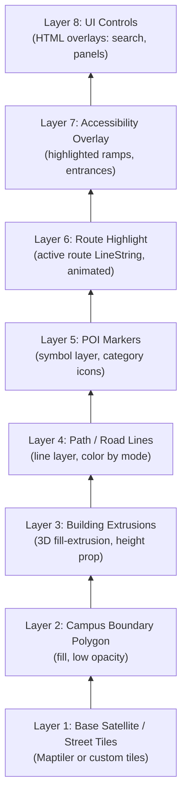

### 6.1.3 Client-Side Routing Engine

The routing engine runs entirely in the browser — no server round-trip. This satisfies the offline-first NFR.

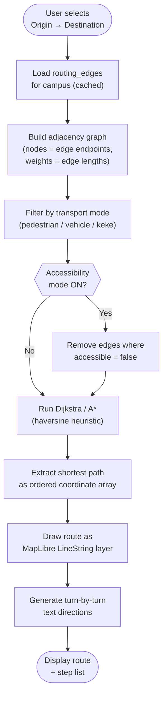

**Algorithm selection:**
- **Dijkstra** — Used when no heuristic is available (sparse graph)
- **A\*** — Used with haversine distance heuristic when origin and destination coordinates are known (faster on dense graphs)

### 6.1.4 Offline Strategy (PWA)

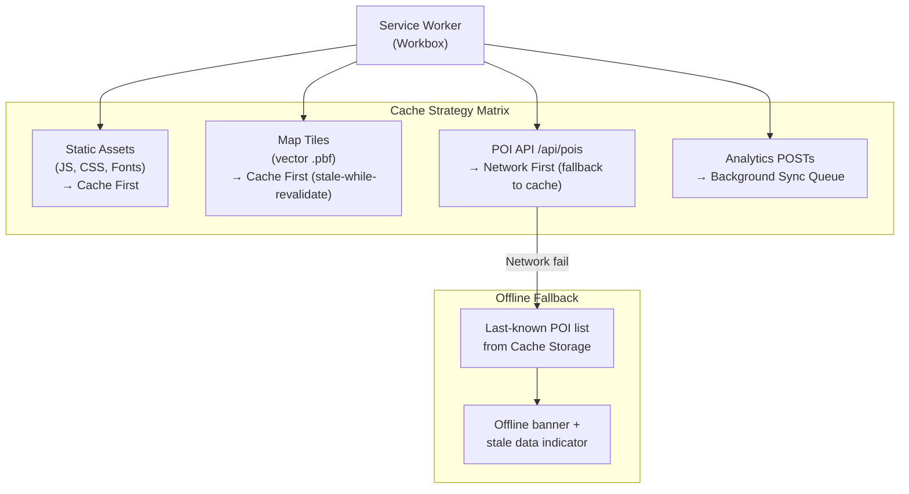

**Workbox strategy configuration:**
```typescript
// vite.config.ts (VitePWA plugin)
workbox: {
  runtimeCaching: [
    {
      urlPattern: /\/api\/pois/,
      handler: 'NetworkFirst',
      options: { cacheName: 'poi-cache', networkTimeoutSeconds: 5 }
    },
    {
      urlPattern: /\.pbf$/,
      handler: 'CacheFirst',
      options: { cacheName: 'tile-cache', expiration: { maxEntries: 500 } }
    }
  ]
}
```

## 6.2 Backend Architecture

### 6.2.1 Express Middleware Stack

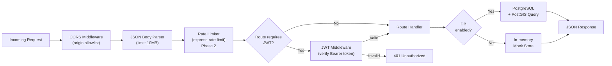

### 6.2.2 Database Connection Pool

```typescript
// Connection pool configuration (Phase 2 production)
const pool = new pg.Pool({
  connectionString: process.env.DATABASE_URL,
  max: 10,                    // max 10 concurrent connections
  idleTimeoutMillis: 30000,   // close idle after 30s
  connectionTimeoutMillis: 2000 // fail fast
});
```

## 6.3 Infrastructure Design

### 6.3.1 Deployment Topology

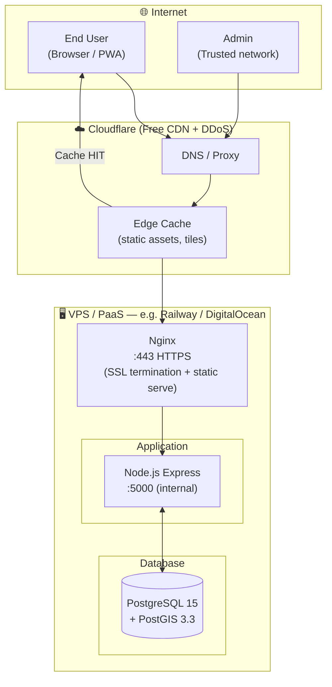

### 6.3.2 Environment Configuration

| Variable | Dev | Production |
|---|---|---|
| `DATABASE_URL` | `postgres://localhost/unijos_nav` | Railway / Supabase connection string |
| `JWT_SECRET` | Local random string | Secret manager / env var (32+ chars) |
| `ADMIN_USERNAME` | `admin` | Unique per deployment |
| `ADMIN_PASSWORD` | Local only | Strong password, rotated quarterly |
| `CORS_ORIGINS` | `http://localhost:5173` | `https://map.unijos.edu.ng` |
| `PORT` | `5000` | Platform-assigned |

## 6.4 DevOps Pipeline Design

### 6.4.1 CI/CD Pipeline

```mermaid
flowchart LR
    Dev["Developer\ncommit + push"] --> GH["GitHub\nRepository"]
    GH --> CI["GitHub Actions\nCI Pipeline"]

    subgraph CI["CI Pipeline"]
        Lint["1. ESLint +\nTypeScript check"]
        Test["2. Unit Tests\n(Vitest)"]
        Build["3. PNPM build\n(frontend + backend)"]
        Docker["4. Docker build\n(backend image)"]
        Scan["5. Trivy security\nimage scan"]
        Lint --> Test --> Build --> Docker --> Scan
    end

    Scan --> CD["CD Pipeline\n(on main branch)"]

    subgraph CD["CD Pipeline"]
        Deploy_FE["Deploy frontend\nto Cloudflare Pages"]
        Deploy_BE["Deploy backend\nto Railway / Render"]
        Migrate["Run DB migrations\n(schema.sql)"]
        Smoke["Smoke test\nGET /healthcheck"]
        Deploy_FE --> Deploy_BE --> Migrate --> Smoke
    end

    Smoke -->|Pass| Live["✅ Production\nLive"]
    Smoke -->|Fail| Rollback["⏮️ Rollback\n(previous release)"]
```

### 6.4.2 Branching Strategy

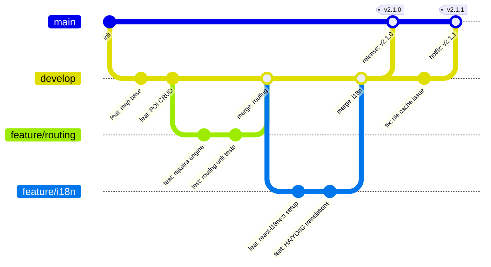

### 6.4.3 GitHub Actions Workflow (Core Steps)

```yaml
# .github/workflows/ci-cd.yml (planned)
name: CI/CD Pipeline

on:
  push:
    branches: [main, develop]
  pull_request:
    branches: [main, develop]

jobs:
  ci:
    runs-on: ubuntu-latest
    steps:
      - uses: actions/checkout@v4
      - uses: pnpm/action-setup@v3
        with: { version: 9 }
      - run: pnpm install --frozen-lockfile
      - run: pnpm lint          # ESLint + tsc --noEmit
      - run: pnpm test          # Vitest unit tests
      - run: pnpm build         # frontend Vite build

  deploy:
    needs: ci
    if: github.ref == 'refs/heads/main'
    steps:
      - name: Deploy frontend
        uses: cloudflare/pages-action@v1
      - name: Deploy backend
        run: railway up --service api
      - name: Smoke test
        run: curl -f https://api.map.unijos.edu.ng/
```

## 6.5 Observability & Monitoring

### 6.5.1 Monitoring Stack

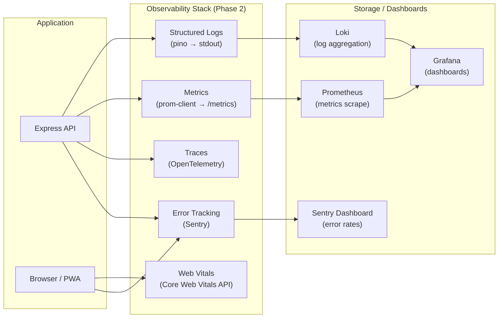

### 6.5.2 Key Metrics to Track

| Metric | Type | Alert Threshold |
|---|---|---|
| API response time (p95) | Histogram | > 500ms |
| Error rate (5xx) | Counter | > 1% of requests |
| DB connection pool utilization | Gauge | > 80% |
| PWA cache hit rate | Counter | < 70% |
| Routing computation time | Histogram | > 500ms |
| Daily Active Users | Counter | — (trend monitoring) |
| Top 10 searched POIs | Counter | — (product insight) |
| GeoJSON upload success rate | Counter | < 95% |

---

# E — Evaluation & Trade-offs

## 7.1 Architectural Trade-offs

### 7.1.1 Client-side Routing vs. Server-side Routing

| Dimension | Client-side (Chosen) | Server-side |
|---|---|---|
| **Offline** | ✅ Works fully offline | ❌ Requires internet |
| **Latency** | ✅ Zero network round-trip | ❌ Network + compute |
| **Graph size** | ⚠️ ~1 MB download for edge data | ✅ Server holds full graph |
| **Complexity** | ⚠️ JS graph library needed | ✅ pgRouting available |
| **Scalability** | ✅ Computation offloaded to client | ❌ Server-side compute scales cost |

**Decision:** Client-side routing wins because offline operation is a P0 requirement. The graph is small enough (~1 MB) for the campus scale.

### 7.1.2 PostgreSQL vs. SQLite vs. Flat GeoJSON Files

| Dimension | PostgreSQL + PostGIS (Chosen) | SQLite + SpatiaLite | Flat GeoJSON Files |
|---|---|---|---|
| **Spatial queries** | ✅ Best (GIST index) | ✅ Good | ❌ Manual filtering |
| **Concurrency** | ✅ MVCC, connection pool | ⚠️ Write lock contention | ✅ Read-only via CDN |
| **Admin mutations** | ✅ Native SQL | ✅ Native SQL | ❌ File rewrite |
| **Analytics** | ✅ SQL aggregations | ✅ Limited | ❌ Impossible |
| **Deployment** | ⚠️ Separate DB host needed | ✅ Single file | ✅ CDN-hosted |
| **Cost** | ⚠️ DB hosting fee | ✅ Free | ✅ Free |

**Decision:** PostgreSQL wins for future analytics, admin CRUD, and correctness. SQLite is noted as a valid fallback if cost is a blocker.

### 7.1.3 JWT vs. Session Cookies for Admin Auth

| Dimension | JWT (Chosen) | Session Cookies |
|---|---|---|
| **Stateless** | ✅ No server-side session store | ❌ Redis/DB session store needed |
| **Expiry control** | ⚠️ Token revocation requires blocklist | ✅ Server can invalidate anytime |
| **Scale** | ✅ Works across multiple servers | ⚠️ Sticky sessions or shared store |
| **Security** | ⚠️ Token in localStorage (XSS risk) | ✅ HttpOnly cookie (safer) |

**Decision:** JWT chosen for simplicity and statelessness given single-admin use case. In Phase 2, move JWT to `HttpOnly` cookie.

## 7.2 Consistency vs. Availability

This system favors **Availability over Consistency** (AP in CAP theorem):
- POI data is read-heavy and not mission-critical real-time
- Analytics logs accept eventual consistency (fire-and-forget)
- Offline cache may serve stale POI data — acceptable for a campus map

## 7.3 Known Risks & Mitigations

| Risk | Likelihood | Impact | Mitigation |
|---|---|---|---|
| PostgreSQL downtime | Low | High | In-memory fallback mode already implemented |
| QField data format mismatch | Medium | Medium | Strict property schema validation in GeoJSON upload endpoint |
| JWT secret exposure | Low | Critical | `.env` in `.gitignore`, secret rotation plan |
| 3G performance regression | Medium | High | PWA cache covers 100% of static assets; measure with Lighthouse |
| Campus boundary data gaps | High | Medium | Iterative QField surveys; admin upload portal handles incremental updates |
| i18n translation accuracy | Medium | Medium | Community review by native Hausa/Yoruba/Igbo speakers |

---

# D — Distinctive Features

## 8.1 Multi-language POI Search

Most campus maps don't support local language search. UNIJOS Navigator supports searching by name in **Hausa, Yoruba, or Igbo** — not just English. The search is implemented as a fuzzy match across all four `name_*` columns simultaneously.

```typescript
// Search implementation (client-side fuzzy match)
function searchPOIs(query: string, pois: POI[], lang: Language): POI[] {
  const q = query.toLowerCase().trim();
  return pois.filter(poi => {
    return (
      poi.name_en?.toLowerCase().includes(q) ||
      poi.name_ha?.toLowerCase().includes(q) ||
      poi.name_yo?.toLowerCase().includes(q) ||
      poi.name_ig?.toLowerCase().includes(q) ||
      poi.tags?.some(t => t.includes(q))
    );
  }).sort((a, b) => {
    // Boost exact matches in current language
    const langKey = `name_${lang}` as keyof POI;
    const aExact = a[langKey]?.toLowerCase().startsWith(q) ? 1 : 0;
    const bExact = b[langKey]?.toLowerCase().startsWith(q) ? 1 : 0;
    return bExact - aExact;
  });
}
```

## 8.2 Accessibility Routing Mode

When accessibility mode is toggled:
1. The routing engine filters the graph to edges where `accessible = true`
2. POI markers for wheelchair ramps, accessible bathrooms, and lifts are overlaid on the map
3. The route display adds an accessibility badge to each step

This is a distinctive feature because no existing campus map in Nigeria implements this.

## 8.3 GIS-Native Admin Workflow

The admin upload flow is designed to be **QGIS-native**:
- Admin exports from QGIS directly as `FeatureCollection` GeoJSON
- Uploads via the drag-and-drop portal
- The API performs `ON CONFLICT DO UPDATE` — partial updates are safe
- PostGIS stores raw geometries — no lossy conversion

This is distinct from typical admin CRUDs which require manually entering coordinates.

## 8.4 PDF Export with Turn-by-Turn Directions

Using the **browser's native print API** (`window.print()`), users can generate a PDF of:
- The current MapLibre map viewport (captured as canvas)
- The active route highlighted
- Turn-by-turn step list with distances
- Accessible offline, no server required

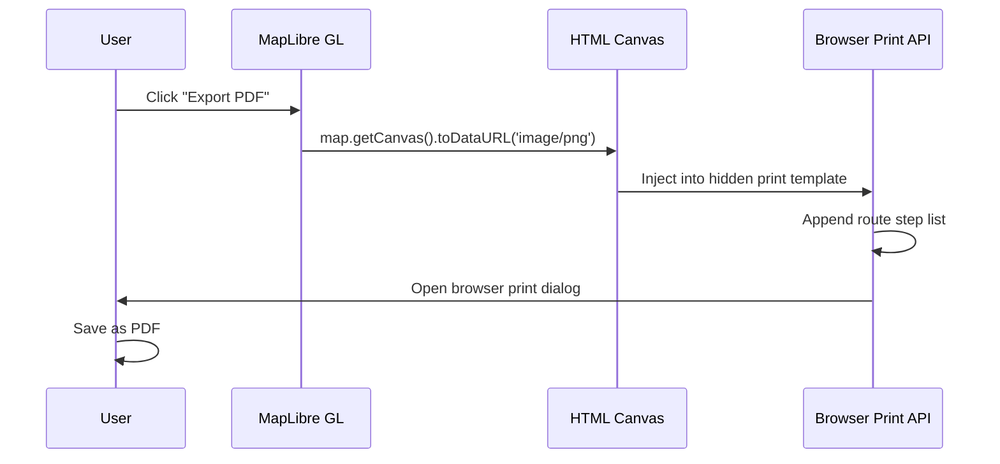

## 8.5 Incremental GeoJSON Versioning (Phase 3)

A future distinctive feature: every GeoJSON upload is stored as a versioned snapshot with a `version_id` and `uploaded_at`. Admins can view a diff of what changed between uploads and rollback if needed.

```sql
-- Planned Phase 3 table
CREATE TABLE geojson_versions (
    id           SERIAL PRIMARY KEY,
    campus       VARCHAR(16),
    uploaded_by  VARCHAR(64),
    feature_count INTEGER,
    diff_summary JSONB,
    raw_geojson  JSONB,
    uploaded_at  TIMESTAMPTZ NOT NULL DEFAULT NOW()
);
```

---

# DevOps Lifecycle

## 9.1 Full DevOps Lifecycle Diagram

```mermaid
flowchart LR
    Plan["📋 Plan\n(PRD, RESHADED,\nGitHub Issues)"]
    Code["💻 Code\n(VS Code, TypeScript,\nPNPM Workspace)"]
    Build["🔨 Build\n(Vite, tsc,\nGitHub Actions CI)"]
    Test["🧪 Test\n(Vitest, Playwright,\nLighthouse CI)"]
    Release["📦 Release\n(Semantic Versioning,\nGitHub Releases)"]
    Deploy["🚀 Deploy\n(Cloudflare Pages,\nRailway / DigitalOcean)"]
    Operate["⚙️ Operate\n(Nginx, PM2,\nPostgreSQL)"]
    Monitor["📊 Monitor\n(Grafana, Sentry,\nAnalytics Dashboard)"]
    Feedback["🔁 Feedback\n(User reports,\nAnalytics insights)"]

    Plan --> Code --> Build --> Test --> Release --> Deploy --> Operate --> Monitor --> Feedback --> Plan

    style Plan fill:#6c2bd9,color:#fff,stroke:#6c2bd9
    style Code fill:#2b6cd9,color:#fff,stroke:#2b6cd9
    style Build fill:#2ba3d9,color:#fff,stroke:#2ba3d9
    style Test fill:#2bd97a,color:#1a1a1a,stroke:#2bd97a
    style Release fill:#a3d92b,color:#1a1a1a,stroke:#a3d92b
    style Deploy fill:#d9b92b,color:#1a1a1a,stroke:#d9b92b
    style Operate fill:#d96c2b,color:#fff,stroke:#d96c2b
    style Monitor fill:#d92b6c,color:#fff,stroke:#d92b6c
    style Feedback fill:#9c2bd9,color:#fff,stroke:#9c2bd9
```

## 9.2 Development Environment Setup

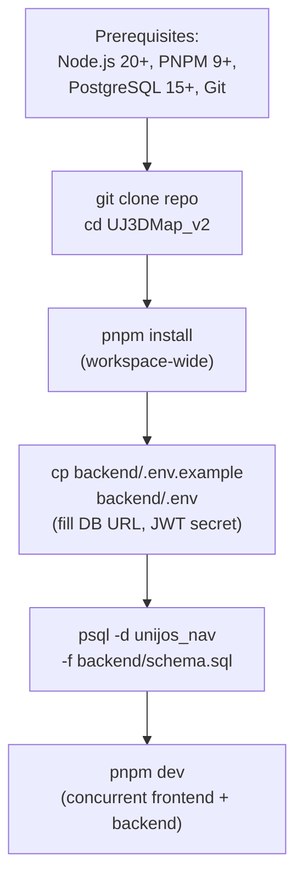

## 9.3 Phase Roadmap

```mermaid
gantt
    title UNIJOS Campus Navigator v2 — Development Roadmap
    dateFormat YYYY-MM-DD
    axisFormat %b %Y

    section Phase 1 — Foundation
    PNPM Workspace setup         :done, p1a, 2026-01-01, 2026-01-14
    MapLibre GL base map         :done, p1b, 2026-01-10, 2026-01-24
    Express API + schema.sql     :done, p1c, 2026-01-15, 2026-01-28
    Admin login + JWT            :done, p1d, 2026-01-20, 2026-02-05
    POI CRUD (in-memory)         :done, p1e, 2026-01-25, 2026-02-10

    section Phase 2 — Core Features
    PostgreSQL + PostGIS wiring  :active, p2a, 2026-02-10, 2026-02-24
    GeoJSON upload + ingest      :p2b, 2026-02-15, 2026-03-01
    Client-side routing engine   :p2c, 2026-02-20, 2026-03-10
    i18n (EN/HA/YO/IG)           :p2d, 2026-03-01, 2026-03-15
    Accessibility mode           :p2e, 2026-03-10, 2026-03-22
    PWA + service worker cache   :p2f, 2026-03-15, 2026-03-29

    section Phase 3 — Polish & Production
    Analytics dashboard          :p3a, 2026-04-01, 2026-04-14
    PDF export                   :p3b, 2026-04-01, 2026-04-10
    CI/CD pipeline (GitHub Actions):p3c, 2026-04-10, 2026-04-20
    Lighthouse performance audit :p3d, 2026-04-20, 2026-04-25
    Security hardening           :p3e, 2026-04-20, 2026-04-28
    Production deployment        :milestone, p3f, 2026-05-01, 0d

    section Phase 4 — Growth
    3D building extrusions       :p4a, 2026-05-15, 2026-06-15
    Routing versioning           :p4b, 2026-06-01, 2026-06-30
    Native mobile app (React Native):p4c, 2026-07-01, 2026-09-30
```

## 9.4 Testing Strategy

```mermaid
graph TD
    subgraph Testing["Testing Pyramid"]
        E2E["E2E Tests\n(Playwright)\n— Map renders, routing works,\nAdmin can login + upload GeoJSON"]
        Integration["Integration Tests\n(Supertest)\n— API routes return correct shape,\nJWT auth guards work,\nDB operations commit correctly"]
        Unit["Unit Tests\n(Vitest)\n— Routing algorithm correctness,\nGeoJSON validation,\ni18n string resolution,\nSearch ranking logic"]
    end

    Unit -->|Most tests| Integration -->|Fewer tests| E2E
```

| Test Suite | Tool | Coverage Target |
|---|---|---|
| Unit — routing algorithm | Vitest | 95% branch coverage |
| Unit — GeoJSON validation | Vitest | 100% schema paths |
| Unit — i18n resolution | Vitest | All 4 languages |
| Integration — API routes | Supertest + Vitest | All 12 endpoints |
| E2E — map load | Playwright | Map renders in < 4s |
| E2E — routing flow | Playwright | Route computed + displayed |
| E2E — admin upload | Playwright | GeoJSON ingested + visible on map |
| Performance | Lighthouse CI | Score ≥ 90 (Performance, PWA) |
| Security | OWASP ZAP | No critical findings |

## 9.5 Security Posture

```mermaid
graph LR
    subgraph Threats["Threat Vectors"]
        XSS["XSS\n(malicious script injection)"]
        SQLI["SQL Injection\n(malformed query params)"]
        JWT_LEAK["JWT Leakage\n(token interception)"]
        DDOS["DDoS\n(traffic flood)"]
        GeoJ_BOMB["GeoJSON Bomb\n(oversized upload)"]
    end

    subgraph Mitigations["Mitigations"]
        CSP["Content Security Policy\n(strict CSP header)"]
        Parameterized["Parameterized Queries\n(pg library, no string concat)"]
        HTTPS["HTTPS Only\n(Cloudflare SSL + HSTS)"]
        RateLimit["Rate Limiting\n(express-rate-limit)"]
        SizeLimit["Body Size Limit\n(express.json limit: 10MB)"]
        CF_WAF["Cloudflare WAF\n(DDoS + bot mitigation)"]
    end

    XSS --> CSP
    SQLI --> Parameterized
    JWT_LEAK --> HTTPS
    DDOS --> CF_WAF
    DDOS --> RateLimit
    GeoJ_BOMB --> SizeLimit
```

---

# Estimations Summary

> All estimations are back-of-the-envelope using conservative, real-world assumptions for a Nigerian university context. They should be revisited at each phase milestone.

## 10.1 Scale Estimations

| Metric | Value | Notes |
|---|---|---|
| **Total campus POIs** | ~550 | 350 buildings + 200 point features |
| **Routing edges** | ~800 | Path + road network |
| **Daily Active Users** | 5,000 | 14% of UNIJOS student body |
| **Peak concurrent users** | 500 | Semester start |
| **Avg RPS** | 2.3 | |
| **Peak RPS** | 23 | 10× average |
| **Daily API requests** | 200,000 | |

## 10.2 Storage Estimations

| Component | Year 1 | Year 3 |
|---|---|---|
| PostgreSQL (pois + edges) | 2.3 MB | 5 MB (more coverage) |
| Analytics logs (search + view) | 701 MB | 2.1 GB |
| PostGIS spatial indexes | 50 MB | 100 MB |
| **Total DB storage** | **~750 MB** | **~2.2 GB** |
| PWA cache (per device) | 11 MB | 15 MB |
| Monthly CDN egress | 140 GB | 250 GB |

## 10.3 Infrastructure Cost Estimations

| Service | Provider | Tier | Est. Monthly Cost (USD) |
|---|---|---|---|
| VPS (API + Nginx) | DigitalOcean Droplet | 1 vCPU, 1 GB RAM | $6 |
| Managed PostgreSQL | DigitalOcean DB | 1 vCPU, 1 GB | $15 |
| Frontend hosting | Cloudflare Pages | Free | $0 |
| CDN + DDoS | Cloudflare | Free | $0 |
| Domain | Namecheap / registry | map.unijos.edu.ng | ~$1/month |
| Error tracking | Sentry | Free (5K events/month) | $0 |
| **Total Phase 1–2** | | | **~$22/month** |
| **Total Phase 3+ (prod)** | | Scaled VPS + Managed DB | **~$35–50/month** |

## 10.4 Development Effort Estimations

| Phase | Key Work | Estimated Developer-Days |
|---|---|---|
| **Phase 1** — Foundation | Workspace, map base, express API, schema, auth | 15 days |
| **Phase 2** — Core Features | PostGIS wiring, routing, i18n, a11y, PWA | 30 days |
| **Phase 3** — Polish & Prod | Analytics, PDF export, CI/CD, security, deployment | 20 days |
| **Phase 4** — Growth | 3D extrusions, mobile app | 60 days |
| **Total to production launch** | | **~65 developer-days (solo dev)** |
| **Calendar time (solo, 4h/day)** | | **~16 weeks / 4 months** |

## 10.5 Performance Budget

| Metric | Target | Measurement Tool |
|---|---|---|
| First Contentful Paint (FCP) | < 2.5s (3G) | Lighthouse CI |
| Time to Interactive (TTI) | < 4.0s (3G) | Lighthouse CI |
| Map tiles visible | < 3.5s (3G) | Manual + WebPageTest |
| Client-side routing compute | < 500ms | `performance.now()` instrumented |
| API response time (p95) | < 200ms | Grafana |
| PWA Lighthouse score | ≥ 90 | Lighthouse CI |
| Bundle size (JS, gzipped) | < 400 KB | Vite bundle analyzer |

---

# Appendix A — Technology Decision Matrix

| Decision | Choice | Alternatives Considered | Rationale |
|---|---|---|---|
| Map renderer | MapLibre GL JS | Leaflet.js, Google Maps | WebGL, offline vector tiles, 3D support, open-source |
| Frontend framework | React + Vite | Next.js, Vue 3 | Component-driven, Vite speed, existing team knowledge |
| Backend runtime | Node.js + Express | Fastify, Go, Python | Language consistency with frontend (TypeScript), rapid API |
| Database | PostgreSQL + PostGIS | SQLite, MongoDB | Spatial queries, relational analytics, ACID compliance |
| Auth | JWT (HS256) | Clerk, Auth0, Sessions | Stateless, no third-party dependency, single-admin scope |
| i18n | react-i18next | FormatJS, Lingui | Most widely used React i18n, good TypeScript support |
| PWA | Vite PWA Plugin (Workbox) | Manual SW, Capacitor | Zero-config, integrates with Vite build, Workbox recipes |
| Package manager | PNPM Workspaces | npm, Yarn | Disk efficiency via content-addressable store, workspace support |
| Routing algorithm | Dijkstra / A* (client JS) | pgRouting (server), OSRM | Offline-first is P0; graph is small enough |
| Deployment | Cloudflare Pages + Railway | Vercel, Netlify, Heroku | Free static hosting + affordable managed DB/backend |

---

*This document was produced using the RESHADED system design framework. It is intended as a living document — update it at each phase milestone.*

*© 2026 SoriKyo / UNIJOS Campus Navigator. All rights reserved.*
